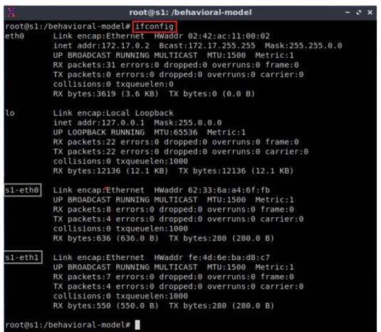
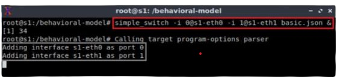
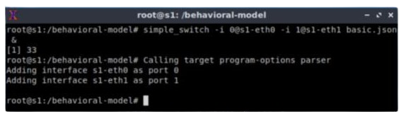
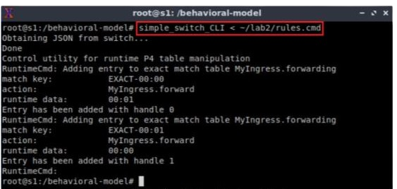
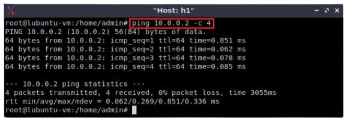

Configuring Switch s1
=====================

Mapping P4 program’s ports
~~~~~~~~~~~~~~~~~~~~~~~~~~

**Step 1.** Issue the following command to display the interfaces in switch s1:: 

     ifconfig

**Figure 18:**  Displaying switch s1 interfaces.

We can see that the switch has the interfaces s1-eth0 and s1-eth1. The interface s1-eth0 on the switch s1 connects to the host h1. 
The interface s1-eth1 on the switch s1 connects to the host h2. 

**Step 2.** Start the switch daemon and map the ports to the switch interfaces by typing the following command::

     simple_switch -i 0@s1-eth0 -i 1@s1-eth1 basic.json &

**Figure 19:** Starting the switch daemon and mapping the logical interfaces to Linux interfaces.

**Figure 20:** Ports 0 and 1 are mapped to the interfaces s1-eth0 and s1-eth1 of switch s1.

Loading the rules to the switch
~~~~~~~~~~~~~~~~~~~~~~~~~~~~~~~

**Step 1.** In switch s1 terminal, press Enter to return the CLI.

**Figure 21:** Returning to switch s1 CLI.

**Step 2.** Populate the table with forwarding rules by typing the following command:: 

     simple_switch_CLI < ~/lab2/rules.cmd

**Figure 22:** Loading table entries to switch s1.

The figure above shows the table entries described in the file rules.cmd.

**Step 3.** Go back to host h1 terminal to test the connectivity between host h1 and host h2 by issuing the following command::

     ping 10.0.0.2 -c 4

**Figure 23:** Performing a connectivity test between host h1 and host h2.

Now that the switch has a program with tables properly populated, the hosts can ping each other.

This concludes lab 2. Stop the emulation and then exit out of MiniEdit.
