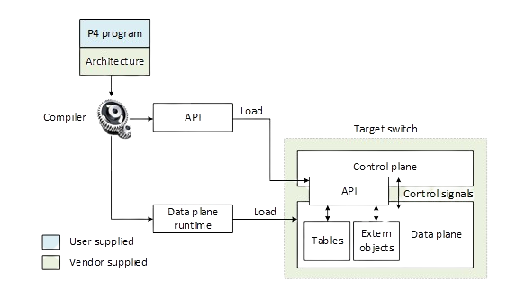
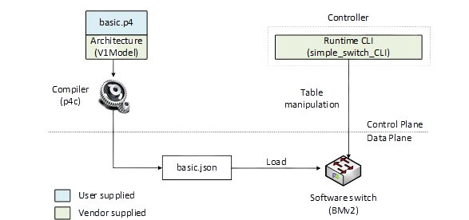

Introduction
============

Since the emergence of the world wide web and the explosive growth of the Internet in the 1990s, 
the networking industry has been dominated by closed and proprietary hardware and software. The 
progressive reduction in the flexibility of protocol design caused by standardized requirements, 
which cannot be easily removed to enable protocol changes, has perpetuated the status quo. This 
protocol ossification1, 2 has been characterized by a slow innovation pace at the hand of few 
network vendors. As an example, after being initially conceived by Cisco and VMware3, the 
Application Specific Integrated Circuit (ASIC) implementation of the Virtual Extensible LAN (VXLAN)4, 
a simple frame encapsulation protocol, took several years, a process that could have been reduced to 
weeks by software implementations. The design cycle of switch ASICs has been characterized by a 
lengthy, closed, and proprietary process that usually takes years. Such process contrasts with the 
agility of the software industry. 

The programmable forwarding can be viewed as a natural evolution of Software-Defined Networking (SDN), 
where the software that describes the behavior of how packets are processed, can be conceived, tested, 
and deployed in a much shorter time span by operators, engineers, researchers, and practitioners in 
general. The de-facto standard for defining the forwarding behavior is the P4 language5, which stands 
for Programming Protocol-independent Packet Processors. Essentially, P4 programmable switches have 
removed the entry barrier to network design, previously reserved to network vendors.

Workflow of a P4 program
~~~~~~~~~~~~~~~~~~~~~~~~

Programming a P4 switch, whether a hardware or a software target, requires a software development 
environment that includes a compiler. Consider Figure 1. The compiler maps the target-independent P4 
source code (P4 program) to the specific platform. The compiler, the architecture model, and the 
target device are vendor specific and are provided by the vendor. The P4 source code on the other 
hand is supplied by the user.

The compiler generates two artifacts after compiling the P4 program. First, it generates a data plane 
configuration (Data plane runtime) that implements the forwarding logic specified in the P4 input 
program. This configuration includes the instructions and resource mappings for the target. Second, 
it generates runtime APIs that are used by the control plane / user to interact with the data plane. 
Examples include adding/removing entries from match-action tables and reading/writing the state of 
extern objects (e.g., counters, meters, registers). The APIs contain the information needed by the 
control plane to manipulate tables and objects in the data plane, such as the identifiers of the 
tables, fields used for matches, keys, action parameters, and others. 

**Figure 1:** Generic workflow design. The compiler, the architecture model, and the target switch 
are provided by the vendor of the device. The P4 source code is customized by the user. The compiler 
generates a data plane runtime to be loaded into the target, and the APIs used by the control plane 
to communicate with the data plane at runtime.

Workflow used in this lab series
~~~~~~~~~~~~~~~~~~~~~~~~~~~~~~~~

This section demonstrates the P4 workflow that will be used in this lab series. Consider Figure 2. 
We will use the Visual Studio Code (VS Code) as the editor to modify the *basic.p4* program. Then, we 
will use the p4c compiler with the V1Model architecture to compile the user supplied P4 program 
(*basic.p4*). The compiler will generate a JSON output (i.e., basic.json) which will be used as the 
data plane program by the switch daemon (i.e., simple_switch). Finally, we will use the 
``simple_switch_CLI`` at runtime to populate and manipulate table entries in our P4 program. The target 
switch (vendor supplied) used in this lab series for testing and debugging P4 programs is the 
behavioral model version 2 (BMv2)6. 

**Figure 2:** Workflow used in this lab series
