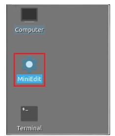
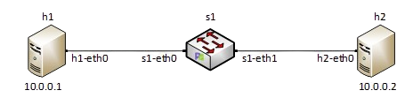
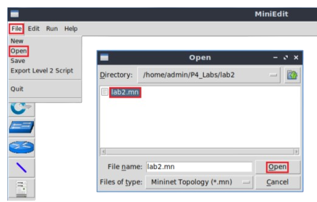
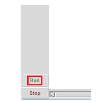
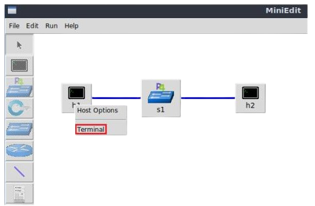

Lab Topology
============

Let’s get started with creating a simple Mininet topology using MiniEdit. The topology uses 10.0.0.0/8 
which is the default network assigned by Mininet. 

**Figure 3:** MiniEdit shortcut

**Step 1.** A shortcut to MiniEdit is located on the machine’s desktop. Start MiniEdit by double-clicking 
on MiniEdit’s shortcut. When prompted for a password, type password.

**Figure 4:** Lab topology

**Step 2.** On MiniEdit’s menu bar, click on File then Open to load the lab’s topology. A window will emerge. 
Open the folder called lab2, select the file lab2.mn, and click on Open.

**Figure 5:** Opening a topology in MiniEdit

**Step 3.** The network must be started. Click on the Run button located at the bottom left of MiniEdit’s 
window to start the emulation. 

**Figure 6:** Running the emulation.

Verifying connectivity between host h1 and host h2
~~~~~~~~~~~~~~~~~~~~~~~~~~~~~~~~~~~~~~~~~~~~~~~~~~

**Step 1.** Hold the right-click on host h1 and select Terminal. This opens the terminal of host h1 and allows 
the execution of commands on that host. 

**Figure 7:** Opening a terminal on host h1.

**Step 2.** Test the connectivity between host h1 and host h2 by issuing the command below::

     ping 10.0.0.2 -c 4

**Figure 8:** Performing a connectivity test between host h1 and host h2.

The figure above indicates no connectivity between host h1 and host h2 because there is no program loaded into the switch.
