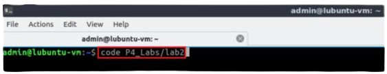
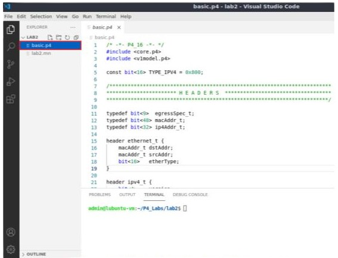
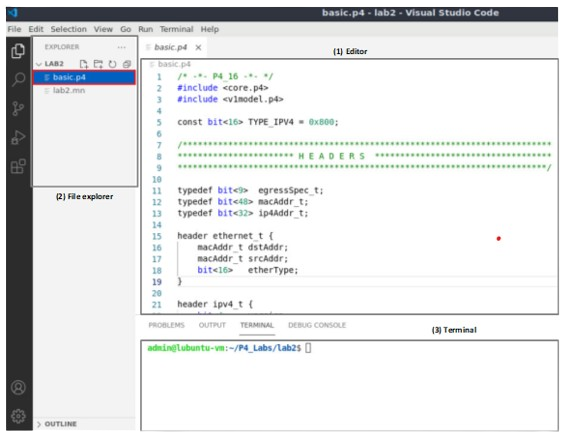
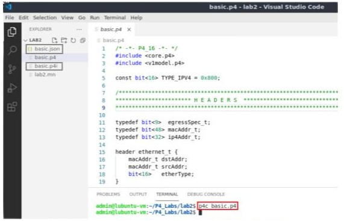
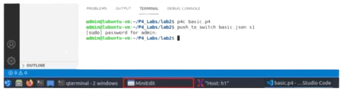
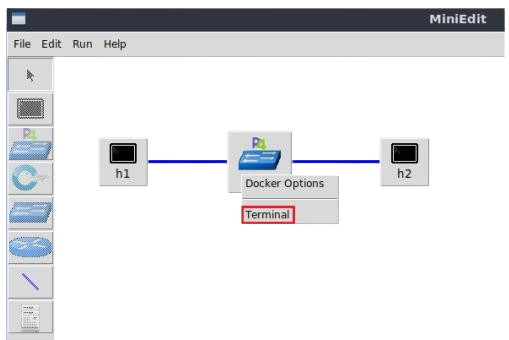
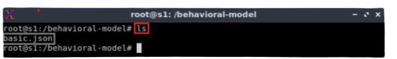

Loading The P4 Program
======================

This section shows the steps required to implement a P4 program. It describes the editor that will be used to modify the P4 
program and the P4 compiler that will produce a data plane program for the software switch. 

VS Code will be used as the editor to modify P4 programs. It highlights the syntax of P4 and provides an integrated terminal 
where the P4 compiler will be invoked. The P4 compiler that will be used is p4c, the reference compiler for the P4 programming 
language. p4c supports both P414 and P416, but in this lab series we will only focus on P416 since it is the newer version and 
is currently being supported by major programming ASIC manufacturers7. 

Loading the programming environment
~~~~~~~~~~~~~~~~~~~~~~~~~~~~~~~~~~~

**Step 1.** Launch a Linux terminal by double-clicking on the Linux terminal icon located on the desktop. 

**Figure 9:**  Shortcut to open a Linux terminal.

**Step 2.** In the terminal, type the command below. This command launches the VS Code and opens the directory where the P4 
program for this lab is located::

    code P4_Labs/lab2

**Figure 10:**  Launching the editor and opening the lab2 directory.

**Step 3.** Once the previous command is executed, VS Code will start. Click on *basic.p4* in the file explorer panel on 
the left hand side to open the P4 program in the editor.

**Figure 11:**  Opening the programming environment in VS Code.

**Step 4.** Identify the components of VS Code highlighted in the grey boxes.

**Figure 12:**  VS Code graphical interface components.

The VS Code interface consists of three main panels:

   #. Editor: the editor panel will display the content of the file selected in the file explorer. In the figure above, 
      the *basic.p4* program is shown in the Editor.
   #. File explorer: this panel contains all the files in the current directory. You will see the *basic.p4* file which contains 
      the P4 program that will be used in this lab, and the topology file for the current lab (i.e., lab2.mn).
   #. Terminal: this is a regular Linux terminal integrated in the VS Code. This is where the compiler (p4c) is invoked to 
      compile the P4 program and generate the output for the switch. 

Compiling and loading the P4 program to switch s1
~~~~~~~~~~~~~~~~~~~~~~~~~~~~~~~~~~~~~~~~~~~~~~~~~

**Step 1.** In this lab, we will not modify the P4 code. Instead, we will just compile it and download it to the switch s1. 
To compile the P4 program, issue the following command in the terminal panel inside the VS Code.

**Figure 13:**  Compiling the P4 program using the VS Code terminal.

The command above invokes the *p4c* compiler to compile the *basic.p4* program. After executing the command, if there are no 
messages displayed in the terminal, then the P4 program was compiled successfully. You will see in the file explorer that 
two files were generated in the current directory: 

   * *basic.json*: this file is generated by the p4c compiler if the compilation is successful. This file will be used by the 
      software switch to describe the behavior of the data plane. You can think of this file as the binary or the executable 
      to run on the switch data plane. The file type here is JSON because we are using the software switch. However, in hardware 
      targets, most probably this file will be a binary file.
   * *basic.p4i*: the output from running the preprocessor of the compiler on your P4 program.

At this point, we will only be focusing on the *basic.json* file.

Now that we have compiled our P4 program and generated the JSON file, we can download the program to the switch and start the 
switch daemon.

**Step 2.** Type the command below in the terminal panel to download the basic.json file to the switch s1. The script accepts as 
input the JSON output of the p4c compiler, and the target switch name (e.g., s1). If asked for a password, type the password 
``password``::

    push_to_switch basic.json s1

**Figure 14:** Downloading the compiled program to switch s1.

Verifying the configuration
~~~~~~~~~~~~~~~~~~~~~~~~~~~

**Step 1.** Click on the MinEdit tab in the start bar to maximize the window.

**Figure 15:** Maximizing the MiniEdit window.

**Step 2.** Right-click on the P4 switch icon in MiniEdit and select Terminal.

**Figure 16:** Starting the terminal on switch s1.

.. note::
   The switch is running on an Ubuntu image started on a Docker container. Thus, you will be able to execute any 
   Linux command on the switch’s terminal. 

**Step 3.** Issue the following command to list the files in the current directory::

    ls

**Figure 17:**  Displaying the contents of the current directory in the switch s1.

We can see that the switch contains the basic.json file that was downloaded after compiling the P4 program.
