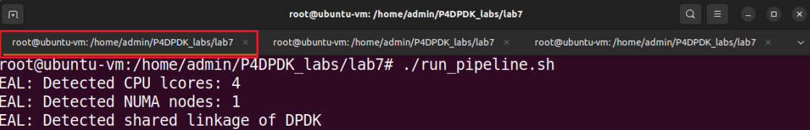
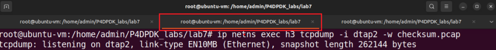
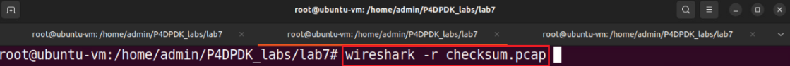

Implementing checksum update in P4
==================================

This section demonstrates how to implement the checksum update in P4.

Programming the checksum update in the P4 code
~~~~~~~~~~~~~~~~~~~~~~~~~~~~~~~~~~~~~~~~~~~~~~

Click on the VScode tab in the start bar to maximize the window.

.. image:: images/33.png

**Figure 33.** Maximizing VScode window.

**Step 2.** Start by creating the ``InternetChecksum`` object by typing the following line on code 
before the apply block in the *parser.p4* code.

    InternetChecksum() checksum;

**Figure 34.** Creating the checksum object.

In this line, the ``InternetChecksum()`` function creates a checksum object given the name 
``checksum.``

**Step 3.** Concatenate the IPv4 header field in a 16-bit word and a 32-bit word by inserting the 
following code at the beginning of the apply block.::

    bit<16> word1 = hdr.ipv4.version ++ hdr.ipv4.ihl ++ hdr.ipv4.diffserv;
    bit<32> word4 = hdr.ipv4.flags ++ hdr.ipv4.fragOffset ++ hdr.ipv4.ttl ++ hdr.ipv4.protocol;

Figure 35. Concatenating the header fields.

The two declared words word1 and word4 will be used in the checksum calculation process. The ``++`` 
operator in P4 is used to concatenate the header field and join them in one variable.

**Step 4.** Add to the checksum object the data considered for the checksum calculation by inserting 
the code below.::

    checksum.add({word1,
        hdr.ipv4.totalLen,
        hdr.ipv4.identification,
        word4,
        hdr.ipv4.srcAddr,
        hdr.ipv4.dstAddr
    });

**Figure 36.** Adding the data needed for the checksum calculation.

**Step 5.** Update the checksum by inserting the following code.::

    hdr.ipv4.hdrChecksum = checksum.get();

**Figure 37.** Updating the checksum.

The ``checksum.get()`` function returns the value of the checksum. In this line of code, the value 
of the updated checksum is written in the checksum field of the IPv4 header of the packet 
``hdr.ipv4.hdrChechsum.``

**Step 6.** Save the changes to the file by pressing ``Ctrl + s``.

**Step 7.** To compile the P4 program, issue the following command in the terminal panel inside 
VS Code.::

    p4c-dpdk --arch pna main.p4 -o lab7.spec

**Figure 38.** Compiling the P4 program using the VS Code terminal.

The command above invokes the ``p4c-dpdk`` compiler to compile the ``lab7.p4`` program and generates the 
``lab7.spec`` file (highlighted in the grey box) which is a specification file needed to run the 
pipeline. Note that now the ``lab7.spec`` file previously generated is overwritten.

Building the P4-DPDK pipeline and the lab topology
~~~~~~~~~~~~~~~~~~~~~~~~~~~~~~~~~~~~~~~~~~~~~~~~~~

**Step 1.** Click on the terminal tab in the start bar to maximize the window.

**Figure 39.** Maximizing Linux terminal window.

**Step 2.** Run the pipeline by typing the following command.::

    ./run_pipeline.sh

**Figure 40.** Running P4-DPDK pipeline.

**Step 3.** Switch back to the separate terminal tab.

**Figure 41.** Switching to a separate terminal.

**Step 4.** Build the lab topology by typing the following command.::

    ./set_topology.sh

.. image:: images/42.png

**Figure 42.** Setting the lab topology.

The *set_topology.sh* script is a shell script that automates the process of building the lab topology. 
Three namespaces are built and configured in this step with a virtual device linked to each.

Capturing and sending a packet
~~~~~~~~~~~~~~~~~~~~~~~~~~~~~~

**Step 1.** Issue the command tcpdum to start a sniffer in host 3 and write the captured packets to 
a pcap file.::

    ip netns exec h3 tcpdump -i dtap2 -w checksum.pcap

**Figure 43.** Start packet capturing on host 3.

The ``-i`` parameter in the tcpdum command, represents the interface on which the packets are being 
captured. In this application, we will be sending a packet from host 1 to host 3 and capture the 
packet received at the interface on host 3 (dtap2). The ``-w`` parameter indicated that the captured 
packets are going to be written to a packet capture (.pcap) file given the name checksum.pcap.

**Step 2.** Switch back to the separate terminal tab.

.. image:: images/44.png

**Figure 44.** Switching to a separate terminal.

**Step 3.** Now, we will send a packet from h1 to h3 over the destination IP address 192.168.30.1 by running 
the provided Python script sender.py.::

    ip netns exec h1 python3 sender.py -s h1 -d 192.168.30.1

**Figure 45.** Sending a packet from h1 to h3.

**Step 4.** Switch back to the terminal tab in which the DPDK pipeline is running to observe the result.

**Figure 46.** Switch back to the DPDK pipeline terminal.

.. note::
    
    Observe the DPDK logs at the bottom of the terminal. These logs correspond to the packet 
    processing function as defined in the .spec file generated when the P4 code is compiled.

**Figure 47.** Logs corresponding to the packet sent.

The process of concatenating the header fields into words generates a lot of logs. We are mainly 
concerned with the logs that correspond to adding the data for the checksum calculation in the 
first grey box and updating the value in the checksum header field in the second grey box.

**Step 5.** Switch back to the terminal tab in which the tcpdump sniffer is running.

**Figure 48.** Switching back to the tcpdump terminal.

**Step 6.** Terminate the tcpdump process by pressing ``Ctrl + c`` in the terminal.

**Figure 49.** Terminating the packet capturing process.

After terminating the process, the output on the terminal indicates the number of captured packets 
at the specified interface. In this example, one packet was captured.

**Step 7.** The captured packet will be inspected in Wireshark. To open the pcap file in Wireshark 
run the following command.

    wireshark -r checksum.pcap

**Figure 50.** Opening the pcap file in Wireshark.

**Step 8.** Expand the IPv4 header to view the header fields in the captured packet received at host 3 by clicking on the arrow on the side.

**Figure 51.** Opening the pcap file in Wireshark.

We can see that the checksum in that packet is now correct. This is because the P4 program updated 
the checksum in the IPv4 header after changing the header field value (i.e., TTL).

**Step 9.** Click on the terminal tab in the start bar to maximize the window.

.. image:: images/52.png

**Figure 52.** Maximizing Linux terminal window.

**Step 10.** Press ctrl+c to terminate the process.

**Figure 53.** Stopping the running process.

**Step 11.** Switch back to the terminal tab running the DPDK pipeline and press ctrl+c to terminate 
the process.

**Figure 54.** Stopping the running pipeline.

This concludes Lab 7. You can now end your reservation.