Implementing the packet deparser in P4
======================================

This section demonstrates how to implement the packet deparser in P4.

VS Code will be used as the editor to write and inspect the codes. It highlights the syntax of 
P4 and provides an integrated terminal where the P4 compiler will be invoked. The P4 compiler 
that will be used is p4c-dpdk, which transforms the P4 code into the specifications file to be 
executed next into the DPDK pipeline.

Loading the programming environment
~~~~~~~~~~~~~~~~~~~~~~~~~~~~~~~~~~~

**Step 1.** Launch a Linux terminal by clicking on the Linux terminal icon in the taskbar.

.. image:: images/3.png

**Figure 3.** Linux terminal icon.

The Linux terminal is a program that opens a window and permits you to interact with a command-line 
interface (CLI). A CLI is a program that takes commands from the keyboard and sends them to the 
operating system for execution.

**Step 2.** In the terminal, type the command below. This command launches the VS Code and opens 
the directory where the P4 program for this lab is located.::

    code P4DPDK_labs/lab7

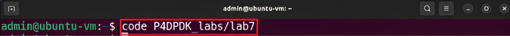

**Figure 4.** Loading VS Code in the lab7 directory.

**Step 1.** Click on the *deparser.p4* file to display the contents of the file. Use the file explorer 
on the left-hand side of the screen to locate the file.

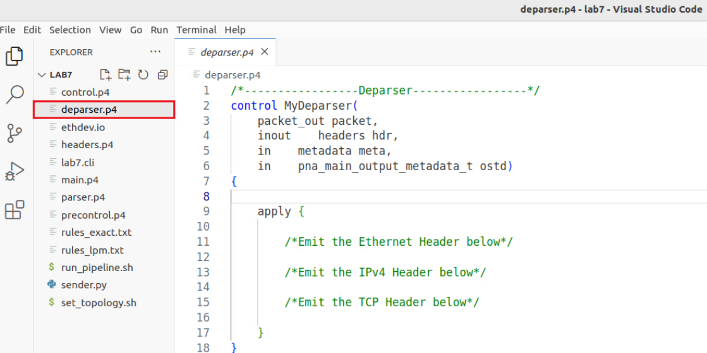

**Figure 5.** Inspecting the *deparser.p4* file.

We can see that the *deparser.p4* declares a control block named *MyDeparser*. Note that the body 
of the apply block of the deparser is empty for us to fill it.

**Step 2.** We will start by emitting the ethernet header by typing the following line of code.::

    packet.emit(hdr.ethernet)

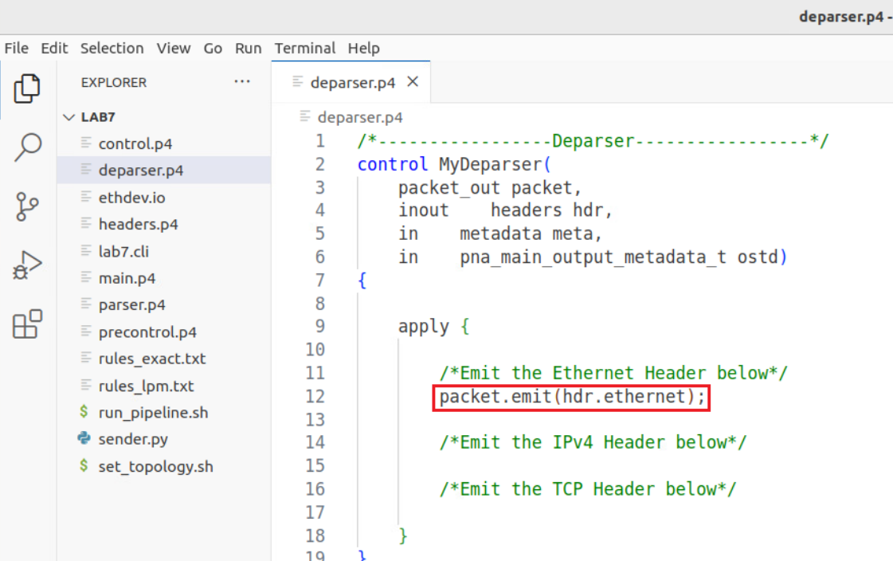

**Figure 6.** Emitting the ethernet header.

**Step 3.** Emit the IPv4 header by typing the following line of code.::

    packet.emit(hdr.ipv4)

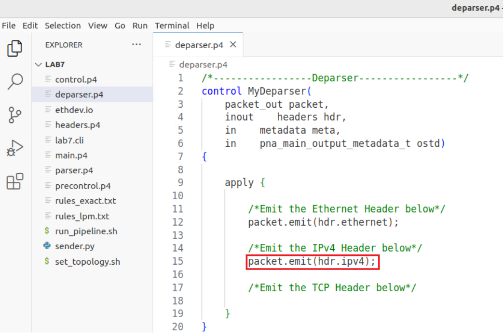

**Figure 7.** Emitting the IPv4 header.

**Step 4.** Emit the TCP header by typing the following line of code.::

    packet.emit(hdr.tcp)

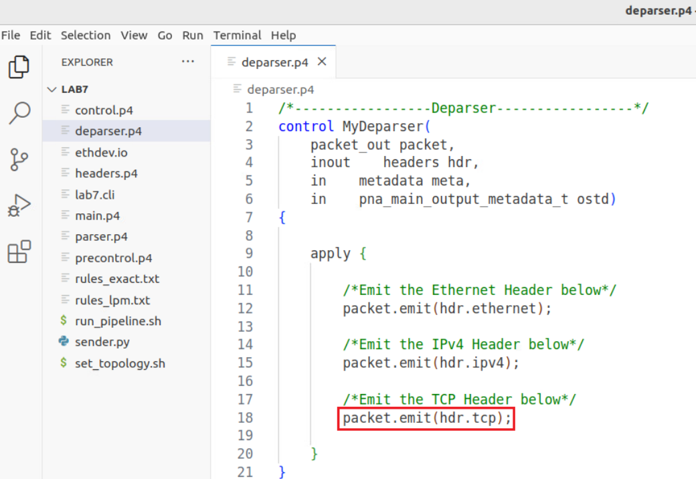

**Figure 8.** Emitting the TCP header.

**Step 5**. Save the changes to the file by pressing ``Ctrl + s``.

Compiling the P4 program
~~~~~~~~~~~~~~~~~~~~~~~~

**Step 1.** Open a new terminal in VS Code by clicking on Terminal in the menu bar and then 
*New Terminal* in the drop-down menu.

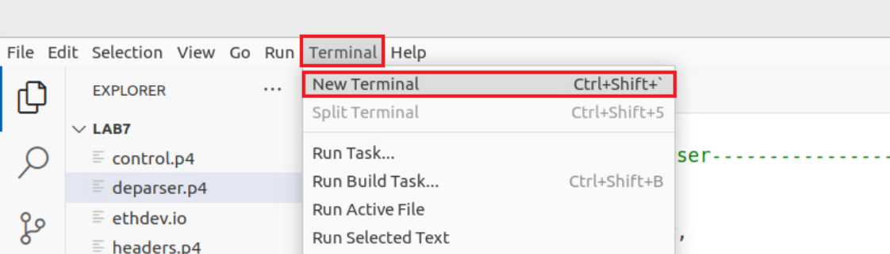

**Figure 9.** Opening a new VS Code terminal.

**Step 2.** To compile the P4 program, issue the following command in the terminal panel 
inside VS Code.::

    p4c-dpdk --arch pna main.p4 -o lab7.spec

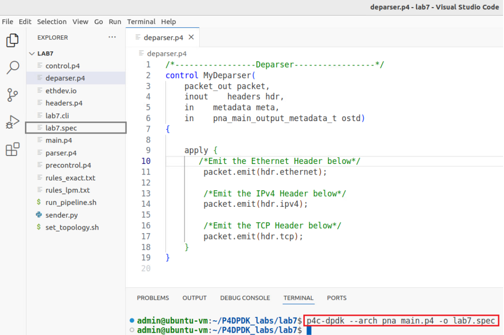

**Figure 10.** Compiling the P4 program using the VS Code terminal.

The command above invokes the *p4c-dpdk* compiler to compile the *lab7.p4* program and generates 
the *lab7.spec* file (highlighted in the grey box) which is a specification file needed to run 
the pipeline.

Building the P4-DPDK pipeline and the lab topology
~~~~~~~~~~~~~~~~~~~~~~~~~~~~~~~~~~~~~~~~~~~~~~~~~~

**Step 1.** Click on the terminal tab in the start bar to maximize the window.

.. image:: images/11.png

**Figure 11.** Maximizing Linux terminal window.

**Step 2.** Issue the command *sudo su* on the terminal to enter root mode. When prompted for a 
password, type *password* and hit enter. Note that the password will not be visible as you type 
it.::

    sudo su

.. image:: images/12.png

**Figure 12.** Entering root mode.

**Step 3.** Navigate to the lab7 directory using the cd command.::

    cd P4DPDK_labs/lab7

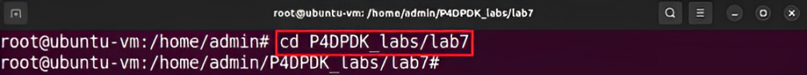

**Figure 13.** Navigating to the lab7 directory.

**Setp 4.** Run the pipeline by typing the following command.::

    ./run_pipeline.sh

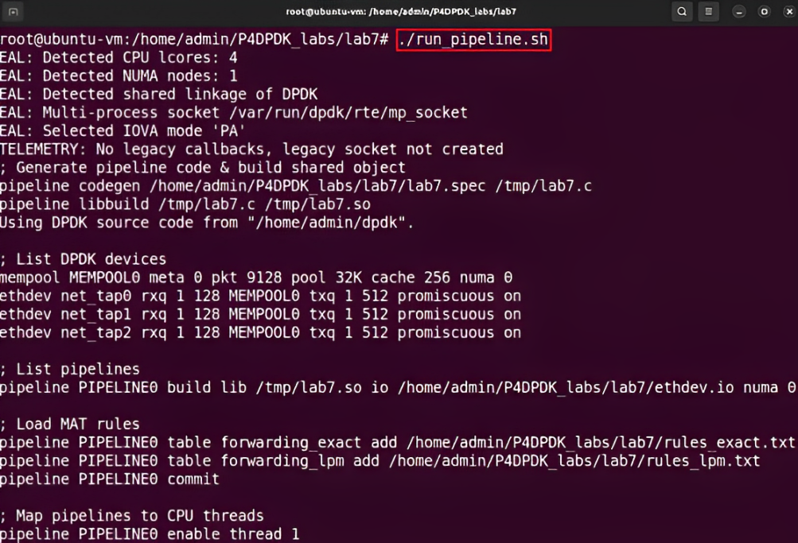

**Figure 14.** Running P4-DPDK pipeline.

The run_pipeline.sh script is a shell script that automates the process of running the P4-DPDK 
pipeline.

**Step 5.** Click on the new tab button at the top left of the terminal while running the pipeline.

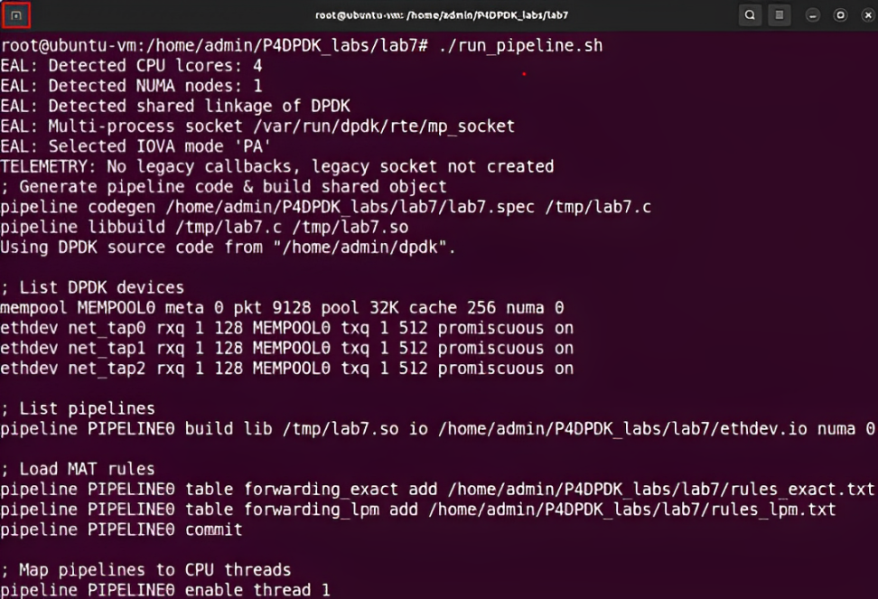

**Figure 15.** Opening a new terminal in a new tab.

**Step 6.** Issue the command ``sudo su`` on the terminal to enter root mode. When prompted for a 
password, type ``password`` and hit `enter`. Note that the password will not be visible as you type 
it.::

    sudo su

.. image:: images/16.png

**Figure 16.** Entering root mode.

**Step 7.** Navigate to the lab7 directory using the cd command.::

    cd P4DPDK_labs/lab7

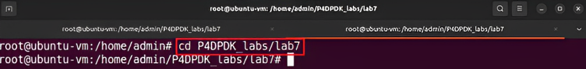

**Figure 17.** Navigating to the lab7 directory.

**Step 8.** Build the lab topology by typing the following command.::

    ./set_topology.sh

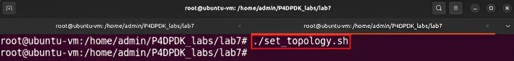

**Figure 18.** Setting the lab topology.

The *set_topology.sh* script is a shell script that automates the process of building the 
lab topology. Three namespaces are built and configured in this step with a virtual device 
linked to each.

Capturing and sending a packet
~~~~~~~~~~~~~~~~~~~~~~~~~~~~~~

**Step 1.** Issue the command tcpdum to start a sniffer in host 3 and write the captured 
packets to a pcap file.::

    ip netns exec h3 tcpdump -i dtap2 -w no_checksum.pcap

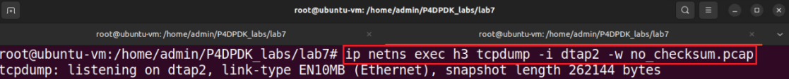

**Figure 19.** Start packet capturing on host 3.

The ``-i`` parameter in the tcpdump command, represents the interface on which the packets are 
being captured. In this application, we will be sending a packet from host 1 to host 3 and 
capture the packet received at the interface on host 3 (dtap2). The ``-w`` parameter indicated 
that the captured packets are going to be written to a packet capture (.pcap) file given the 
name no_checksum.pcap.

**Step 2.** Click on the new tab button at the top left to open a new terminal tab.

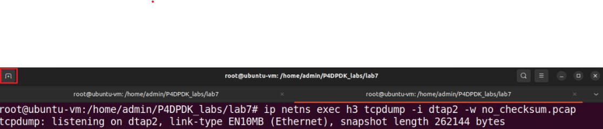

**Figure 20.** Opening a new terminal in a new tab.

**Step 3.** Issue the command sudo su on the terminal to enter root mode. When prompted for a 
password, type password and hit enter. Note that the password will not be visible as you type it.::

    sudo su

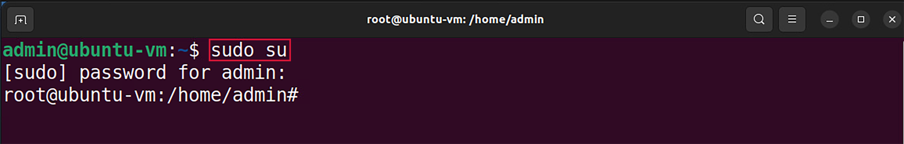

**Figure 21.** Entering root mode.

**Step 4.** Navigate to the lab7 directory using the cd command.::

    cd P4DPDK_labs/lab7

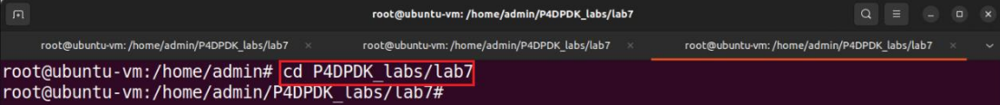

**Figure 22.** Navigating to the lab7 directory.

**Step 5.** Now, we will send a packet from h1 to h3 over the destination IP address 
192.168.30.1 by running the provided Python script *sender.py*.::

    ip netns exec h1 python3 sender.py -s h1 -d 192.168.30.1

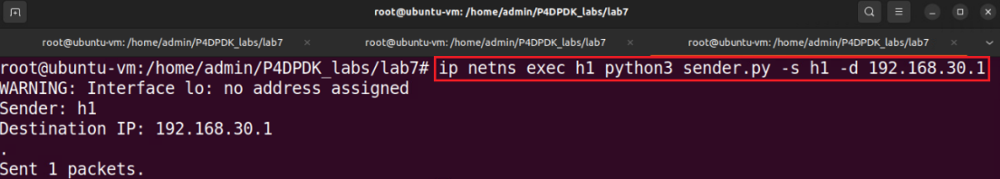

**Figure 23.** Sending a packet from h1 to h3.

Running the Python script requires two parameters:

* ``-s``: Sender (h1 or h2 or h3)
* ``-d``: Destination IP Address

Inspecting DPDK logs and the captured packet
~~~~~~~~~~~~~~~~~~~~~~~~~~~~~~~~~~~~~~~~~~~~

**Step 1.** Switch back to the terminal tab in which the DPDK pipeline is running to observe the 
result.

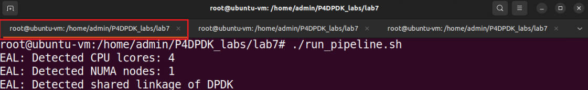

**Figure 24.** Switch back to the DPDK pipeline terminal.

.. note:: 
    
    Observe the DPDK logs at the bottom of the terminal. These logs correspond to the packet processing 
    function executed in the .spec file generated when the P4 code is compiled.

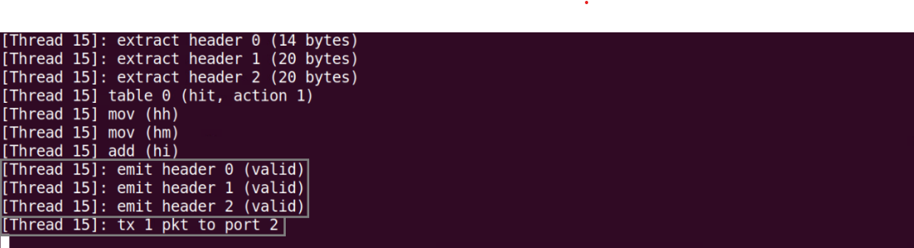

**Figure 25.** Logs corresponding to the packet sent.

The “emit header” log appears three times in the grey box, corresponds to the deparsed ethernet 
header (header 0) with size of 14 bytes (112 bits), the deparsed IPv4 header (header 1) with size 
20 bytes (160 bits) and the deparsed TCP header (header 2) with size 20 bytes (160 bits) as declared 
in the deparser.p4 file. Note that the order of the deparsed headers matches the order of the 
parsed headers as shown in the “extract header” logs. The “tx 1 pkt to port 2” log indicated 
that one packet has been sent to port 2 which corresponds to host 3.

**Step 2.** Switch back to the terminal tab in which the tcpdump sniffer is running.

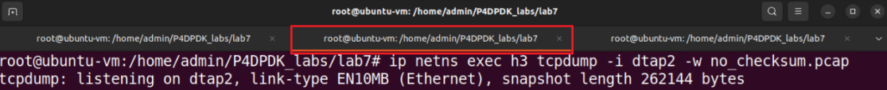

**Figure 26.** Switching back to the tcpdump terminal.

**Step 3.** Terminate the tcpdump process by pressing Ctrl + c in the terminal.

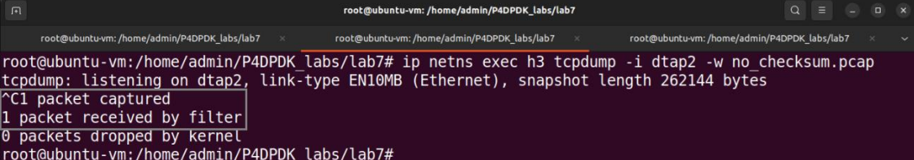

**Figure 27.** Terminating the packet capturing process.

After terminating the process, the output on the terminal indicates the number of captured packets 
at the specified interface. In this example, one packet was captured.

**Step 4.** The captured packet will be inspected in Wireshark. To open the pcap file in Wireshark 
run the following command.::

    wireshark -r no_checksum.pcap

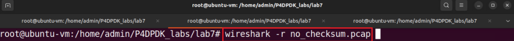

**Figure 28.** Opening the pcap file in Wireshark.

**Step 5.** Expand the IPv4 header to view the header fields in the captured packet received at host 
3 by clicking on the arrow on the side.

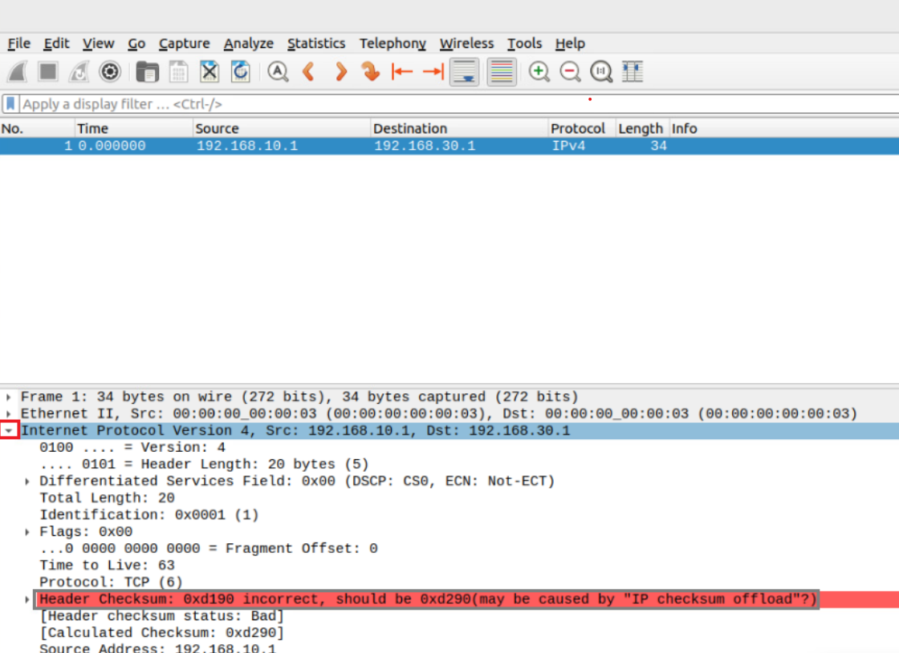

**Figure 29.** Opening the pcap file in Wireshark.

We can see that the checksum in that packet is incorrect. This is because the P4 program changed 
the header field value (i.e., TTL), but did not update the checksum in the packet.

**Step 6.** Click on the terminal tab in the start bar to maximize the window.

.. image:: images/30.png

**Figure 30.** Maximizing Linux terminal window.

**Step 7.** Press ctrl+c to terminate the process.

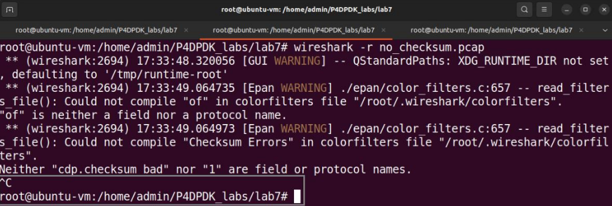

**Figure 31.** Stopping the running process.

**Step 8.** Switch back to the terminal tab running the DPDK pipeline and press ctrl+c to terminate the process.

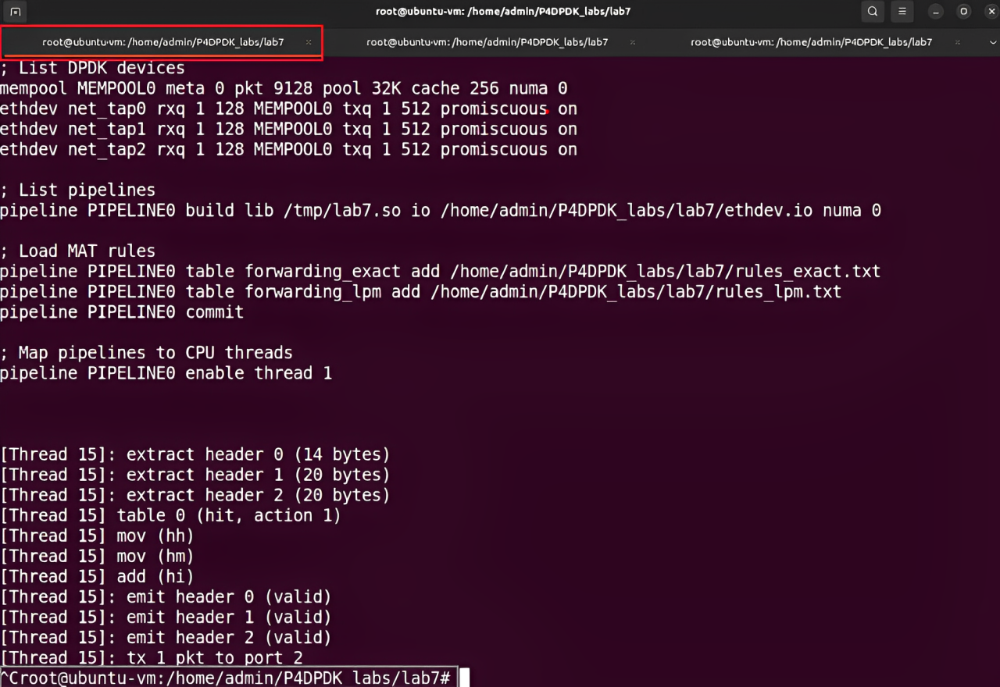

**Figure 32.** Stopping the running pipeline.