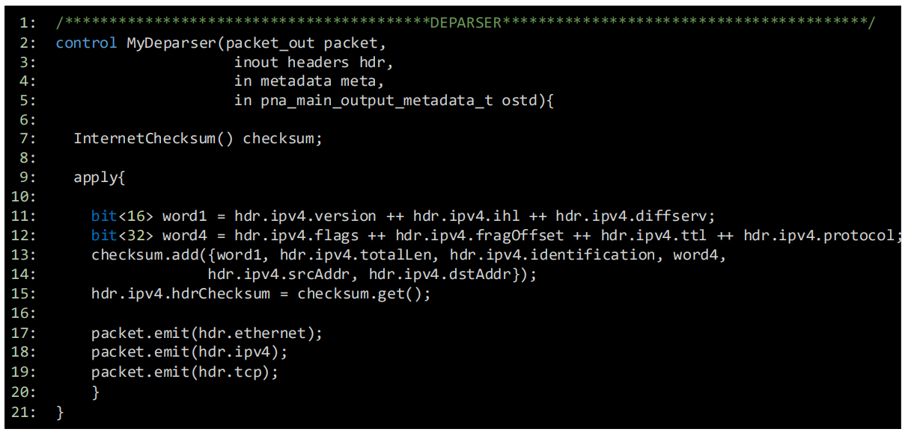

Introduction
============

Deparsing
~~~~~~~~~~~~~

The P4 program includes a deparser that specifies which headers are to be emitted. The deparser 
emits the headers and the payload of the original packet. Note that only the valid headers are 
emitted. A header is considered valid after it has been parsed in the P4 program or after the 
program explicitly validates the header.

Checksums
~~~~~~~~~

Several protocols use checksums to validate the integrity of the packet headers. A checksum is 
a small value derived from another data block, often through a checksum algorithm such as the 
Cyclic Redundancy Check (CRC). The checksum calculation and verification start with the sender 
calculating the checksum of the data before transmitting the packet. Then, the checksum value 
is inserted into the packet header. Upon receiving the packet, the receiver computes the checksum 
of the received packet using the same algorithm as the one used by the sender. If the calculated 
checksum value matches the one in the packet header, the packet is verified; otherwise, a 
transmission error has occurred. Incorrect checksums typically lead to dropping the packet by 
the switch.

In a P4 program, the developer may change the packet headers. For example, if the program is 
implementing a routing function, then header fields such as the Time-to-Live (TTL) must be 
it is necessary to recompute the checksum in the P4 program in case modifications are made to 
the header fields.

Figure 1 shows an example of computing the checksum and implementing a deparser in a P4 program. 
The deparser is defined as a control block and is executed after finishing the packet processing 
by the other control blocks.

**Figure 1.** Checksum update and deparser implementation.

In the PNA `[1] <references.html>`_ architecture, the checksum update is implemented in the deparser control block before 
the packet headers are emitted. In like 7, the ``InternetChecksum()`` instance is needed to create 
a checksum object with the name checksum. The checksum update is then done in the apply block of 
the deparser.

Note that in DPDK the checksum is calculated using the 16-bit one’s complement algorithm `[2] <references.html>`_ `[3] <references.html>`_. 
Therefore, the data whose checksum is to be computed should be introduced as words of 16 bits 
or 32 bits. The data usually includes the header fields of the protocol which uses the checksum. 
The example above shows the header fields of IPv4. In lines 11 and 12 the ``++`` operator is used 
to concatenate the packet headers into a 16-bit word and a 32-bit word. In line 13, the 
``checksum.add()`` function takes the data which includes the header fields in this example. 
Finally, in line 14, the checksum field in the packet is updated using the ``checksum.get()`` 
function.

The deparser control block has a ``packet_out`` type in its parameters. The ``packet_out`` 
type includes the emit method which accepts the headers to be reassembled when the deparser 
constructs the outgoing packet (lines 17-19). Note that the order of emitting packets' headers 
is important, and the headers are only emitted if they are valid.