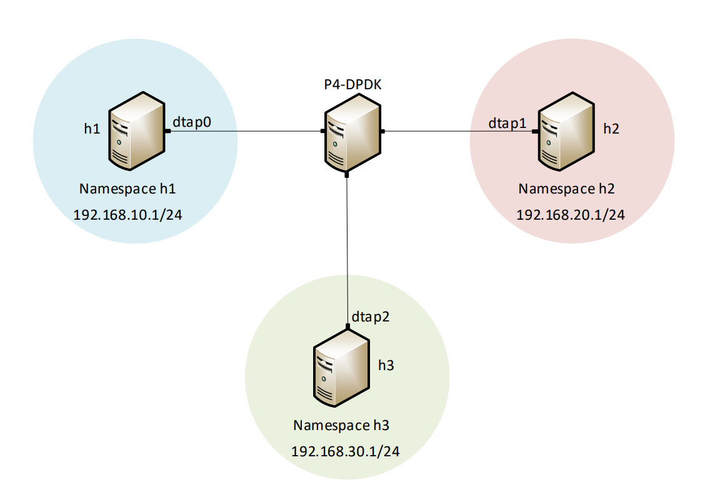

Lab Topology
============

Consider Figure 2. Three network namespaces, h1, h2, and h3 are linked to the running P4-DPDK 
pipeline, enabling connectivity between three namespaces. The network environments of hosts h1, 
h2, and h3 are isolated from each other and the root namespace.

**Figure 2:** Lab topology

Lab settings
++++++++++++

The hosts should be configured according to Table 2. 

.. table:: Table 2: Topology information.
   :align: center
   
   ========  =============  ==============  ==========
   **Host**  **Interface**  **IP Address**  **Subnet**
   ========  =============  ==============  ==========
   h1        dtap0          192.168.10.1    /24        
   h2        dtap1          192.168.20.1    /24
   h3        dtap2          192.168.30.1    /24
   ========  =============  ==============  ==========