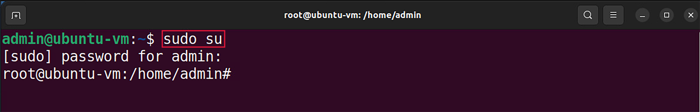

Building the P4-DPDK pipeline and the lab topology
==================================================

This section shows the steps required to run the P4-DPDK along with building the 
lab topology. The step-by-step procedure is explained in detail in a previous lab. 
In this lab, the procedure is automated.

.. image:: images/16.png

**Figure 16:** Maximizing Linux terminal window.

**Step 2.** Issue the command ``sudo su`` on the terminal to enter root mode. When 
prompted for a password, type ``password`` and hit enter. Note that the password 
will not be visible as you type it::

    sudo su

.. image:: images/17.png

**Figure 17:** Entering root mode.

**Step 3.** Navigate to the lab4 directory using the cd command::

    cd P4DPDK_labs/lab4  

**Figure 18:** Navigating to the lab4 directory.

**Step 4.** Run the pipeline by typing the following command::

     ./run_pipeline.sh

**Figure 19:** Running P4-DPDK pipeline.

The run_pipeline.sh script is a shell script that automates the process of running 
the P4-DPDK pipeline.

.. note:: 

    Note that highlighted in the grey box, a rule file was loaded to add rules to the 
    forwarding table. The rules.txt file contains rules for exact matching.

Inspecting table entries
~~~~~~~~~~~~~~~~~~~~~~~~

**Step 1.** Click on the new tab button at the top left of the terminal while running the 
pipeline.

**Figure 20:** Opening a new terminal in a new tab.

**Step 2.** Issue the command ``sudo su`` on the terminal to enter root mode. When prompted 
for a password, type ``password`` and hit enter. Note that the password will not be visible 
as you type it::

    sudo su

**Figure 21:** Entering root mode.

**Step 3.** Navigate to the lab4 directory using the ``cd`` command. 

    cd P4DPDK_labs/lab4  

.. image:: images/22.png

**Figure 22:** Navigating to the lab4 directory.

**Step 4.** To inspect the entries loaded to the match-action table, we will enter the following
 command::

    cat rules.txt

**Figure 23:**  Inspecting the rules.txt file.

The grey box shows the entries loaded to the match action table. Each entry consists of three components.

*	``match <key>``: The key based on which a match is found or not. In the first entry, the key is 
    192.168.10.1 (0xC0A80A01 in hexadecimal) which is the IP address of host 1. The match key of the 
    second entry is 192.168.10.2 (0xC0A80A01 in hexadecimal) which is the IP address of host 2.
*	``action <action name>``: The action to be executed if there is a match. If a match is found the 
    action to be executed for both entries is the forward action declared in the control.p4 code which 
    was written earlier in this lab. 
*	The last item is the action data. In this case, the action data is the port ID. Therefore, if a match 
    is found, the packet is forwarded through port 0 or port 1.

Building the lab topology
~~~~~~~~~~~~~~~~~~~~~~~~~

**Step 1.** Build the lab topology by typing the following command::

    ./set_topology.sh

**Figure 24:**  Setting the lab topology.

The set_topology.sh script is a shell script that automates the process of building the lab topology. Two 
namespaces are built and configured in this step with a virtual device linked to each.

