Defining a table with exact match lookup
========================================

This section demonstrates how to implement a simple table in P4 that uses exact 
matching on the destination IP address of the packet. When there is a match, the 
packet is forwarded from a certain port. Otherwise, the packet is dropped.

VS Code will be used as the editor to write and inspect the codes. It highlights 
the syntax of P4 and provides an integrated terminal where the P4 compiler will be 
invoked. The P4 compiler that will be used is p4c-dpdk, which transforms the P4 code 
into the specifications file to be executed next into the DPDK pipeline.

Loading the programming environment
~~~~~~~~~~~~~~~~~~~~~~~~~~~~~~~~~~~

**Step 1.** Launch a Linux terminal by clicking on the Linux terminal icon in the taskbar.

.. image:: images/4.png

**Figure 4:** Linux terminal icon

The Linux terminal is a program that opens a window and permits you to interact with a 
command-line interface (CLI). A CLI is a program that takes commands from the keyboard 
and sends them to the operating system for execution. 

**Step 2.** In the terminal, type the command below. This command launches the VS Code 
and opens the directory where the P4 program for this lab is located::

    code P4DPDK_labs/lab4 

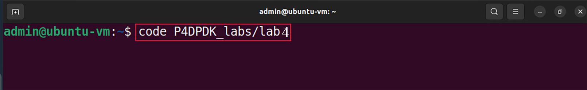

**Figure 5:** Loading VS Code in the lab4 directory.

Programming the exact table in the control block
~~~~~~~~~~~~~~~~~~~~~~~~~~~~~~~~~~~~~~~~~~~~~~~~

**Step 1.** Click on the control.p4 file to display the contents of the file. Use the file 
explorer on the left-hand side of the screen to locate the file.

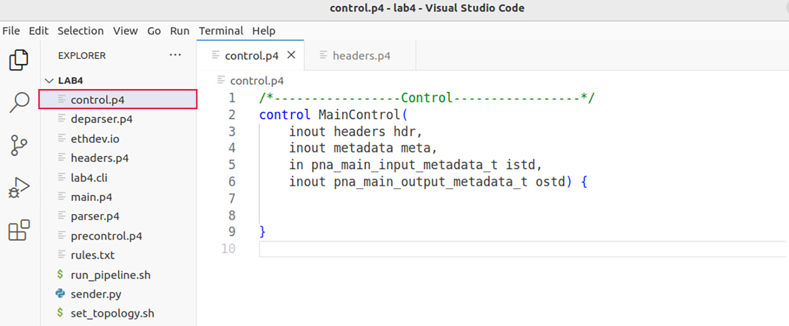

**Figure 6:** Inspecting the control.p4 file.

We can see that the control.p4 declares a control block named MainControl. Note that the body 
of the control block is empty. Our objective is to define a P4 table and its actions, and then 
invoke them inside the block.

**Step 2.** We will start by defining the possible actions that a table will call. In this simple 
forwarding program, we have two actions: 

*	``forward``: This action will be used to forward the packet out of a port. 
*	``drop``: This action will be used to drop the packet.

**Step 3.** Now we will define the behavior of the ``forward`` action. Insert the code below inside 
the MainControl control block::

    action forward (PortId_t port_id) {
        send_to_port(port_id);
    }

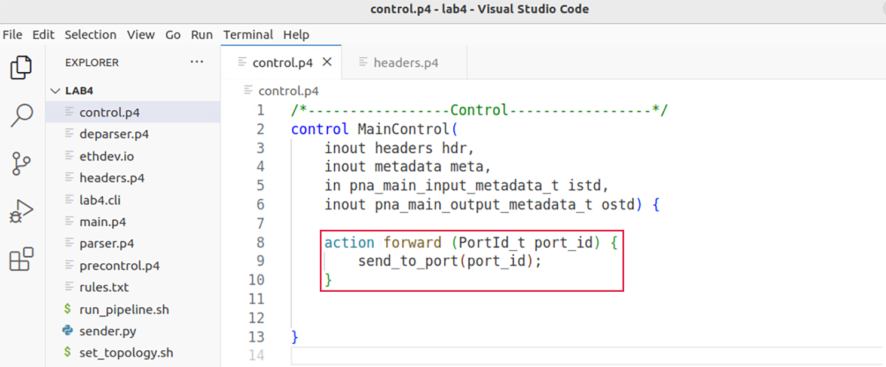

**Figure 7:** Defining the ``forward`` action.

The action ``forward`` accepts as a parameter the port number (``PortId_t port_id``) to be used by 
the pipeline to forward the packet. The ``send_to_port`` is a function that takes the port number 
as an input. Therefore, when the forward action is executed, the packet will be sent out of the port 
number specified as a parameter.

**Step 4.** Now we will define the drop action. Insert the code below inside the MainControl control
block::

    action drop() {
        drop_packet();
    }

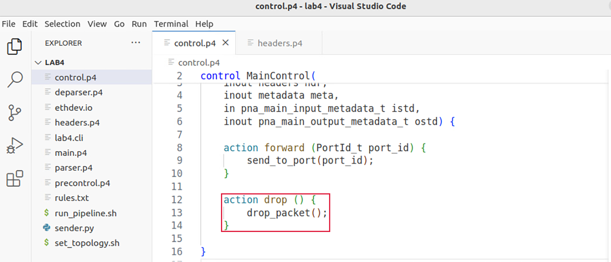

**Figure 8:** Defining the ``drop`` action.

The ``drop()`` action invokes a primitive action ``drop_packet()`` that causes the packet to be dropped.

**Step 5.** Now we will define the table named ``forwarding``. Write the following piece of code inside the 
body of the MainControl control block::

    table forwarding {

    }

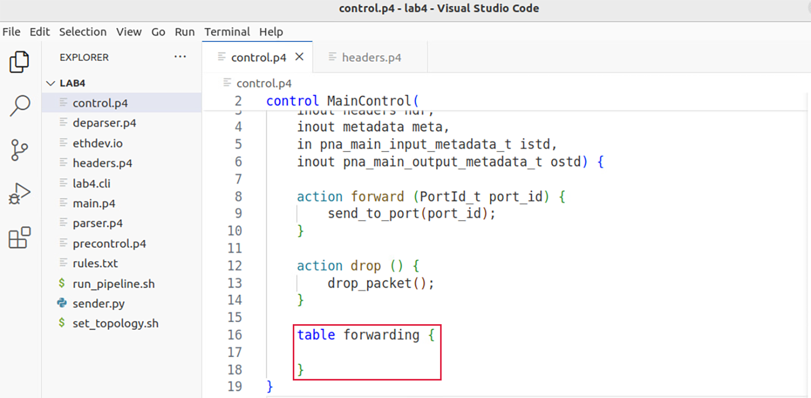

**Figure 9:** Declaring the ``forwarding`` table.

Tables require keys and actions. In the next step, we will define a key.

**Step 6.** Add the following code inside the forwarding table::

    key = {
        hdr.ipv4.dstAddr:exact;
    }

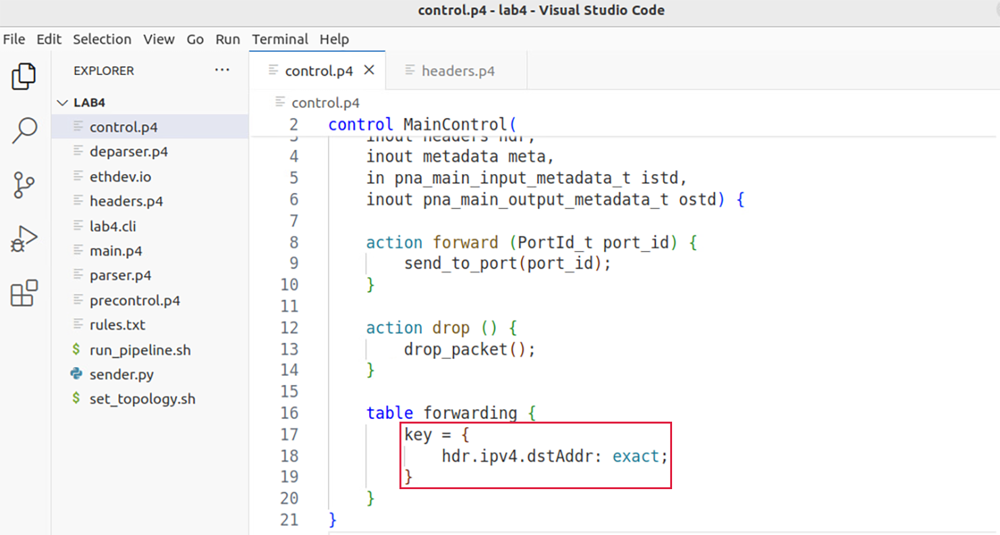

**Figure 10:** Specifying the key and the match type.

The inserted code specifies that the destination IPv4 address of a packet (``hdr.ipv4.dstAddr``) will be used as a 
key in the table. Also, the match type is ``exact``, denoting that the value of the destination IP address will be 
matched as is against a value specified later in the control plane.

**Step 7.** Add the following code inside the forwarding table to list the possible actions that will be used
in this table:: 

    actions = {
        forward;
        drop;
    }

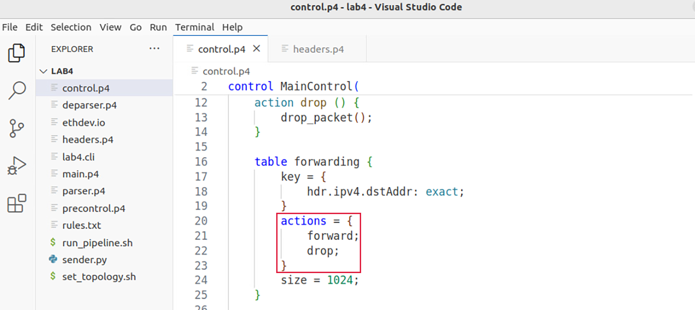

**Figure 11:** Adding the actions to the ``forwarding`` table.

**Step 8.** Add the following code inside the forwarding table. 
The ``size`` keyword specifies the maximum number of entries that 
can be inserted into this table from the control plane::

    size = 1024;
     
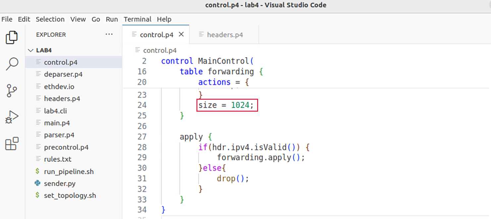

**Figure 12:** Specifying the size of the ``forwarding`` table.

**Step 9.** Add the following code inside the MainControl block. The apply block defines the sequential flow of packet 
processing. It is required in every control block, otherwise the program will not compile. It describes in order, the 
sequence of tables to be invoked, among other packet processing instructions::

    apply {
        if(hdr.ipv4.isValid()) {
            forwarding.apply();
        } else{
            drop(); 
        }
    }

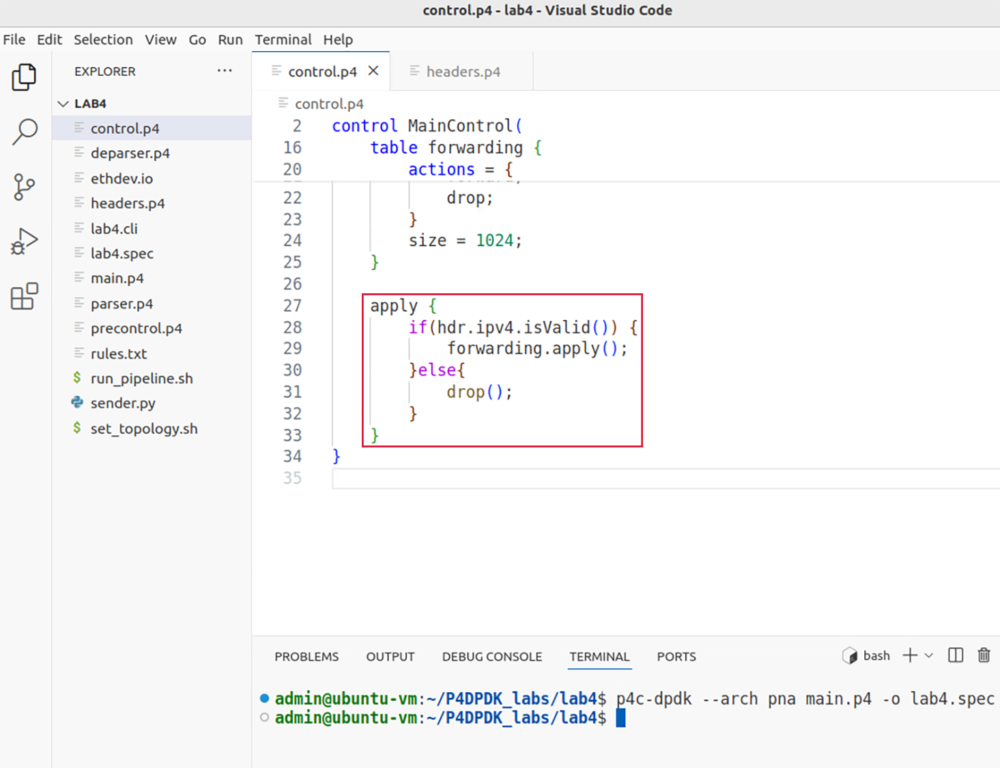

**Figure 13:** Defining the ``apply`` block.

In the code above, we are calling the table forwarding (``forwarding.apply()``) only if the IPv4 header is valid 
(``if (hdr.ipv4.isValid()``), otherwise the packet is dropped. The validity of the header is set if the parser s
uccessfully parsed said header (see parser.p4 for a recap on the parser details).

**Step 10.** Save the changes to the file by pressing ``Ctrl + s``.

Compiling the P4 program
~~~~~~~~~~~~~~~~~~~~~~~~

**Step 1.** Open a new terminal in VS Code by clicking on Terminal in the menu bar and then New Terminal in the 
drop-down menu.

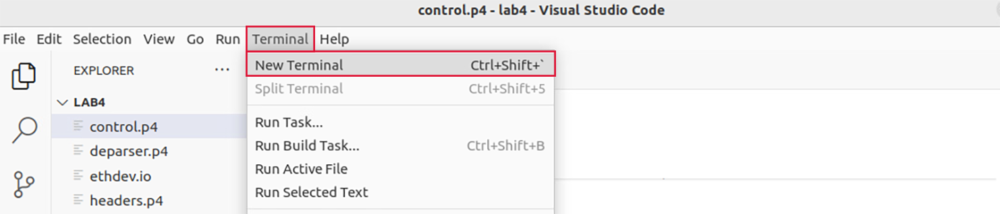

**Figure 14:** Opening a new VS Code terminal.

**Step 2.** To compile the P4 program, issue the following command in the terminal panel inside VS Code::

    p4c-dpdk --arch pna main.p4 -o lab4.spec

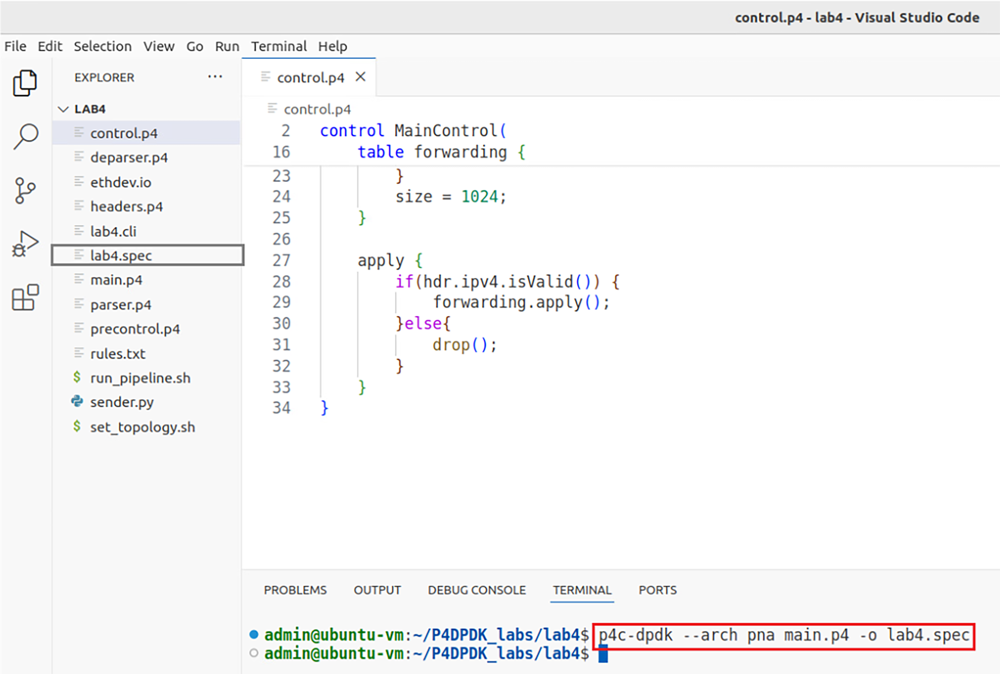

**Figure 15:** Compiling the P4 program using the VS Code terminal.

The command above invokes the p4c-dpdk compiler to compile the lab4.p4 program and generates the lab4.spec 
file (highlighted in the grey box) which is a specification file needed to run the pipeline.

