Enabling add-on-miss
====================

In this section, we will be modifying the P4 code to enable the add_on_miss feature. 

Modifying the P4 code
~~~~~~~~~~~~~~~~~~~~~

**Step 1.** Click on the VS Code icon to maximize the window.

**Figure 29:** Maximizing VS Code.

**Step 2.** Click on the headers.p4 file to display the contents of the file. Use the 
file explorer on the left-hand side of the screen to locate the file.

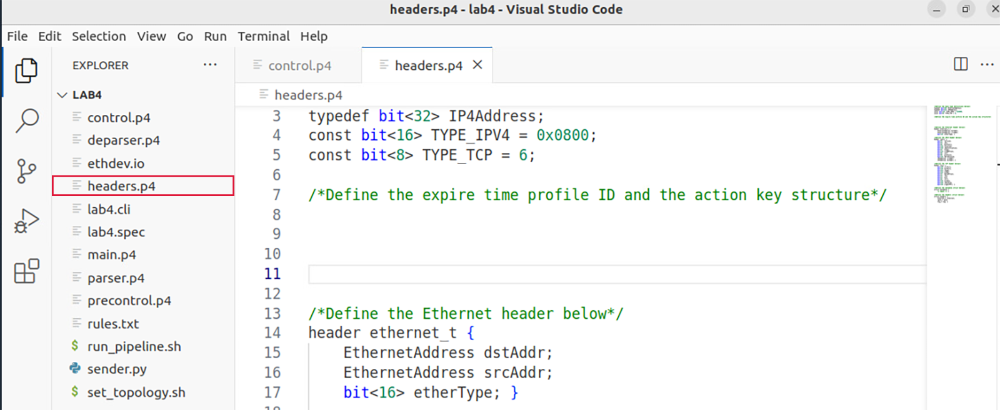

**Figure 30:** Inspecting the headers.p4 file.

We can see that the headers.p4 has a designated space in which we will be declaring an 
additional constant along with a structure. 

**Step 3.** Now we will define the ``EXPIRE_TIME_PROFILE_ID`` constant. Insert the code 
below in the designated empty space in line 8::

    const ExpireTimeProfileId_t EXPIRE_TIME_PROFILE_ID = (ExpireTimeProfileId_t) 4;

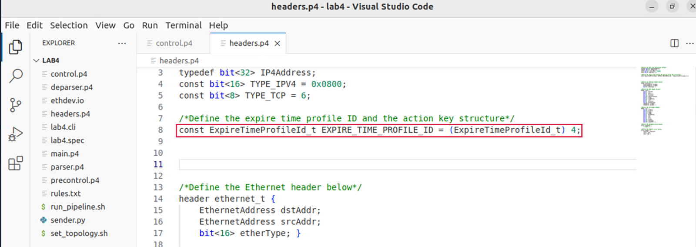

**Figure 31:** Defining the ``EXPIRE_TIME_PROFILE_ID`` constant.

Each P4 target has a set of expire time profiles where each profile represents the time 
in seconds it takes for an entry to be removed if it has not been a match to the packets 
being processed. ``EXPIRE_TIME_PROFILE_ID`` is a constant that represents the expire time 
profile ID of the entry added. This constant is represented in 8 bits since it is cast to 
the ``ExpireTimeProfileId_t`` typedef. In this lab, we selected the expiration time with 
profiled ID 4 which is equivalent to 300 seconds. The set of expire time profiles can be 
found in the .spec file created after the P4 code is compiled.

**Step 4.** Now we will define the ``forward_action_keys`` structure. Insert the code below 
in the designated empty space in line 9::

    struct forward_action_keys {
        PortId_t port_id;
    }

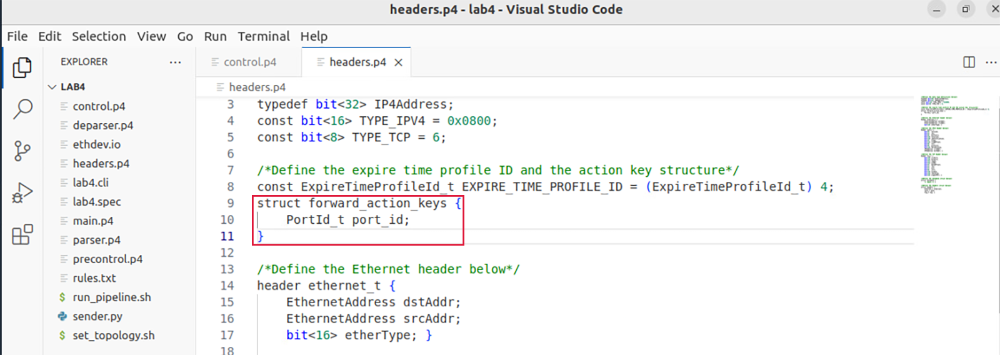

**Figure 32:** Defining the ``forward_action_keys`` structure.

**Step 5.** Save the changes to the file by pressing ``Ctrl + s``.

**Step 6.** Click on the control.p4 file to display the contents of the file. Use the file 
explorer on the left-hand side of the screen to locate the file.

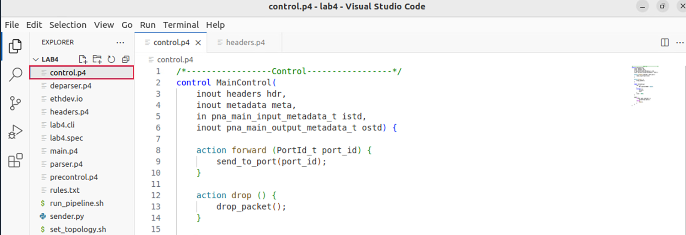

**Figure 33:** Inspecting the control.p4 file.

**Step 7.** Now we will define the forward_miss action and its behavior. Insert the code 
below inside the MainControl control block below the defined actions.::

     action forward_miss () {
        forward_action_keys forward_params;
        forward_params.port_id = (PortId_t) 1;
        add_entry(action_name = "forward", action_params = forward_params,
                              expire_time_profile_id = EXPIRE_TIME_PROFILE_ID);
    }

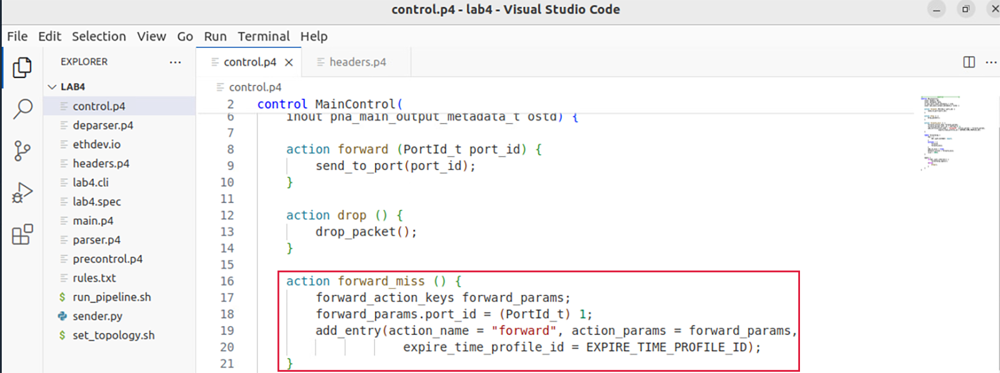

**Figure 34:** Defining the ``forward_miss`` action.

The action ``forward_miss`` does not accept any input parameters from the control
plane. This action is executed when no match is found among the entries in the table. 
Therefore, an entry is added to the table.

First, we are including the ``forward_action_keys`` structure and labeling it as 
forward_params. Then, we set the port field to be equal to 1 by casting it to the 8-bit 
representation typedef PortId_t.

The ``add_entry`` function adds the entry to the table by grabbing the key based on which 
we are matching in the table from the processed packet. In this lab, we are matching against 
the IPv4 destination address. Therefore, the key would be the IPv4 destination address of the 
packet received. The add entry function associated the added key with an action specified as 
``action_name``. In this application, all added entries will be associated with the forward 
action defined earlier in this lab. The forward action takes the port ID as a parameter. 
Therefore, the input parameter (action data) is passed to the add_entry function by setting 
the ``action_params`` equal to the defined structure forward_params. Finally, the 
``expire_time_profile_id`` is set equal to the EXPIRE_TIME_PROFILE_ID constant defined earlier.

**Step 8.** In the forwarding table actions, we will substitute the ``drop`` action with the 
``forward_miss`` action::

    Forward_miss;

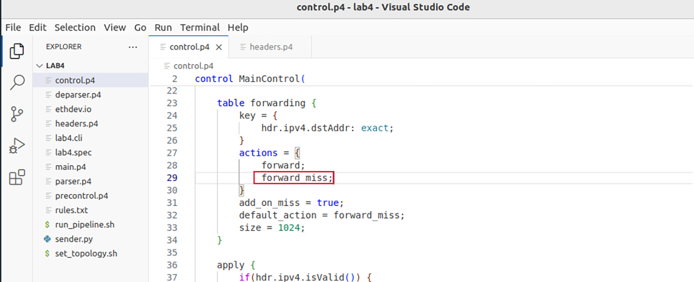

**Figure 35:** Adding the ``forward_miss`` action.

**Step 9.** Add the following code inside the forwarding table::

    add_on_miss = true;
    default_action = forward_miss;

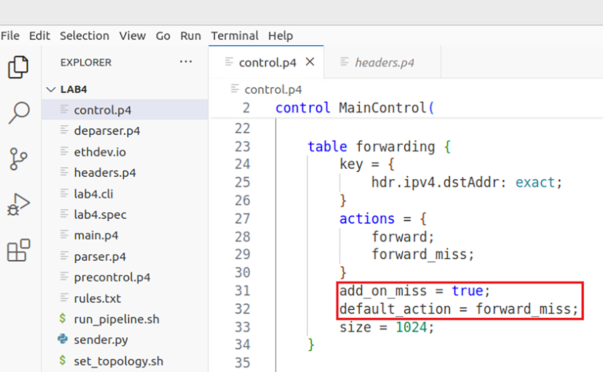

**Figure 36:** Enabling the ``add_on_miss`` feature.

The ``add_on_miss`` parameter is set to true to enable the feature. We also set the forward_miss as 
the default action.

.. note:: 
    Note that the ``add_on_miss`` feature can only be enabled with a table that applies exact matching 
    and that the default action must call the action that contains the ``add_entry``function. 

**Step 10.** Save the changes to the file by pressing ``Ctrl + s``.

**Step 11.** To compile the P4 program, issue the following command 
in the terminal panel inside VS Code::

    p4c-dpdk --arch pna main.p4 -o lab4.spec

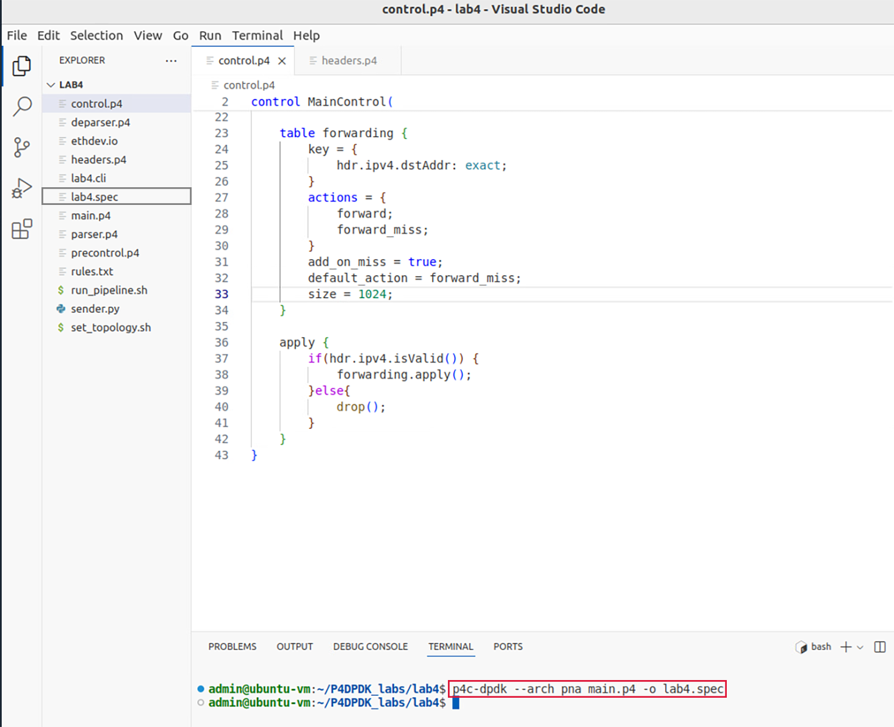

**Figure 37:** Compiling the P4 program using the VS Code terminal.

The command above invokes the p4c-dpdk compiler to compile the lab4.p4 program and generates the lab4.spec 
file (highlighted in the grey box) which is a specification file needed to run the pipeline. Note that now 
the lab4.spec file previously generated is overwritten.

Running the P4-DPDK pipeline and building the topology
~~~~~~~~~~~~~~~~~~~~~~~~~~~~~~~~~~~~~~~~~~~~~~~~~~~~~~

Now that all the required scripts are prepared, we can run the pipeline.

**Step 1.** Click on the terminal tab in the start bar to maximize the window.

.. image:: images/38.png

**Figure 38:** Maximizing Linux terminal window.

Step 2. Run the pipeline by typing the following command::

    ./run_pipeline.sh

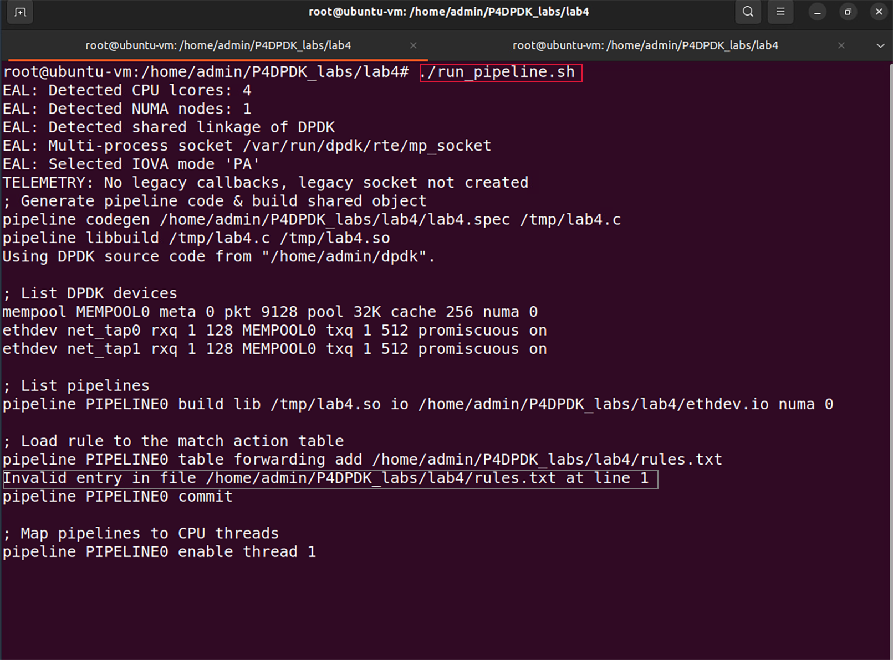

**Figure 39:** Running P4-DPDK pipeline.

The run_pipeline.sh script is a shell script that automates the process of running the P4-DPDK pipeline. 

.. note:: 
    Note that in the grey box, we have an Invalid entry error. When add_on_miss is enabled, the p4c-dpdk compiler
    translates the defined table in the P4 code to a learner in the .spec file. Therefore, forwarding is no longer 
    a table. This results in an error when the rules are added to a table named forwarding. 

**Step 3.** Switch to the separate terminal tab. 

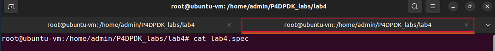

**Figure 40:** Switching to a separate terminal.

**Step 4.** Inspect the .spec file to see the expiration time profiles in P4-DPDK by typing the following P4 command::

    cat lab4.spec

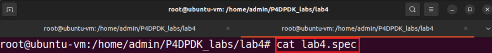

**Figure 41:** Inspecting lab4.spec file.

Scroll up the see the forwarding learner table properties.

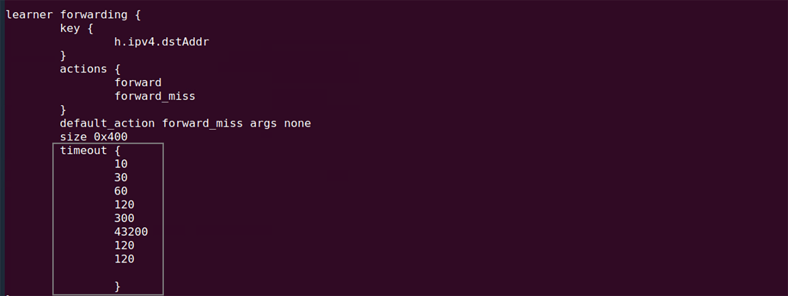

**Figure 42:** Timeout profiles in lab4.spec file.

Note that there are 8 different expiration time profiles that we can choose from. In this lab, we selected the expiration 
time profile with profile ID 1 as declared in the constant ``EXPIRE_TIME_PROFILE_ID`` in the headers.p4 script earlier in 
this lab. Therefore, the expiration time profile with profile ID 4 corresponds to 300 seconds.

**Step 5.** Build the lab topology by typing the following command::

    ./set_topology.sh

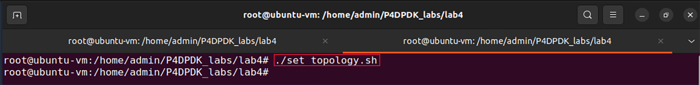

**Figure 43:** Setting the lab topology.

The set_topology.sh script is a shell script that automates the process of building the lab topology. Two namespaces are 
built and configured in this step with a virtual device linked to each.

