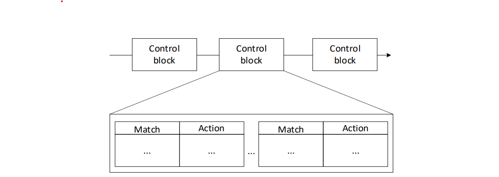
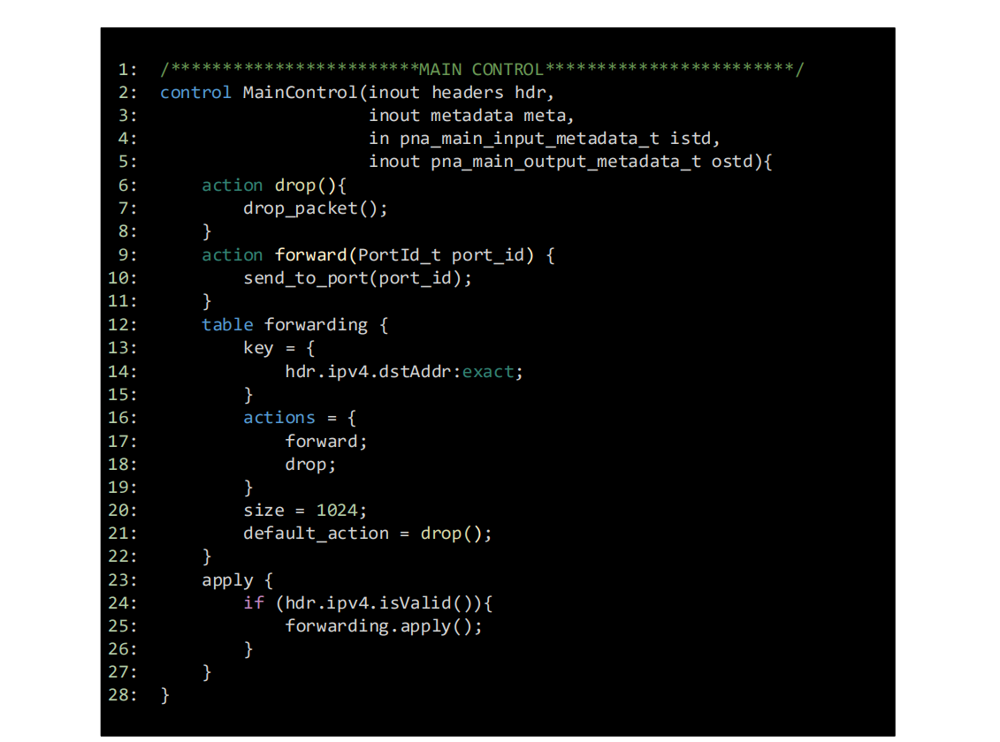

Introduction to control blocks
==============================

P4-DPDK supports the PNA architecture which consists of the parser, the pre-control, 
the main control, and the deparser. The Main Control block is essential for processing 
a packet. It is where the code would be written for the packet processing logic. It 
aims to transform headers, update stateful elements like counters, meters, and registers, 
and optionally associate additional user-defined metadata with the packet `[1] <references.html>`_ `[2] <references.html>`_. For example, 
a control block for layer-3 forwarding may require a forwarding table that is indexed by the 
destination IP address. The control block may include actions to forward a packet when a hit 
occurs, and to drop the packet otherwise. Figure 1 shows the basic structure of a control block.

**Figure 1:** Control blocks.

Tables
~~~~~~

Tables are essential components that define the processing behavior of a packet inside the switch. 
A table is specified in the P4 program and has one or more entries (rows) that are populated by the 
control plane. An entry contains a key, an action, and action data.  
*	Key: it is used for lookup operations. A key is built for the incoming packet using one or more 
    header fields (e.g., destination IP address) or metadata (e.g., ingress port ID, egress port ID) 
    and then looks up that value in the table.  
*	Action: once a match occurs, the action specified in the entry is performed by the arithmetic logic 
    unit. Actions are simple operations such as modifying a header field, forwarding the packet to an 
    egress port, and dropping the packet. The P4 program contains the possible actions.  
*	Action data: it can be considered as parameter/s used along with the action. For example, the action 
    data may represent the port number the switch must use to forward the packet. The action data is 
    populated by the control plane.

Match Types
~~~~~~~~~~~

There are three types of matching: exact match, Longest Prefix match (LPM), and ternary match. They are 
defined in the standard library (core.p4 `[3] <references.html>`_). Note that architectures may define and implement additional 
match types. For example, the PNA `[1] <references.html>`_ `[4] <references.html>`_ also has matching based on ranges and selectors. In this lab, we will 
discuss exact matching.

Exact match
~~~~~~~~~~~

Assume that the exact match lookup is used to search for a specific value of an entry in a table. Assume 
that Table 2 matches on the destination IP address. If an incoming packet has 10.0.0.2 as the destination 
IP address, then it will match against the second entry and the P4 program will forward the packet using 
port 1 as the egress port of the pipeline.

Table 1 contains the credentials of the virtual machine used for this lab. 

.. table:: Table 2: Exact match table
   :align: center
   
   ========  =============  ==============  
   Key       Action         Action data  
   ========  =============  ==============
   10.0.0.1  forward        port 0        
   ========  =============  ==============
   10.0.0.2  forward        port 1
   ========  =============  ==============
   default   drop
   ========  =============  ==============

   Figure 2 shows the main control block portion of a P4 program. Two actions are defined, ``drop`` and ``forward``. 
   The ``drop`` action (lines 6 - 8) invokes the ``drop_packet`` function, causing the packet to be dropped. The 
   ``forward`` action (lines 9 - 11) accepts as input (i.e., action data) the destination port. This parameter 
   is inserted by the control plane and updated in the packet during the ingress processing. In line 10, the 
   P4 program assigns the egress port defined by the control plane as an input to the ``send_to_port`` extern function. 
   It is used to direct a packet to a specified network port. Lines 12-22 implement a table named ``forwarding``. 
   The match is against the destination IP address using the exact lookup method. The actions associated with 
   the table are forward and drop. The default action which is invoked when there is a miss is the drop action. 
   The maximum number of entries a table can support is configured manually by the programmer (i.e., 1024 entries, 
   see line 20). Note, however, that the number of entries is limited by the amount of memory in the switch. The 
   control block starts executing from the apply statement (see lines 23-28) which contains the control logic. In 
   this program, the ``forwarding`` table is enabled when the incoming packet has a valid IPv4 header. Otherwise, the 
   packet is dropped.

**Figure 2:** Main control block portion of a P4 program. The code implements a match-action table with exact match lookup.

Add_on_miss capability
~~~~~~~~~~~~~~~~~~~~~~

The add_on_miss `[1] <references.html>`_ table property is uniquely compatible with the P4 PNA. This feature helps by adding rules to a table 
whenever a match is not found without the control plane’s contribution. Note that this feature is only applicable with 
exact matching. The add_on_miss parameter takes a boolean value. If set to true, the default action executed adds an 
entry to the table when a match is not found. Therefore, the new table entry will be a successful match when the next 
packet is processed.  