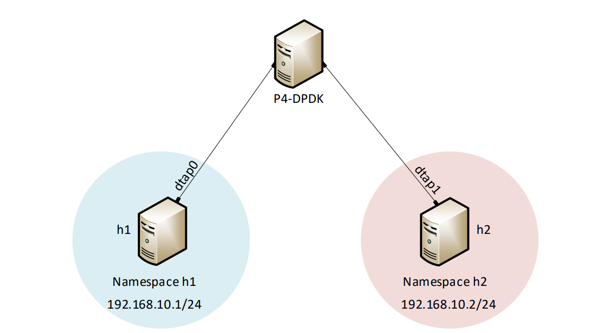

Lab Topology
============

Consider Figure 3. Two network namespaces, h1 and h2, are linked to the running P4-DPDK 
pipeline, enabling connectivity between two namespaces. The network environments of hosts
 h1 and h2 are isolated from each other and the root namespace.

**Figure 3:** Lab topology

Lab settings
~~~~~~~~~~~~

The hosts should be configured according to Table 3.

.. table:: Table 3: Topology information
   :align: center
   
   ========  =============  ==============  ==========
   **Host**  **Interface**  **IP Address**  **Subnet**
   ========  =============  ==============  ==========
   h1        dtap0          192.168.10.1    /24        
   ========  =============  ==============  ==========
   h2        dtap1          192.168.10.2    /24
   ========  =============  ==============  ==========