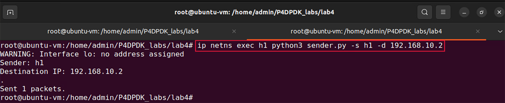
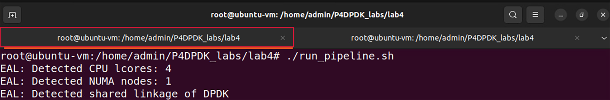
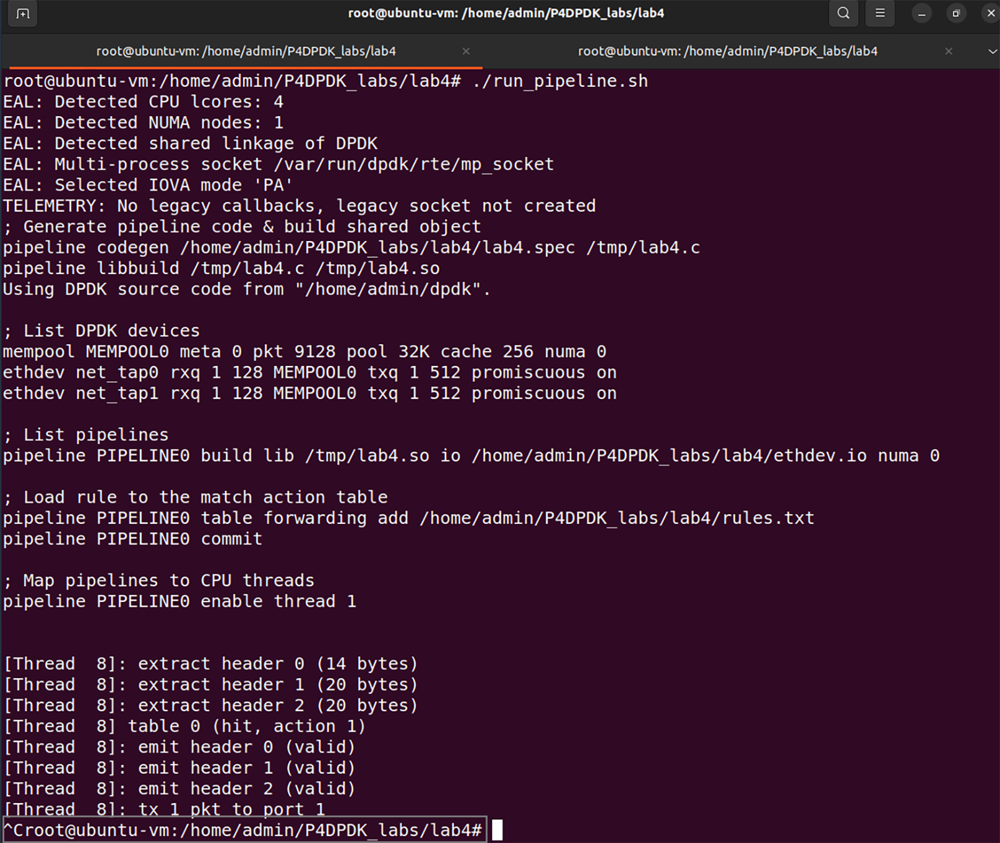

Testing Exact Matching
======================

**Step 1.** To test exact matching, we will send a packet with an ethernet, IPv4, and TCP header 
from h1 to h2 over the destination IP address 192.168.10.2 by running the provided Python script 
sender.py::

    ip netns exec h1 python3 sender.py -s h1 -d 192.168.10.2

**Figure 25:** Sending a packet from h1 to h2.

Running the Python script requires two parameters:

•	``-s``: Sender (h1 or h2)
•	``-d``: Destination IP Address

**Step 2**. Switch back to the terminal tab in which the DPDK pipeline is running to observe the result.

**Figure 26:** Switch back to the DPDK pipeline terminal.

.. note:: 
    Observe the DPDK logs at the bottom of the terminal. These logs correspond to the packet processing 
    function executed in the .spec file generated when the P4 code is compiled. 

**Figure 27:** Logs corresponding to the packet sent.

The log highlighted in the first grey box corresponds to the match found in the match-action table with 
table ID 0 which is the forwarding table. Since there is a match, the forwarding action with action ID 1 
is executed. The “tx 1 pkt to port 1” log indicated that the forwarding action is properly executed by 
sending one packet to port 1 which corresponds to host 2.

**Step 3.** Stop the DPDK pipeline by pressing ``ctrl+c``. 

**Figure 28:** Stopping the DPDK pipeline.

