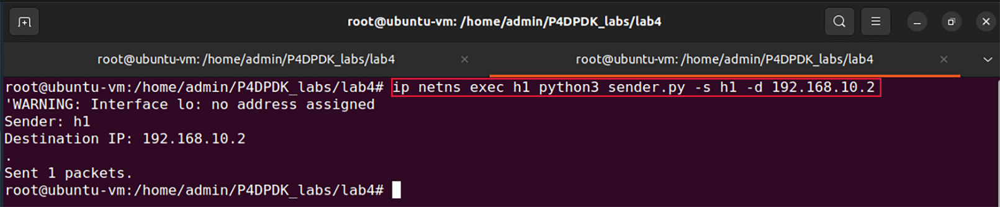
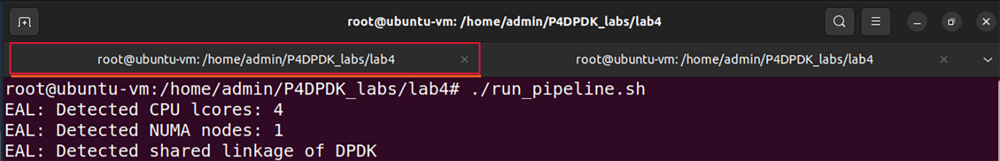
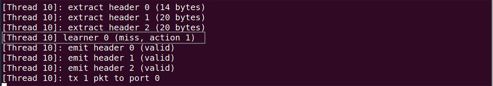
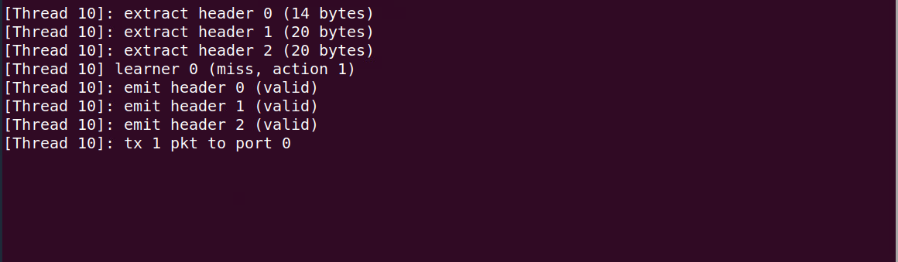
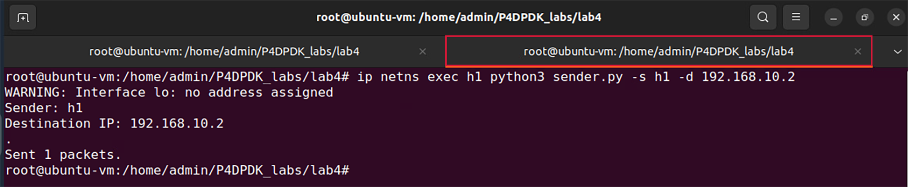
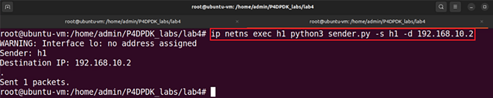
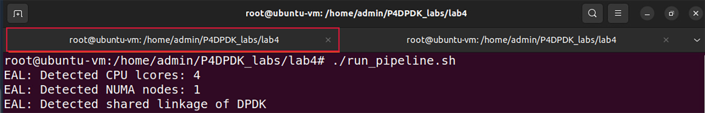
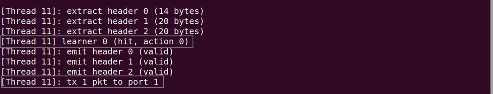
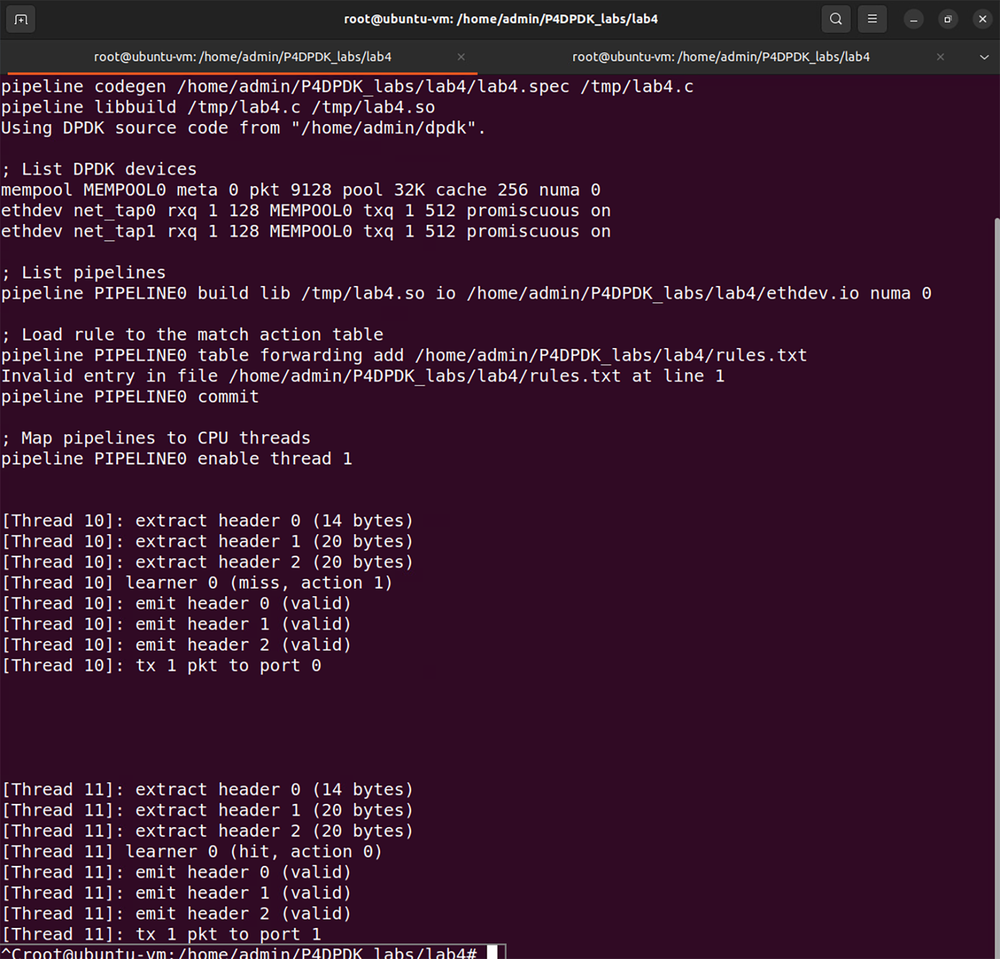

Testing Exact Matching With add-on-miss Enabled
===============================================

**Step 1.** To test exact matching with add-on-miss, we will send a packet with an ethernet, 
IPv4, and TCP header from h1 to h2 over the destination IP address 192.168.10.2 by running the 
provided Python script sender.p::

    ip netns exec h1 python3 sender.py -s h1 -d 192.168.10.2

**Figure 44:** Sending a packet from h1 to h2.

**Step 2.** Switch back to the terminal tab in which the DPDK pipeline is running to observe the 
result.

**Figure 45:** Switch back to the DPDK pipeline terminal.

.. note::

    Observe the DPDK logs at the bottom of the terminal. These logs correspond to the packet 
    processing function executed in the .spec file generated when the P4 code is compiled. 

**Figure 46:** Logs corresponding to the packet sent.

The log highlighted in the first grey box indicates that no match was found in the learner table. 
Therefore, the forwarding_miss action with action ID 1 is executed and an entry is added now to 
the table.

**Step 3.** For a more readable output press enter in the terminal a few times (five times).

**Figure 47:** Logs corresponding to the packet sent.

**Step 4.** Switch back to the terminal tab in which we run the Python command.

**Figure 48:** Switch back to a separate terminal tab.

**Step 5.** Now that an entry is added, we will re-send a packet with an ethernet, IPv4, and TCP 
header from h1 to h2 over the destination IP address 192.168.10.2 by running the provided Python 
script sender.py::

    ip netns exec h1 python3 sender.py -s h1 -d 192.168.10.2

**Figure 49:** Sending a packet from h1 to h2.

**Step 6.** Switch back to the terminal tab in which the DPDK pipeline is running to observe the result.

**Figure 50:** Switch back to the DPDK pipeline terminal.

Observe the DPDK logs at the bottom of the terminal. 

**Figure 51:** Logs corresponding to the packet sent.

The log highlighted in the first grey box corresponds to the match found in the learner table with table 
ID 0. This is due to the added entry. Now that a match has been found, the forward action with action ID 
0 is executed. The “tx 1 pkt to port 1” log indicated that the forwarding action is properly executed by 
sending one packet to port 1 as assigned in the forward_miss action.

**Step 7.** Stop the DPDK pipeline by pressing ``ctrl+c``. 

**Figure 52:** Stopping the DPDK pipeline.

This concludes Lab 4. You can now end your reservation.
