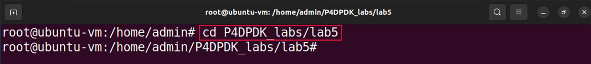
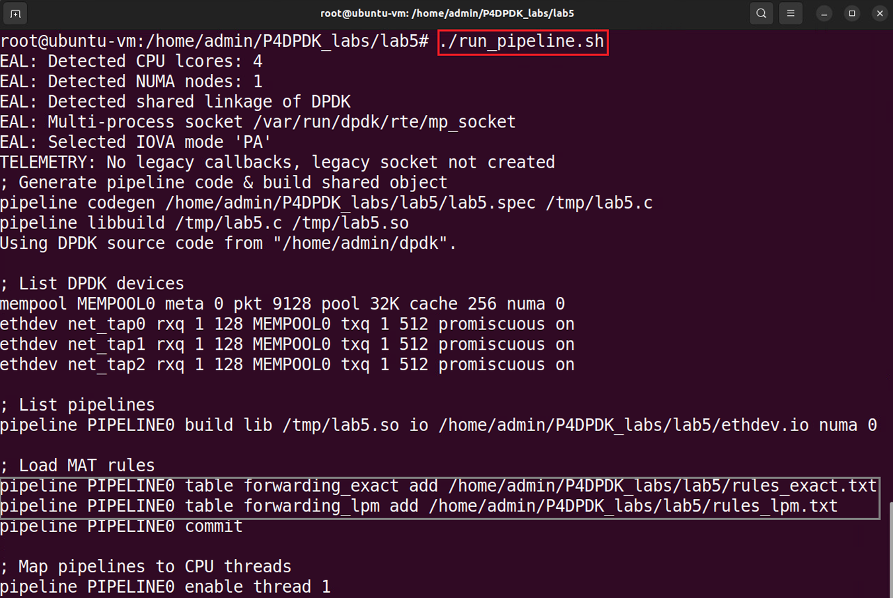
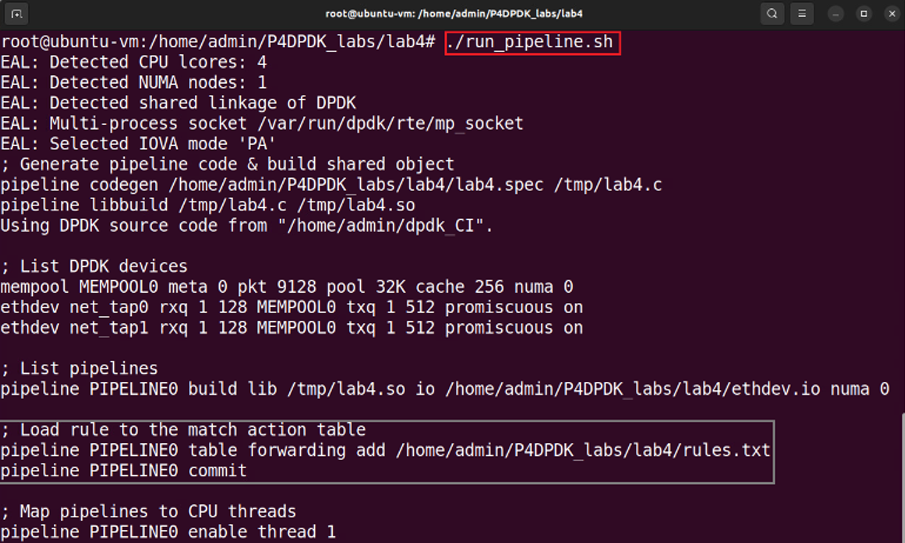
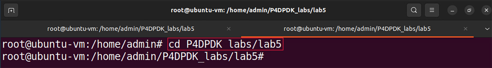
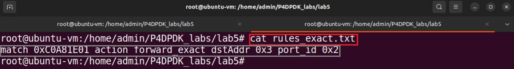
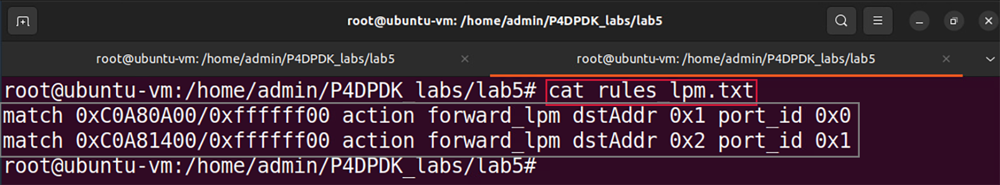
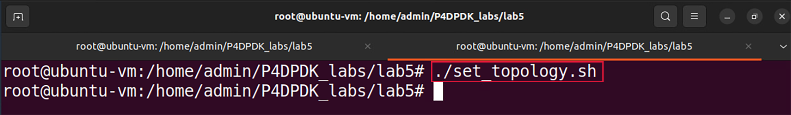

Building the P4-DPDK pipeline and the lab topology
==================================================

This section shows the steps required to run the P4-DPDK along with 
building the lab topology. The step-by-step procedure is explained 
in detail in a previous lab. In this lab, the procedure is automated.

Running the P4-DPDK pipeline 
~~~~~~~~~~~~~~~~~~~~~~~~~~~~

Now that all the required scripts are prepared, we can run the pipeline.

**Step 1.** Click on the terminal tab in the start bar to maximize the 
window.

 .. image:: images/14.png
    
**Figure 14:**  Maximizing Linux terminal window.

**Step 2.** Issue the command ``sudo su`` on the terminal to enter
root mode. When prompted for a password, type ``password`` and hit 
enter. Note that the password will not be visible as you type it::

    sudo su

.. image:: images/15.png

**Figure 15:** Entering root mode.

**Step 3:** Navigate to the *lab5* directory using the ``cd`` command::
  
    cd P4DPDK_labs/lab5  

**Figure 16:** Navigating to the lab5 directory.

**Step 4:** Run the pipeline by typing the following command::

    ./run_pipeline.sh

**Figure 17.** Running P4-DPDK pipeline.

The run_pipeline.sh script is a shell script that automates the process 
of running the P4-DPDK pipeline. 

.. note::
    Note that in the grey box, two rule files were loaded to add rules 
    to the corresponding table. The *rules_exact.txt* file contains 
    rules for exact matching and the *rules_lpm.txt* file contains rules 
    for LPM.

Inspecting table entries
~~~~~~~~~~~~~~~~~~~~~~~~

**Step 1.** Click on the new tab button at the top left of the terminal 
while running the pipeline.

 .. image:: images/18.png

**Figure 18:** Opening a new terminal in a new tab.

**Step 2.** Issue the command ``sudo su`` on the terminal to enter root 
mode. When prompted for a password, type ``password`` and hit enter. 
Note that the password will not be visible as you type it::

    sudo su

**Figure 19.** Entering root mode.

**Step 3.** Navigate to the *lab5* directory using the ``cd`` command::

    cd P4DPDK_labs/lab5  

 
**Figure 20:** Navigating to the lab5 directory.

**Step 4.**  To inspect the entries loaded to the *forwarding_exact* 
match-action table, we will enter the following command::

    cat rules_exact.txt

 
**Figure 21:** Inspecting the *rules_exact.txt* file.

The grey box shows the entry loaded to the forwarding_exact match 
action table. The entry consists of three components.

•	``match <key>``: The key based on which a match is found or not. 
    The key is 192.168.30.1 (0xC0A81e01 in hexadecimal) which is the 
    IP address of host 3.
•	``action <action name>``: The action to be executed if there is 
    a match. If a match is found the action to be executed is the 
    *forward_exact* action declared in the *control.p4* code which 
    was written earlier in this lab. 
•	The last item is the action data. In this case, the action data 
    are the destination MAC address and egress port ID. Therefore, 
    if a match is found with this entry, the packet is forwarded to
    host 3 through port 2 (0x2 in hexadecimal), and the destination 
    MAC address is 00:00:00:00:00:03 (0x3 in hexadecimal).

**Step 5.**To inspect the entries loaded to the *forwarding_lpm* 
match-action table, we will enter the following command::

    cat rules_lpm.txt

 
**Figure 22:** Inspecting the *rules_lpm.txt* file.

The grey box shows the entries loaded to the *forwarding_lpm* match 
action table. Each entry consists of four components.

•	``match <key>``: The key based on which a match is found or not. 
    In the first entry, the key is 192.168.10.0/24 (0xC0A80A00/ffffff00 
    in hexadecimal) which is the IP address and netmask of host 1. The 
    match key of the second entry is 192.168.20.0/24 (0xC0A81400/ffffff00 
    in hexadecimal) which is the IP address and netmask of host 2.
•	``action <action name>``: The action to be executed if there is a match. 
    If a match is found the action to be executed for both entries 
    is the *forward_lpm* action declared in the *control.p4* code which 
    was written earlier in this lab. 
•	The last item is the action data. In this case, the action data 
    are the destination MAC address and egress port ID. Therefore, if 
    a match is found with the first entry, the packet is forwarded to 
    host 1 through port 0 (0x0 in hexadecimal) and the destination MAC 
    address is 00:00:00:00:00:01 (0x1 in hexadecimal). Whereas, if a match 
    is found with the second entry, the packet is forwarded to host 2 
    through port 1 (0x1 in hexadecimal) and the destination MAC address is 
    00:00:00:00:00:02 (0x2 in hexadecimal).

Building the lab topology
~~~~~~~~~~~~~~~~~~~~~~~~~

**Step 1.** Build the lab topology by typing the following command. 

    ./set_topology.sh

**Figure 23:** Setting the lab topology.

The *set_topology.sh* script is a shell script that automates the process 
of building the lab topology. Three namespaces are built and configured 
in this step with a virtual device linked to each.

