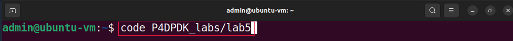
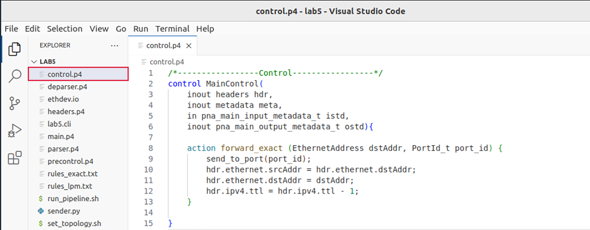
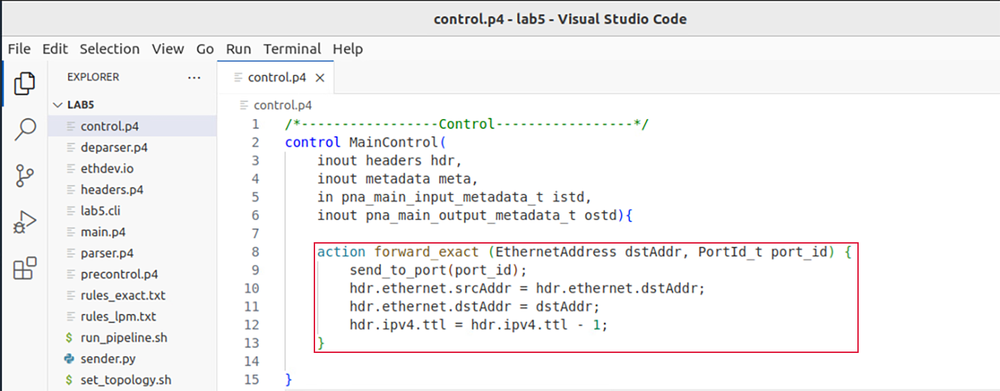
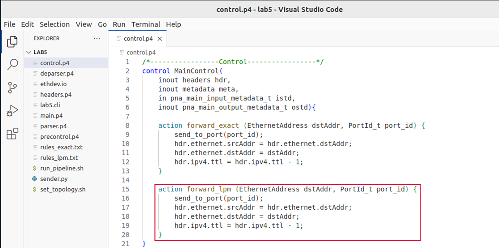
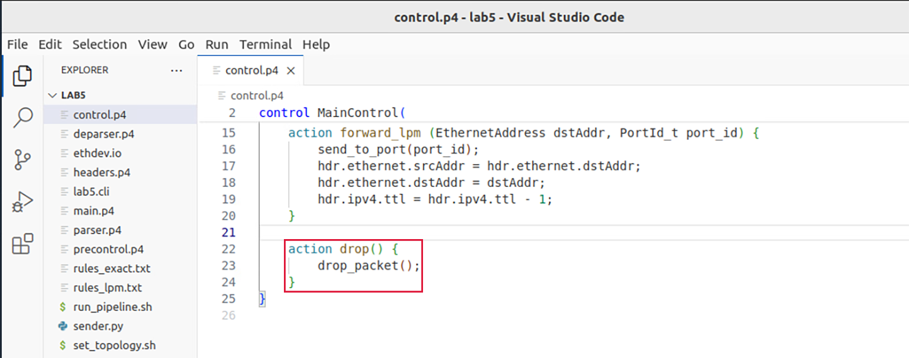
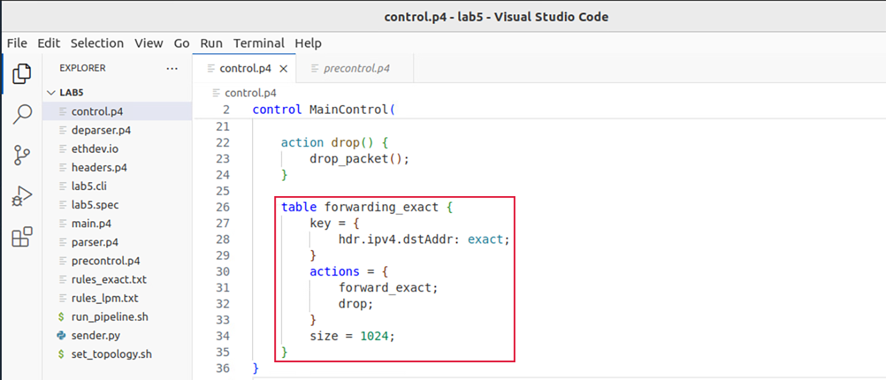
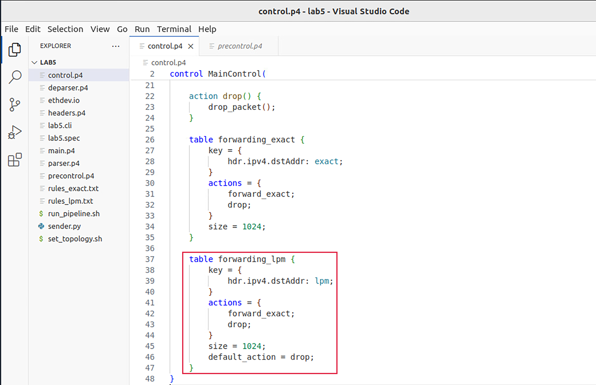
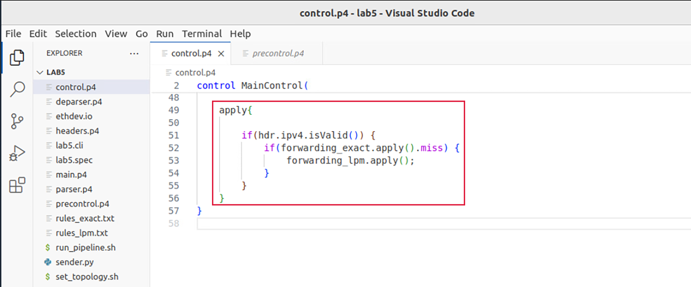
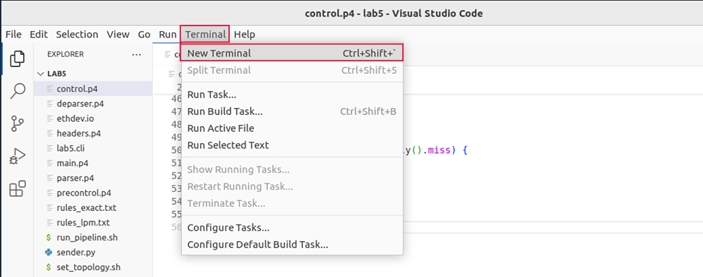
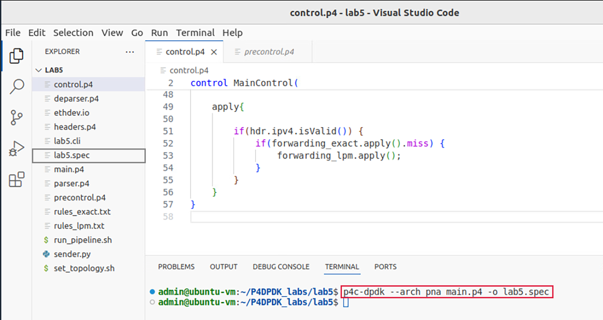

Defining tables with exact matching and LPM lookups
===================================================

This section demonstrates how to implement a simple table in P4 that uses exact 
matching on the destination IP address of the packet. When there is a match, the 
packet is forwarded from a certain port. If no match is found, LPM is applied to 
the packet’s destination IP address. If a match is found, the packet is forwarded 
from a certain port. Otherwise, the packet is dropped.

VS Code will be used as the editor to write and inspect the codes. It highlights 
the syntax of P4 and provides an integrated terminal where the P4 compiler will be 
invoked. The P4 compiler that will be used is p4c-dpdk, which transforms the P4 code 
into the specifications file to be executed next into the DPDK pipeline.

Loading the programming environment
~~~~~~~~~~~~~~~~~~~~~~~~~~~~~~~~~~~

**Step 1.** Launch a Linux terminal by clicking on the Linux terminal icon in the 
taskbar.

.. image:: images/3.png

**Figure 3:** Linux terminal icon

The Linux terminal is a program that opens a window and permits you to interact 
with a command-line interface (CLI). A CLI is a program that takes commands from 
the keyboard and sends them to the operating system for execution. 

**Step 2.** In the terminal, type the command below. This command launches the 
VS Code and opens the directory where the P4 program for this lab is located::

    code P4DPDK_labs/lab5 

**Figure 4:** Loading VS Code in the lab5 directory

Programming the control block
~~~~~~~~~~~~~~~~~~~~~~~~~~~~~

**Step 1.** Click on the *control.p4* file to display the contents of the file. Use 
the file explorer on the left-hand side of the screen to locate the file.

**Figure 5:** Inspecting the *control.p4* file

We can see that the *control.p4* declares a control block named *MainControl*. 
Note that the body of the control block is empty. Our objective is to define P4 
tables and their actions, and then invoke them inside the block.

**Step 2.** Now we will define the behavior of the ``forward_exact`` action. 
Insert the code below inside the *MainControl* control block::

    action forward_exact (EthernetAddress dstAddr, PortId_t port_id) {
        send_to_port(port_id);
        hdr.ethernet.srcAddr = hdr.ethernet.dstAddr;
        hdr.ethernet.dstAddr = dstAddr;
        hdr.ipv4.ttl = hdr.ipv4.ttl - 1;
    }

**Figure 6:** Defining the ``forward_exact`` action.

The action ``forward_exact`` accepts as parameters the next hop’s MAC address 
(i.e., ``EthernetAddress dstAddr``) and the port number (``PortId_t port_id``) 
to be used by the pipeline to forward the packet. Note that ``EthernetAddress`` 
is a typedef that corresponds to ``bit<48>`` defined in the *headers.p4* file. 

The ``send_to_port`` is a function that takes the port number as an input. Therefore,
when the forward action is executed, the packet will be sent out of the port number 
specified as a parameter.

To modify header fields inside the packet, we refer to the field name based on 
where it exists inside the headers. Recall that the names of the headers and the 
fields are defined by the programmer. The file *headers.p4* defines the program’s 
headers. Line 10 shows how we are assigning the destination MAC address of the 
packet (i.e., ``hdr.ethernet.dstAddr``) to be the new source MAC of the packet 
(i.e., ``hdr.ethernet.srcAddr``). Line 11 shows how we are assigning the destination
MAC address which is provided as a parameter (assigned later in the control plane) 
to be the new destination MAC of the packet. 

It is possible in P4 to perform basic arithmetic operations on header fields and 
other variables. In line 12, we are decrementing the TTL value of the header field.

**Step 3.** Similarly, we will define the behavior of the ``forward_lpm`` action. I
nsert the code below inside the *MainControl* control block::

    action forward_lpm (EthernetAddress dstAddr, PortId_t port) {
        send_to_port(port_id);
        hdr.ethernet.srcAddr = hdr.ethernet.dstAddr;
        hdr.ethernet.dstAddr = dstAddr;
        hdr.ipv4.ttl = hdr.ipv4.ttl - 1;
    }

**Figure 7:** Defining the ``forward_lpm`` action.

.. note::
    Note that the P4-DPDK compiler matches each action to one table. In this 
    application, we will need two tables, one for exact matching and the other 
    for LPM. Therefore, a forwarding action is needed for each (*forward_exact* 
    and *forward_lpm*)

**Step 4.** Now we will define the drop action. Insert the code below inside the 
MainControl control block::

     action drop() {
        drop_packet();
    }

**Figure 8:** Defining the ``drop`` action.

The ``drop()`` action invokes a primitive action ``drop_packet()`` that causes 
the packet to be dropped.

**Step 5.** Now we will define the table named ``forwarding_exact``. Write the 
following piece of code inside the body of the *MainControl* control block::

    table forwarding_exact {
        key = {
            hdr.ipv4.dstAddr: exact;
        }
        actions = {
            forward_exact;
        }
        size = 1024;
    }

**Figure 9:** Declaring the ``forwarding_exact`` table.

The inserted code specifies that the destination IPv4 address of a packet (hdr.ipv4.
dstAddr)will be used as a key in the forwarding_exact table. Note that the match 
type is exact, denoting that the value of the destination IP address will be matched 
as is against a value specified later in the control plane. The defined possible action 
is the forward_exact action. Finally, the size keyword specifies the maximum number of 
entries that can be inserted into this table from the control plane.

**Step 6.** Now we will define a table that performs an LPM on the destination IP 
address of the packet. The table will be invoking the forward and the drop actions, 
and hence,those actions will be listed inside the table definition.::

    table forwarding_lpm {
        key = {
            hdr.ipv4.dstAddr: lpm;
        }
        actions = {
            forward_lpm;
            drop;
        }
        size = 1024;
        default_action = drop();
    }

**Figure 10:** Adding the actions to the ``forwarding_lpm`` table.

The inserted code specifies that the destination IPv4 address of a packet (``hdr.ipv4.
dstAddr``) will be used as a key in the ``forwarding_lpm`` table. Note that the match 
type is ``lpm``, denoting that the value of the destination IP address will be matched 
based on the LPM algorithm. The defined possible actions are the ``forward_lpm`` and 
the ``drop`` actions. The ``size`` keyword specifies the maximum number of entries that 
can be inserted into this table from the control plane. Finally, the default action that 
is invoked when there is a miss is ``drop`` action.

**Step 7.** Add the following code at the end of the *main control* block. The ``apply`` 
block defines the sequential flow of packet processing. It is required in every control 
block, otherwise the program will not compile. It describes the sequence of tables to be 
invoked, in addition to other packet processing instructions::

    apply {
        if(hdr.ipv4.isValid()) {
            if(forwarding_exact.apply().miss) {
                forwarding_lpm.apply();
            }
        }
    }

**Figure 11:** Defining the ``apply`` block.

The logic of the code above is as follows: if the packet has an IPv4 header, apply the 
``forwarding_exact`` table which performs an exact match lookup on the destination IP 
address. If there is no *hit* (i.e., the table does not contain a rule that corresponds 
to this IPv4 address, denoted by the *miss* keyword), apply the ``forwarding_lpm`` table, 
which matches thedestination IP address of the packet against a network address. At this 
stage, if no match is found by the LPM algorithm, the packet is dropped when the default 
action in the LPM table is invoked. 

**Step 8.** Save the changes to the file by pressing ``Ctrl + s``.

Compiling the P4 program
~~~~~~~~~~~~~~~~~~~~~~~~

**Step 1.** Open a new terminal in VS Code by clicking on *Terminal* in the menu bar 
and then *New Terminal* in the drop-down menu.

**Figure 12:** Opening a new VS Code terminal.

**Step 2.** To compile the P4 program, issue the following command in the terminal 
panel inside VS Code::

    p4c-dpdk --arch pna main.p4 -o lab5.spec

**Figure 13:** Compiling the P4 program using the VS Code terminal.

The command above invokes the *p4c-dpdk* compiler to compile the *lab5.p4* program 
and generates the *lab5.spec* file (highlighted in the grey box) which is a specification 
file needed to run the pipeline.