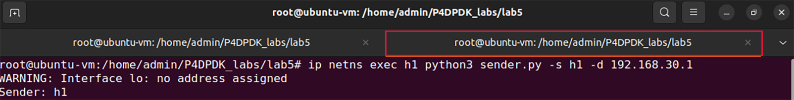

Testing the application
=======================

Testing exact matching
~~~~~~~~~~~~~~~~~~~~~~

**Step 1.** To test exact matching, we will send a packet 
with an ethernet, IPv4, and TCP header from h1 to h3 over 
the destination IP address 192.168.30.1 by running the 
provided Python script *sender.py*::

    ip netns exec h1 python3 sender.py -s h1 -d 192.168.30.1

**Figure 24:**  Sending a packet from h1 to h3.

Running the Python script requires two parameters:

*	``-s``: Sender (h1 or h2 or h3)
*	``-d``: Destination IP Address

**Step 2.** Switch back to the terminal tab in which the 
DPDK pipeline is running to observe the result.

 .. image:: images/25.png

**Figure 25:**  Switch back to the DPDK pipeline terminal.

.. note::
    Observe the DPDK logs at the bottom of the terminal. 
    These logs correspond to the packet processing function 
    executed in the .spec file generated when the P4 code is 
    compiled. 

**Figure 26:**  Logs corresponding to the packet sent.

The log highlighted in the first grey box corresponds to 
the match found in the match-action table with table ID 0 
which indicates that an exact match is found. Since there 
is a match the *forward_exact* action with action ID 1 is
executed. 

The second grey box shows that two move functions and one 
arithmetic operation are done to flip the source and 
destination MAC addresses and decrease the TTL as specified
in the *forward_exact* action in the *control.p4* script.

The “tx 1 pkt to port 2” log in the third grey box indicates 
that the forwarding action is properly executed by sending one 
packet to port 2 which corresponds to host 3.

**Step 3.** For a more readable output press enter in the 
terminal a few times (five times).

**Figure 27:** Providing space in the terminal.

**Step 4.**Switch back to the terminal tab in which the Python 
script was executed.

**Figure 28:** Switching back to the Python terminal.

Testing default action when no match is found
~~~~~~~~~~~~~~~~~~~~~~~~~~~~~~~~~~~~~~~~~~~~~

**Step 1.** Now, we will send a packet with an ethernet, IPv4, 
and TCP header from h1 to h3 over the destination IP address 
192.168.30.3 by running the provided Python script *sender.py*::

    ip netns exec h1 python3 sender.py -s h1 -d 192.168.30.3
 

**Figure 29:**  Sending a packet from h1 to h3.

**Step 2.** Switch back to the terminal tab in which the DPDK 
pipeline is running to observe the result.

**Figure 30:** Switch back to the DPDK pipeline terminal.

Observe the DPDK logs at the bottom of the terminal.

**Figure 31:** Logs corresponding to the packet sent.

The log highlighted in the first grey box corresponds to the 
table lookup. An exact match was not found in table 0 which 
corresponds to the *forwarding_exact* table. In this case, a 
table lookup will be performed in the second table named 
*forwarding_lmp* with a table ID of 1. A match was not found 
in the second table. Therefore, the default action (action 3) 
is executed, and the packet is dropped. The log in the second 
grey box indicates that one packet has been dropped.

**Step 3.**For a more readable output press enter in the terminal 
a few times (five times).

**Figure 32:** Providing space in the terminal.

**Step 4.** Switch back to the terminal tab in which the Python 
script was executed.

**Figure 33:** Switching back to the Python terminal.

Testing LPM
~~~~~~~~~~~

**Step 1.** To test the LPM table lookup, we will send a packet 
with an ethernet, IPv4, and TCP header from h1 to h2 over the 
destination IP address 192.168.20.3 by running the provided 
Python script *sender.py*::

    ip netns exec h1 python3 sender.py -s h1 -d 192.168.20.3

**Figure 34:**  Sending a packet from h1 to h2.

None of the rules uploaded include matching on the IP address 
192.168.20.3. Therefore, the LPM rules are applied to match the 
IP address to the longest prefix which is in this case 192.168.20.0.

**Step 2.** Switch back to the terminal tab in which the DPDK 
pipeline is running to observe the result.

**Figure 35:** Switch back to the DPDK pipeline terminal.

Observe the DPDK logs at the bottom of the terminal.

**Figure 36:** Logs corresponding to the packet sent.

The log highlighted in the first grey box corresponds to the 
table lookup. An exact match was not found in table 0 which 
corresponds to the *forwarding_exact* table. In this case, a 
table lookup will be performed in the second table named 
forwarding_lmp with a table ID of 1. A match was found in the 
second table. Therefore, the *forward_lpm* (action 2) is 
executed.

The second grey box shows that two move functions and one 
arithmetic operation are done to flip the source and destination 
MAC addresses and decrease the TTL as specified in the *forward_lpm* 
action in the *control.p4* script.

The “tx 1 pkt to port 1” log in the third grey box indicates 
that the forwarding action is properly executed by sending one 
packet to port 1 which corresponds to host 2.

**Step 3.** Stop the DPDK pipeline by pressing ``ctrl+c``. 

    
**Figure 37:**  Stopping the DPDK pipeline.

This concludes Lab 5. You can now end your reservation.
