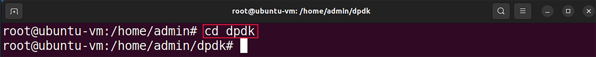
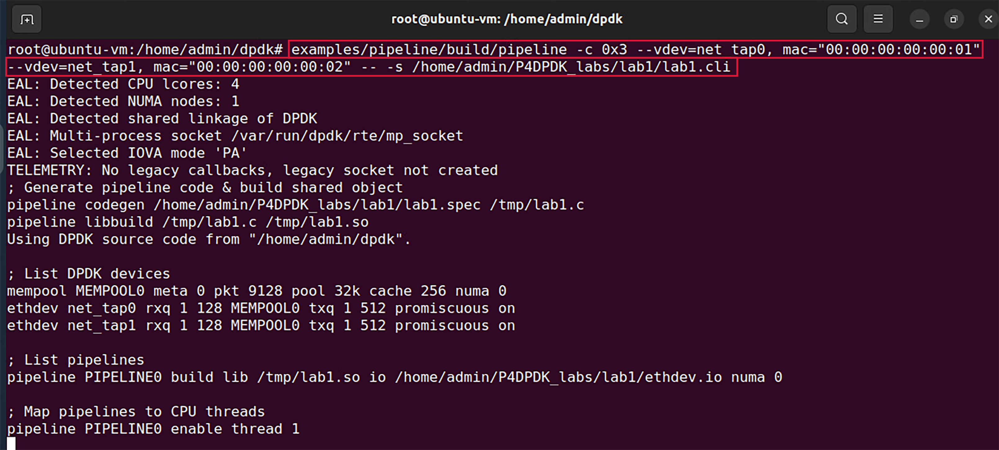

Implementing the P4 Dpdk Pipeline
=================================

This section shows the steps required to implement a P4-DPDK pipeline. It discusses the components 
needed for the process of compiling, building, and running the pipeline.

VS Code will be used as the editor to write and inspect the codes. It highlights the syntax of P4 
and provides an integrated terminal where the P4 compiler will be invoked. The P4 compiler that 
will be used is p4c-dpdk, which transforms the P4 code and executes it into a DPDK pipeline.

Loading the programming environment
+++++++++++++++++++++++++++++++++++

**Step 1.** Launch a Linux terminal by clicking on the Linux terminal icon in the taskbar.

.. image:: images/fig_6.png

**Figure 6:** Linux terminal icon.

The Linux terminal is a program that opens a window and permits you to interact with a command-line 
interface (CLI). A CLI is a program that takes commands from the keyboard and sends them to the 
operating system for execution.

**Step 2.** In the terminal, type the command below. This command launches the VS Code and opens the 
directory where the required files for this lab are located::

    code P4DPDK_labs/lab1

**Figure 7:** Launching the editor and opening the lab1 directory.

**Step 3.** Once the previous command is executed, VS Code will start. Click on lab1.p4 in the file 
explorer panel on the left-hand side to open the P4 program in the editor.

**Figure 8:** Opening the programming environment in VS Code.

The file explorer pamel contains all the files in the current directory. You will see all the files 
needed to compile, build, and run the P4-DPDK pipeline. *Lab1.p4* contains the P4 program which simply 
forwards packets received on one port to the other.

Compiling the P4 program
++++++++++++++++++++++++

**Step 1.** Open a new terminal in VS Code by clicking on Terminal in the menu bar and then New Terminal 
in the drop-down menu.

**Figure 9:** Opening a new VS Code terminal.

**Step 2.** In this lab, we will not modify the P4 code. Instead, we will just compile it using the p4c-dpdk 
compiler. To compile the P4 program, issue the following command in the terminal panel inside the VS Code::

    p4c-dpdk --arch pna lab1.p4 -o lab1.spec

**Figure 10:** Compiling the P4 program in VS Code terminal.

The command above invokes the p4c-dpdk compiler to compile the lab1.p4 program which is compatible with the 
PNA architecture as specified after the ``--arch`` flag. After executing the command, if there are no messages 
displayed in the terminal, then the P4 program was compiled successfully. We will see in the file explorer 
that the *lab1.spec* file (highlighted in the grey box) which is a specification file generated by the p4c-dpdk 
compiler in the current directory as specified after the ``-o`` flag.

Now that we have compiled the P4 program and generated the spec file, we can create the P4-DPDK pipeline.

Preparing the P4-DPDK CLI script
++++++++++++++++++++++++++++++++

Each P4-DPDK pipeline is built through the CLI script. In this subsection, we will write the CLI script in 
which the pipeline is created and built.

**Step 1.** Click on *lab1.cli* in the file explorer panel on the left-hand side to open the CLI script in 
the editor.

**Figure 11:** Inspecting the CLI script.

**Step 2.** We will start by generating the pipeline code and building the shared object. Write the following in 
the lab1.cli file::

    pipeline codegen /home/admin/P4DPDK_labs/lab1/lab1.spec /tmp/lab1.c

    pipeline libbuild /tmp/lab1.c /tmp/lab1.so

**Figure 12:** Generating the pipeline code and building the shared object.

In the figure above the codegen function (line 2) is used to generate the C code of the compiled user application 
in the spec file. This function takes two arguments, the path to the specification file compiled 
``/home/admin/P4DPDK_labs/lab1/lab1.spec`` and the generated code is placed in a temporary directory ``/tmp/lab1.c``.

The libbuild function (line 3) is used to generate a shared object to execute the application. This function takes 
two arguments, the path to the C code ``/tmp/lab1.c`` and the generated shared object is placed in a temporary 
``/tmp/lab1.so``.

**Step 3.** Now we will list the DPDK devices with customized parameters that match our setup. Write the following in 
the *lab1.cli* file::

    mempool MEMPOOL0 meta 0 pkt 9128 pool 32K cache 256 numa 0

    ethdev net_tap0 rxq 1 128 MEMPOOL0 txq 1 512 promiscuous on

    ethdev net_tap1 rxq 1 128 MEMPOOL0 txq 1 512 promiscuous on

**Figure 13:** listing DPDK devices.

The block of code in the figure above (lines 6-8) is used to create DPDK objects like a memory pool ``mempool`` and ``ethernet`` 
devices ethdev with parameters to setup each DPDK device. A memory pool *MEMPOOL0* is defined as follows:

* ``mempool``: create a memory pool object associated with a given name.
* ``meta``: specifies the private size of the memory buffer in bytes, which is the memory allocated for an application’s 
  private data.
* ``pkt``: Specifies the private size of the memory buffer in bytes, which is the memory allocated for an application to 
  store data associated with a packet.
* ``pool``: the size of the defined memory pool specified in bytes.
* ``cache``: the cache size in bytes which should be a power of 2.
* ``numa``: pinned NUMA node ID.

Two ethernet devices which are the interfaces linked to the pipeline, are also defined as *net_tap0* and *net_tap1* as follows:

* ethdev: ethernet device name (the attached devices net_tap0 and net_tap1 are virtual ethernet devices with their instances 
  created when the pipeline is invoked).
* rxq: receiving queue parameters (number of receiving queues, queue size (bytes), memory pool name).
* txq: transmitting queue parameters (number of transmitting queues, queue size (bytes)).
* promiscuous: A mode allows a network device to read each network packet that arrives (on / off).

.. note:: 

    It is important that the interface IDs net_tap0 and net_tap1 remain consistent as they will also be used in the I/O 
    specification file and as they will be created while running the pipeline. This is the notation considered by DPDK while 
    the operating system assigns different tags to the interfaces.

**Step 4.** Now we will list the P4-DPDK pipelines. Write the following in the *lab1.cli* file::

    pipeline PIPELINE0 build lib /tmp/lab1.so io 
    
    /home/admin/P4DPDK_labs/lab1/ethdev.io numa 0

**Figure 14:** listing P4-DPDK pipelines.

In the figure above the build function (line 11) is used to create a pipeline object ``PIPELINE0``. This function takes the path 
of the shared object library ``lib`` /tmp/lab1.so, the path of the I/O spec file (which will be discussed in detail in the next 
subsection) ``io`` /home/admin/P4DPDK_labs/lab1/ethdev.io and the numa node ID ``numa`` 0.

**Step 5.** Now we will map the created pipeline to a CPU thread. Write the following in the *lab1.cli* file::

    pipeline PIPELINE0 enable thread 1

**Figure 15:** Mapping the pipeline to a thread.

In the figure above the *enable thread* function (line 14) is used to map the pipeline ``PIPELINE0`` to the CPU thread ID 1.

**Step 6.** Save the changes by pressing ``Ctrl+s``.

**Step 1.** Click on *ethdev.io* in the file explorer panel on the left-hand side to open the I/O script in the editor.

**Figure 16:** Inspecting the I/O script.

**Step 2.** We will start by defining the pipeline input ports. Write the following in the *ethdev.io* file::

    port in 0 ethdev net_tap0 rxq 0 bsz 1

    port in 1 ethdev net_tap1 rxq 0 bsz 1

**Figure 17:** Defining pipeline input ports.

Input ports to the pipeline are defined as follows:
* ``port in``: the pipeline input port ID
* ``ethdev``: the ethernet device associated with the defined port
* ``rxq``: the receiving queue ID
* ``bsz``: burst size (packets)

In the figure above the *port* in function (lines 2-3) is used to define two input ports to the pipeline, each from an interface. 
In this case, 0 and 1 are assigned as the port IDs of the first and second port respectively. *net_tap0* and *net_tap1* are both 
virtual ethernet devices that are associated with ports 0 and 1 respectively.

Every packet received at an input port is then forwarded to a receiving queue in the pipeline as determined by the *rxq* parameter 
which holds a value representing the receiving queue ID. Both ports will forward packets to a single queue with ID 0. The *bsz* 
parameter represents the burst size. DPDK attempts to aggregate the cost of processing each packet individually by processing 
packets in bursts but in this experiment, the burst size is set to 1.

**Step 3.** Now we will define the pipeline output ports. Write the following in the *ethdev.io* file::

    port out 0 ethdev net_tap0 txq 0 bsz 1

    port out 1 ethdev net_tap1 txq 0 bsz 1

**Figure 18:** Defining pipeline output ports.

Output ports to the pipeline are defined as follows:

* ``port out``: the pipeline output port ID
* ``ethdev``: the ethernet device associated with the defined port
* ``txq``: the transmitting queue ID
* ``bsz``: burst size (packets)

In the figure above the port out function (lines 6-7) is used to define two output ports from the pipeline, each to an interface. 
Similar to the port in function in step 2, when this function is called, it is followed by the port ID and ethernet device 
interface ID. Every packet delivered at an output port is then forwarded to a transmitting queue in the pipeline as determined by 
the *txq* parameter which holds a value representing the transmitting queue ID. Both ports will forward packets to a single queue 
with ID 0. Similar to step 2, the burst size is set to 1.

**Step 4.** Save the changes by pressing *Ctrl+s*.

Running the P4-DPDK pipeline
++++++++++++++++++++++++++++

Now that all the required scripts are prepared, we can run the pipeline.

**Step 1.** Click on the terminal tab in the start bar to maximize the window.

.. image:: images/fig_19.png

**Figure 19:** Maximizing Linux terminal window.

**Step 2.** Issue the command *sudo su* on the terminal to enter root mode. When 
prompted for a password, type *password* and hit enter. Note that the password will not be visible as you type it::
    
    sudo su

.. image:: images/fig_20.png

**Figure 20:** Entering root mode.

**Step 3.** Configure the number of hugepages in the system by typing the following command::

    echo 1024 > /sys/kernel/mm/hugepages/hugepages-2048kB/nr_hugepages

**Figure 21:** Reserving hugepages.

Hugepage reservation is done by setting the number of hugepages required to the *nr_hugepages* file in the kernel 
corresponding to a specific page size (in Kilobytes).

The *echo* command is used to print a value which in this case is *1024* representing the number of hugepages. 
The > symbol is a redirection operator that redirects the output of the previous command (*echo 1024*) to the 
file specified in the following path: */sys/kernel/mm/hugepages/hugepages-2048kB/nr_hugepages*

**Step 4.** Navigate to the dpdk directory which includes the DPDK libraries using the *cd* command::

    cd dpdk

**Figure 22:** Navigating to the DPDK installation directory.

**Step 5.** Run the pipeline by typing the following command::

    examples/pipeline/build/pipeline -c 0x3 
    --vdev=net_tap0,mac="00:00:00:00:00:01" --vdev=net_tap1,mac="00:00:00:00:00:02" 
    -- -s /home/admin/P4DPDK_labs/lab1/lab1.cli

**Figure 23:** Running P4-DPDK pipeline.

In the figure above, the command is used to run the DPDK pipeline application considering the following arguments:

* *examples/pipeline/build/pipeline*: the path to the executable DPDK pipeline application.

* *-c*: this parameter is used to specify the hexadecimal bitmask of the cores to run on. In this case, (*0x3*) 
  indicated that 2 cores are reserved for the pipeline and one extra core is needed for other processes.

* *--vdev*: this parameter is used to create a virtual device also called a software NIC. Two virtual devices are 
  created, *net_tap0* and *net_tap1*.

* *mac*: fixed MAC addresses are assigned as *00:00:00:00:00:01* for *net_tap0* and *00:00:00:00:00:02* for *net_tap1*. 
  (If this parameter is not specified, random MAC addresses will be assigned to the virtual devices).

* *-s*: this parameter is used to specify the path to the CLI script file to be run at application startup 
  */home/admin/P4DPDK_labs/lab1/lab1.cli*.

Inspecting interfaces
+++++++++++++++++++++

**Step 1.** Click on the new tab button at the top left of the terminal while running the pipeline.

**Figure 24:** Opening a new terminal in a new tab.

**Step 2.** Use the *ifconfig* command to display the current configuration for a network interface::

    ifconfig

.. image:: images/fig_25.png

**Figure 25:** Displaying interface configuration.

We can see that two new interfaces are displayed (highlighted in the grey boxes); *dtap0* and *dtap1*. These interfaces are 
the interfaces of the virtual devices created earlier *net_tap0* and *net_tap1*. The ``ifconfig`` command displays the names of 
the interfaces as understood by the operating system.

**Step 3.** Enter the pipeline CLI by typing the following command::

    telnet 0.0.0.0 8086

**Figure 26:** Entering the pipeline CLI.

The ``telnet`` command is followed by the broadcast IP address (0.0.0.0) and the port number (8086) to connect to the pipeline.

**Step 4.** In the pipeline CLI, inspect the interface configuration by typing the following command::

    ethdev show

**Figure 27:** Inspecting interfaces.

We can see that two interfaces are displayed (highlighted in the grey boxes); *net_tap0* and *net_tap1*. These interfaces are the 
interfaces of the virtual devices created in the command that runs the pipeline.

As we inspect the output for each ethernet device in the figure above, we can see in the first line, that ``ether`` is the MAC 
addresses assigned to the interfaces while running the pipeline along with ``rxqueues`` and ``txqueues``, the number of receiving and 
transmitting queues as assigned in the CLI script while listing the ethernet devices. The second line shows the port number 
``port#`` as specified in the I/O file. The remaining lines of the output show the received packet count ``RX packets`` and the transmitted 
packet count ``TX packets`` with the corresponding total byte-count ``bytes`` and the number of dropped packets ``misses`` for each.

**Step 5.** Close the pipeline CLI and the telnet session by pressing ``ctrl+]`` and then type the ``quit`` command.

**Figure 28:** Closing pipeline and telnet session.