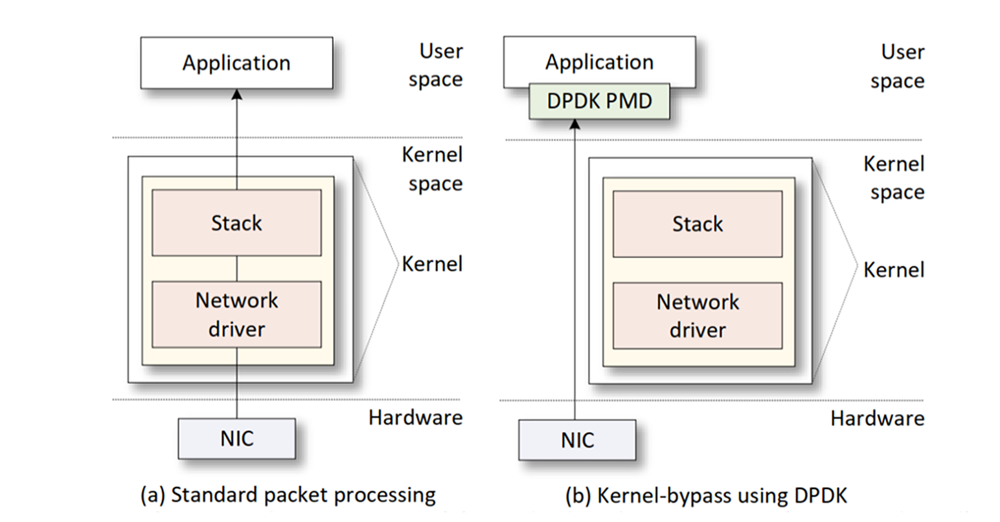

Introduction
============

The process of receiving and handling network packets involves several steps, each of which 
contributes to the overall system performance. Accelerating packet processing while minimizing 
overhead is crucial for achieving optimal network throughput. Before packet processing accelerators, 
a standard Network Interface Card (NIC) receives a data packet (e.g., from the network cable), 
and triggers an interrupt. This interrupt is a signal sent to the operating system (OS) to 
inform it that data has arrived. The OS then processes this interrupt and identifies the memory 
location where the packet is stored. This location is typically in the system’s Random Access Memory 
(RAM). The network stack is a software component within the OS responsible for handling network-related 
tasks. It includes protocols, drivers, and other networking functionalities. Once the OS knows the 
packet’s location in memory, it transfers the packet to the network stack. This transfer involves 
copying the packet data from the NIC’s buffer to the network stack’s buffer. To deliver the 
packet to the correct user-level application (e.g., a web browser or email client), the network 
stack relies on system calls.

While the above steps of standard packet processing shown in Figure 1 (a) are necessary for 
proper packet handling, they come at a cost. The additional processing involved in interrupt 
handling, memory copying, and system calls creates overhead. To mitigate this, modern systems 
use techniques like interrupt moderation, zero-copy networking, and kernel bypass mechanisms 
to minimize the impact of overhead on network performance.

The Data Plane Development Kit (DPDK) is a software packet processing acceleration tool that 
consists of a collection of libraries and drivers that support packet processing within the 
user space while bypassing the kernel as shown in Figure 1 (b). With DPDK, the ports of the 
NIC do not rely on the in-kernel drivers. Instead, a NIC that supports DPDK is managed by DPDK 
drivers that operate as a Poll Mode Driver (PMD). It receives, classifies, and delivers packets 
as it consistently polls for incoming packets2. This approach minimizes interrupt services 
overhead and improves performance. DPDK functionalities can also run on multiple cores with 
specific tasks running on each core using core affinity which prevents task switching among 
different cores and therefore enhances performance `[1] <references.html>`_.

**Figure 1:** Software packet processing. (a) standard packet processing (interrupt-based), 
(b) kernel-bypass packet processing (polling mode) `[2] <references.html>`_.

In network processing, both the CPU and the NIC frequently require access to data stored in memory 
such as cache and Dynamic Random Access Memory (DRAM). To optimize memory access, DPDK supports 
the use Hugepage and memory pools. To sever memory management purposes, DPDK swiftly moves data 
into the cache to prevent CPU overheads `[3] <references.html>`_.

DPDK pipeline model
~~~~~~~~~~~~~~~~~~~

The DPDK Packet Framework allows the implementation of accelerated packet processing with great 
flexibility. This framework required the use of a DPDK library (librte_pipeline) which provides 
a methodology for building a programmable pipeline tailored to serve a specific application1. 
These pipelines act as modular building blocks that can be interconnected through packet queues 
to create entire network applications. See Figure 2. A DPDK pipeline has three main components: 
input ports, tables, and output ports. Each pipeline can be instantiated multiple times, with 
each instance mapped to a different CPU thread `[4] <references.html>`_.

**Figure 2:** DPDK packet framework pipeline block `[5] <references.html>`_.

P4 programming
~~~~~~~~~~~~~~

Although DPDK is based on C programming, writing in P4 is generally considered more straightforward. 
P4 is a programming language to control the packet processing within the data plane of programmable 
forwarding elements, such as hardware or software switches, network interface cards, routers, and 
various network devices. Although initially designed for programmable switches, P4's application 
has expanded to be compatible with a diversity of devices called P4 targets, including SmartNICs. 
P4 is specifically designed to program the data plane of the target. The P4 code is written by the 
user in a specific architecture to ensure compatibility with the target. Afterward, the P4 code is 
ready to be compiled so that it can be executed by the target `[6] <references.html>`_.

**Figure 3:** The p4c-dpdk workflow.

P4-DPDL compiler
~~~~~~~~~~~~~~~~

The Software Switch (SWX) pipeline integrates DPDK performance with the flexibility of the P4 language. 
It serves as a tool for developing software switches or data plane applications. Moreover, it can be 
combined with the open-source P4 compiler p4c-dpdk. This enables the translation of P4 programs to the 
DPDK SWX API, allowing them to run efficiently on multi-core CPUs. The primary output of the p4c-dpdk 
compiler given a P4 code is the specifications file (.spec). This file is needed to configure the DPDK 
pipeline. Subsequently, a C code is generated from the .spec file. This code includes C functions 
corresponding to each action and control block. A C compiler then generates a shared object (.so) from 
the C code. Finally, the shared object is needed to execute the application `[7] <references.html>`_.

Memory in DPDK
~~~~~~~~~~~~~~

Memory management is very important to maintain performance measures. DPDK supports various memory 
management features such as Hugepages, Non-uniform Memory Access (NUMA) nodes pinning, and memory pools 
`[8] <references.html>`_.

A hugepage is a memory management technique used in modern computer systems to improve performance by using 
larger memory blocks (pages) than the default page size. When the DPDK application initializes and requests 
a certain number of hugepages, the operating system will reserve a large block of memory and allocate it to 
the application. Hugepage reservation is required in packet processing applications due to the large memory 
pool allocation used for packet buffers. If regular memory is used instead, applications using DPDK would 
experience significant performance degradation due to the high rate of accessed memory location misses.

NUMA node pinning is a technique used in computer systems with NUMA architecture to optimize performance 
by controlling how processes and memory are allocated. In a NUMA system, CPU cores are grouped into nodes, 
with each node having its own dedicated memory that is physically close to the running CPU cores. A general 
representation of the system is shown in Figure 4. Memory management features offered by DPDK make it less 
probable to write a poorly performing user application by including APIs NUMA nodes have to be specified 
to run the applications. Therefore, pinned NUMA nodes to CPU cores are configured for every operation being 
held by the system.

**Figure 4:** NUMA node pinning `[8] <references.html>`_.

DPDK also provides a memory pool manager supported by a library (librte_mbuf) which is built on top of the 
DPDK APIs. It is responsible for allocating pools of objects in the memory. This library also allows the 
user to tag a pool with a defined name to address the allocated memory.
