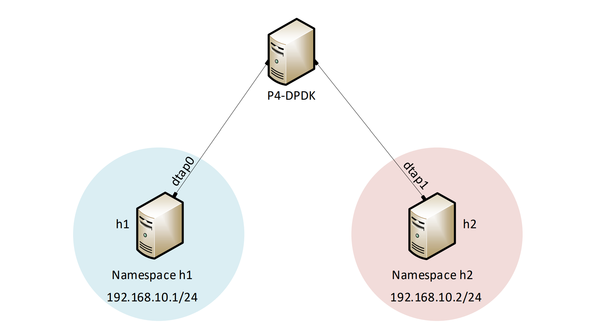

lab Topology
============

Consider Figure 5. Two network namespaces, h1 and h2, are linked to the running P4-DPDK pipeline, enabling 
connectivity between two namespaces. The network environments of hosts h1 and h2 are isolated from each other 
and the root namespace in which a P4-DPDK pipeline is running `[9] <references.html>`_.

**Figure 5:** Lab topology.

Lab settings
++++++++++++

Table 1 contains the credentials of the virtual machine used for this lab. 

.. table:: Table 2: Topology information.
   :align: center
   
   ========  =============  ==============  ==========
   **Host**  **Interface**  **IP Address**  **Subnet**
   ========  =============  ==============  ==========
   h1        dtap0          192.168.10.1    /24        
   h2        dtap1          192.168.10.2    /24
   ========  =============  ==============  ==========