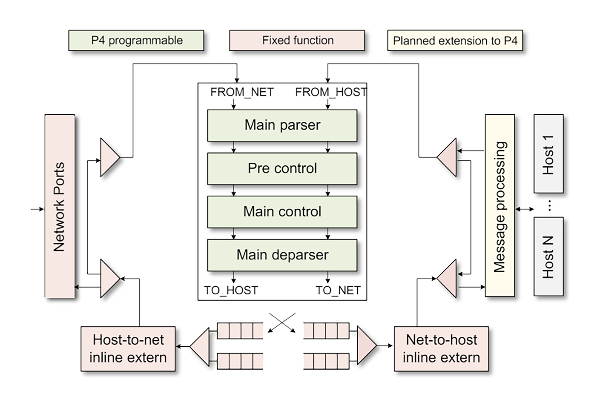
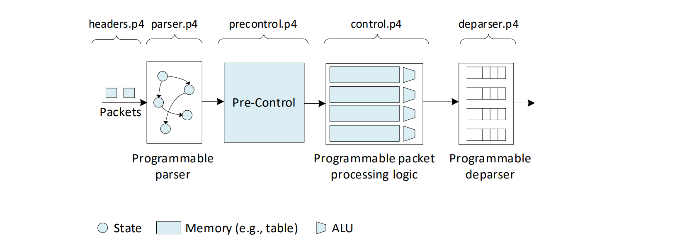

Introduction to P4 Architiecture
================================

A P4 architecture represents a programming model that outlines the capabilities 
of a target to process a P4 pipeline.Manufacturers provide for each specific hardware 
or P4 target, the architecture and a P4 compiler. P4 programs are specifically written 
for a particular P4 architecture and can be applied to any targets compatible with the same 
architecture. The compilation of these P4 programs yields two key elements: a data plane 
configuration implementing the forwarding logic based on the input program and an API 
facilitating the control plane's management of the data plane object states `[1] <references.html>`_.

The PNA architecture
~~~~~~~~~~~~~~~~~~~~

The Portable NIC Architecture (PNA) is a P4 architecture that defines the structure and common 
capabilities for programmable NICs. PNA's primary objective is to provide P4 capabilities for 
deploying packet processing functions on NICs. It enables P4 programmers to create portable P4 
programs that can be compiled and executable across various NIC devices. PNA has four P4 programmable 
blocks (main parser, pre-control, main control, and main deparser), and several fixed-function blocks, 
as shown in Figure 1. The host-to-net and net-to-host externs allow executing functions on the 
domain-specific accelerators such as encrypting or decrypting IPsec payload. The message processing 
is responsible for converting between large messages in host memory and network size packets on the 
network and for dealing with one or more host operating systems, drivers, and/or message descriptor formats 
in host memory `[2] <references.html>`_ `[3] <references.html>`_.

**Figure 1:** Portable NIC architecture (PNA)2.

Programmable parser
~~~~~~~~~~~~~~~~~~~

Packets arriving from a network port first go through a Main Parser and a Pre-Control which will be 
discussed in the next subsection. The programmable parser permits the programmer to define the headers 
(according to custom or standard protocols) and to describe how the headers should be processed. 
The parser de-encapsulates the headers, converting the original packet into a parsed representation 
of the packet. The programmer declares the headers that must be recognized and their order in the 
packet. The parser can be represented as a state machine without cycles (direct acyclic graph), 
with one initial state (start) and two final states (accept or reject) `[2] <references.html>`_ `[3] <references.html>`_.

Programmable controller 
~~~~~~~~~~~~~~~~~~~~~~~

Pre-Control can optionally perform table lookups. Its purpose is to determine whether a packet requires 
processing by the net-to-host inline extern block. An example would be a packet that has an IPsec header 
and needs processing before being handled by the main controller. The Main Control is where the code 
would be written for the packet processing logic. It aims to transform headers, update stateful elements 
like counters, meters, and registers, and optionally associate additional user-defined metadata with the 
packet `[2] <references.html>`_ `[3] <references.html>`_.

Programmable deparser
~~~~~~~~~~~~~~~~~~~~~

The deparser assembles back the packet and serializes it for transmission. The programmer specifies the headers 
to be emitted by the deparser. When assembling the packet, the deparser emits the specified headers followed by 
the original payload of the packet `[2] <references.html>`_ `[3] <references.html>`_.

P4 program mapping to the PNA
~~~~~~~~~~~~~~~~~~~~~~~~~~~~~

The P4 program used in this lab is separated into different files. Figure 2 shows the PNA architecture 
and its associated P4 files. These files are as follows:

* ``headers.p4``: this file contains the packet headers’ and the metadata’s definitions.
* ``parser.p4``: this file contains the implementation of the programmable parser.
* ``precontrol.p4``: this file contains the pre-control block that optionally includes table look-ups.
* ``control.p``4: this file contains the main control block.
* ``deparser.p4``: this file contains the deparser logic that describes how headers are emitted.
* ``main.p4``: this file contains the starting point of the program and invokes the other files. 
    This file must be compiled.

**Figure 2:** Mapping of P4 files to the PNA’s components.

