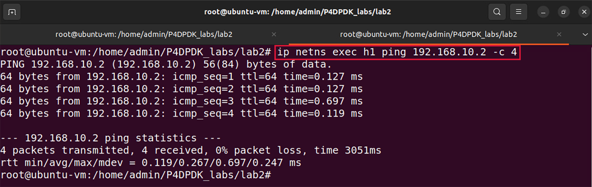
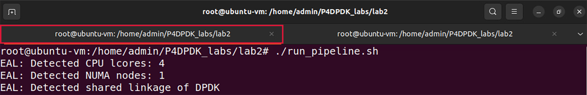
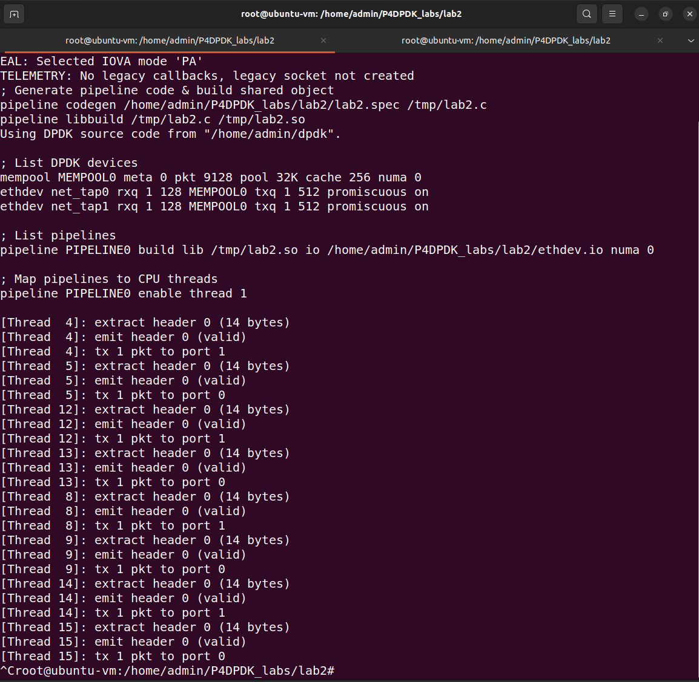

Testing Connectivity
====================

**Step 1.** Test the connectivity between namespaces h1 and h2 using the ``ping`` command::

    ip netns exec h1 ping 192.168.10.2 -c 4

**Figure 24:** Output of the ``ping`` command.

The figure shows successful connectivity between two namespaces.

**Step 2.** Switch back to the terminal tab in which the DPDK pipeline is running.

**Figure 25:** Switching terminal tabs.

The logs in the terminal correspond to the code executed for packet processing. 

**Step 3.** Stop the DPDK pipeline by pressing ``ctrl+c``. 

**Figure 26:** Stopping the DPDK pipeline.

This concludes Lab 2. You can now end your reservation.