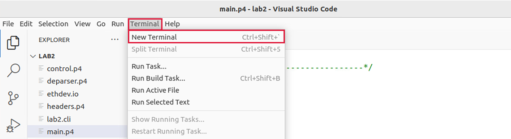

Writing the P4 Code
===================

This section shows the steps required to write the P4 code. 
It discusses the individual coding blocks that form the PNA architecture.

VS Code will be used as the editor to write and inspect the codes. It 
highlights the syntax of P4 and provides an integrated terminal where 
the P4 compiler will be invoked. The P4 compiler that will be used is 
p4c-dpdk, which transforms the P4 code into the specifications file to 
be executed next into the DPDK pipeline.

Loading the programming environment
+++++++++++++++++++++++++++++++++++

**Step 1.** Launch a Linux terminal by clicking on the Linux terminal icon in the taskbar.	

.. image:: images/4.png

**Figure 4:** Linux terminal icon.

The Linux terminal is a program that opens a window and permits you to interact with 
a command-line interface (CLI). A CLI is a program that takes commands from the keyboard 
and sends them to the operating system for execution. 

**Step 2.** In the terminal, type the command below. This command launches the VS Code and 
opens the directory where the P4 program for this lab is located::

    code P4DPDK_labs/lab2 

**Figure 5:** Loading VS Code in the lab2 directory.

Describing the components of the P4 program
+++++++++++++++++++++++++++++++++++++++++++

**Step 1.** Once the previous command is executed, VS Code will start. Click on main.p4 in 
the file explorer panel on the left-hand side to open the P4 program in the editor.

**Figure 6:** The main P4 file and how it includes other user-defined files.

The main.p4 file includes the starting point of the P4 program and other files that 
are specific to the language (*core.p4*) and to the architecture (pna.p4). To make the 
P4 program easier to read and understand, we separated the whole program into different 
files. Note how the files in the explorer panel correspond to the components of the PNA
model. To use those files, the main file (*main.p4*) must include them first. For example, 
to use the parser, we need to include the parser.p4 file (``#include “parser.p4”``).

We will navigate through the files in sequence as they appear in the architecture.

**Step 2.** Click on the *headers.p4* file to display the content of the file.

**Figure 7:** The defined headers.

The *headers.p4* above shows the headers that will be used in our pipeline. We can see that 
the ethernet header is defined. We can also see how it is inserted in a structure (``struct headers``). The ``headers`` name will be used throughout the program when referring to the headers. Furthermore, the file shows how we can use ``typedef`` to provide an alternative name to a type.

**Step 3.** Click on the *parser.p4* file to display the content of the parser.

**Figure 8:** The parser implementation.

The figure above shows the content of the parser.p4 file. We can see that the parser is already written with the name *MyParser*. This name will be used when defining the pipeline sequence.

**Step 4.** Click on the *precontrol.p4* file to display the content of the parser.

**Figure 9:** The pre-control implementation.

The figure above shows the content of the *precontrol.p4* file. We can see that the parser is 
already written with the name PreControl. This name will be used when defining the pipeline sequence. 

**Step 5.** Click on the *control.p4* file to display the content of the main control block.

**Figure 10:** The main control implementation.

The figure above shows the content of the control.p4 file. We can see that the code is already 
written with the name MainControl. This name will be used when defining the pipeline sequence. 

**Step 6.** Click on the *deparser.p4* file to display the content of the main control block.

**Figure 11:** The deparser implementation.

The figure above shows the content of the deparser.p4 file. We can see that the code is already 
written with the name MyDeparser. We can see that the deparser is already written with one instruction 
that reassembles the packet.

Programming the pipeline sequence
+++++++++++++++++++++++++++++++++

Now it is time to write the pipeline sequence in the main.p4 program. 

**Step 1.** Click on the main.p4 file to display the content of the file.

**Figure 12:** Selecting the main.p4 file.

**Step 2.** Write the following block of code at the end of the file::

    PNA_NIC(
    MyParser(),
    PreControl(),
    MainControl(),
    MyDeparser()
    ) main;
    

**Figure 13:** Writing the pipeline sequence in the main.p4 program.

We can see here that we are defining the pipeline sequence according to the PNA architecture. 
First, we start with the parser and the pre-control. Afterwards, the main control block is included. Finally, we specify the deparser.

**Step 3.** Save the changes by pressing ``Ctrl+s``.

Compiling the P4 program
++++++++++++++++++++++++

**Step 1.** Open a new terminal in VS Code by clicking on *Terminal* in the menu bar and then *New Terminal* in the drop-down menu.

**Figure 14:** Opening a new VS Code terminal.

**Step 2.** To compile the P4 program, issue the following command in the terminal panel inside VS Code::

    p4c-dpdk --arch pna main.p4 -o lab2.spec

**Figure 15:** Compiling the P4 program using the VS Code terminal.

The command above invokes the *p4c-dpdk* compiler to compile the *lab2.p4* program and generates the *lab2.spec* file (highlighted in the grey box) which is a specification file needed to run the pipeline.