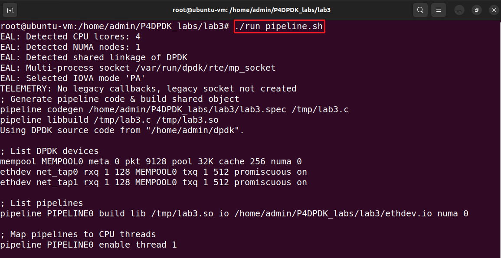
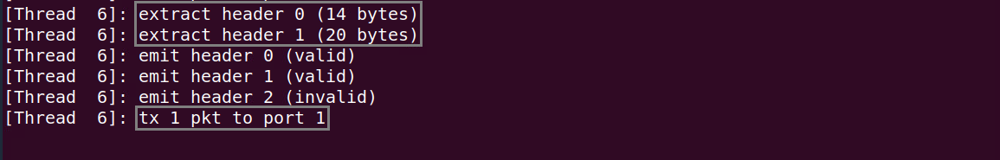

Building the P4 DPDK Pipeline and the Lab Topology
==================================================

This section shows the steps required to run the P4-DPDK along with building the lab topology. 
The step-by-step procedure is explained in detail in a previous lab. In this lab, the procedure 
is automated.

Running the P4-DPDK pipeline
~~~~~~~~~~~~~~~~~~~~~~~~~~~~

Now that all the required scripts are prepared, we can run the pipeline.

**Step 1.** Click on the terminal tab in the start bar to maximize the window.

.. image:: images/23.png

**Figure 23.** Maximizing Linux terminal window.

**Step 2.** Issue the command sudo su on the terminal to enter root mode. When prompted for a password, 
type password and hit enter. Note that the password will not be visible as you type it.:

    sudo su

.. image:: images/24.png

**Figure 24.** Entering root mode.

**Step 3.** Navigate to the lab3 directory using the cd command.::

    cd P4DPDK_labs/lab3

**Figure 25.** Navigating to the lab3 directory.

**Step 4.** Run the pipeline by typing the following command.::

    ./run_pipeline.sh

**Figure 26.** Running P4-DPDK pipeline.

The run_pipeline.sh script is a shell script that automates the process of running the P4-DPDK pipeline.

Building the lab topology
~~~~~~~~~~~~~~~~~~~~~~~~~

**Step 1.** Click on the new tab button at the top left of the terminal while running the pipeline.

.. image:: images/37.png

**Figure 27.** Opening a new terminal in a new tab.

**Step 2.** Issue the command sudo su on the terminal to enter root mode. When prompted for a password, type password 
and hit enter. Note that the password will not be visible as you type it.::

    sudo su

**Figure 28.** Entering root mode.

**Step 3.** Navigate to the lab3 directory using the cd command.::  

    cd P4DPDK_labs/lab3

.. image:: images/39.png

**Figure 29.** Navigating to the lab3 directory.

**Step 4.** Build the lab topology by typing the following command.::

    ./set_topology.sh

**Figure 30.** Setting the lab topology.

The **set_topology.sh** script is a shell script that automates the process of building the lab topology. Two namespaces are 
built and configured in this step with a virtual device linked to each.