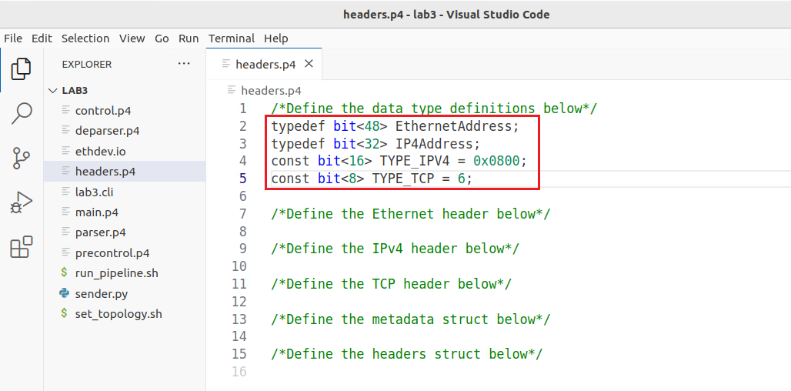
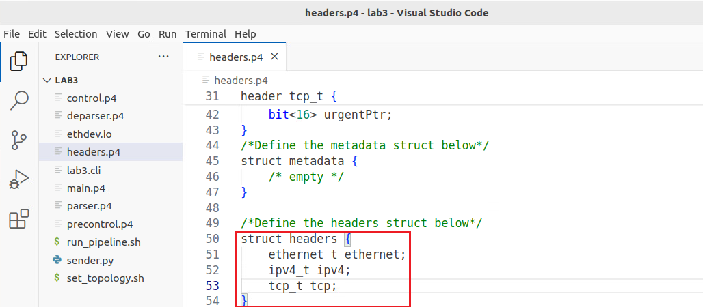

Defining The Headers
====================

This section demonstrates how to define custom headers in a P4 program. It also shows how to use 
constants and typedefs to make the program more readable.

VS Code will be used as the editor to write and inspect the codes. It highlights the syntax of P4 
and provides an integrated terminal where the P4 compiler will be invoked. The P4 compiler that will 
be used is p4c-dpdk, which transforms the P4 code into the specifications file to be executed next 
into the DPDK pipeline.

Loading the programming environment
~~~~~~~~~~~~~~~~~~~~~~~~~~~~~~~~~~~

**Step 1.** Launch a Linux terminal by clicking on the Linux terminal icon in the taskbar.

.. image:: images/7.png

**Figure 7.** Linux terminal icon.

The Linux terminal is a program that opens a window and permits you to interact with a command-line 
interface (CLI). A CLI is a program that takes commands from the keyboard and sends them to the 
operating system for execution.

**Step 2.** In the terminal, type the command below. This command launches the VS Code and opens 
the directory where the P4 program for this lab is located.::

    code P4DPDK_labs/lab3

**Figure 8.** Loading VS Code in the lab3 directory.

Defining headers in the *headers.p4* file
~~~~~~~~~~~~~~~~~~~~~~~~~~~~~~~~~~~~~~~~~

**Step 1.** Click on the headers.p4 file to display the contents of the file. Use the file explorer on 
the left-hand side of the screen to locate the file.

**Figure 9.** Inspecting the headers.p4 file.

We can see that the *headers.p4* is empty and we have to fill it.

**Step 2.** We will start by defining some typedefs. Write the following in the headers.p4 file.::

    typedef bit<48> EthernetAddress;
    typedef bit<32> IP4Address;
    const bit<16> TYPE_IPV4 = 0x0800;
    const bit<8> TYPE_TCP = 6;

**Figure 10.** Data types and constant definitions.

In the figure above the typedef declaration used (lines 2 - 5) is used to assign alternative names 
to types. Here we are saying that ``EthernetAddress`` can be used instead of ``bit<48>`` and ``IP4Address`` 
instead of ``bit<32>``. We will use this typedef when defining the headers. Lines 4 and 5 show how to 
define constants with the name ``TYPE_IPV4`` set to a value of ``0x800`` and the name ``TYPE_TCP`` set to a 
value of ``6``. We will use these values in the parser implementation.

**Step 3.** Now we will define the Ethernet header. Add the following code to the *headers.p4* file.::

    header ethernet_t {
    EthernetAddress dstAddr;
    EthernetAddress srcAddr;
    bit<16> etherType; }

**Figure 11.** Adding the Ethernet header definition.

Note how we used the typedef ``EthernetAddress`` which corresponds to ``bit<48>`` when defining the destination 
MAC address field (``dstAddr``) and the source MAC address field (``srcAddr``). Note how we are mapping the 
fields to those defined in the standard Ethernet header (see Figure 1).

**Step 4.** Now we will define the IPv4 header. Add the following code to the *headers.p4* file.::

    header ipv4_t {
    bit<4> version;
    bit<4> ihl;
    bit<8> diffserv;
    bit<16> totalLen;
    bit<16> identification;
    bit<3> flags;
    bit<13> fragOffset;
    bit<8> ttl;
    bit<8> protocol;
    bit<16> hdrChecksum;
    IP4Address srcAddr;
    IP4Address dstAddr; }

**Figure 12.** Adding the IPv4 header definition.

Consider the figure above. Note how we used the typedef ``IP4Address`` which corresponds to ``bit<32>`` when defining the 
source IP address field (``srcAddr``) and the destination IP address field (``dstAddr``). Also, note how we are mapping the 
fields to those defined in the standard IPv4 header (see Figure 2).

**Step 5.** Now we will define the TCP header. Add the following code to the headers.p4 file.::

    header tcp_t {
    bit<16> srcPort;
    bit<16> dstPort;
    bit<32> seqNo;
    bit<32> ackNo;
    bit<4> dataOffset;
    bit<3> res;
    bit<3> ecn;
    bit<6> ctrl;
    bit<16> window;
    bit<16> checksum;
    bit<16> urgentPtr; }

**Figure 13.** Adding the TCP header definition.

Consider the figure above. Note how we are mapping the fields to those defined in the standard TCP header (see Figure 3). The 
Flags field which is usually represented in 9 bits is split into two: Explicit Congestion Notification Flags (ecn) represented 
by 3 bits and the Control Flags (*ctrl*) represented by 6 bits.

**Step 6.** Now we will create a struct to represent our metadata. Metadata is passed from one block to another as the packet 
propagates through the architecture. For simplicity, this program does not require any user metadata, and hence we will define 
it as empty with no fields. Add the following to the *headers.p4* file.::

    struct metadata {
    /* empty */
    }

**Figure 14.** Adding the metadata structures.

**Step 7.** Now we will create a structure (struct) to contain our headers (Ethernet, IPv4, and TCP). Append the following code 
to the *headers.p4* file.

    struct headers {
    ethernet_t ethernet;
    ipv4_t ipv4;
    tcp_t tcp;}

**Figure 15.** Appending the headers’ data structure to the *headers.p4* file.

**Step 8.** Save the changes by pressing ``Ctrl+s``.

