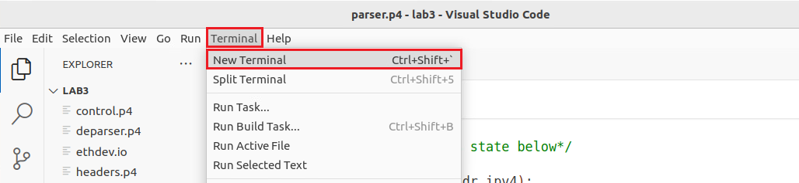

Implementing The Parser
=======================

Now it is time to define how the parser works.

**Step 1.** Click on the *parser.p4* file to display the content of the file.

**Figure 16.** Inspecting the *parser.p4* file.

We can see that the headers.p4 file that we just filled out is included here in the parser. 
The file also includes a starter code that declares a parser named MyParser. Note how the headers 
and the metadata structs that we defined previously are passed as parameters to the parser.

**Step 2.** Add the start state inside the parser by inserting the following code.::

    state start {
        transition parse_ethernet;
    }

**Figure 17.** Adding ``start`` state to the *parser.p4* file.

The start state is the state where the parser begins parsing the packet. Here we are transitioning unconditionally to the parse_ethernet state.

**Step 3.** Add the parse_ethernet state inside the parser by inserting the following code.::

    state parse_ethernet {
        packet.extract(hdr.ethernet);
        transition select(hdr.ethernet.etherType) {
            TYPE_IPV4: parse_ipv4;
            default: accept;
        }
    }

**Figure 18.** Adding ``parse_ethernet`` state to the *parser.p4* file.

The ``parse_ethernet`` state extracts the Ethernet header and checks for the value of the header field 
``etherType``. Note how we reference a header field by specifying the header to which that field belongs 
(i.e., ``hdr.ethernet.etherType``). If the value of ``etherType`` is ``TYPE_IPV4`` (which corresponds to 0x0800 
as defined previously), the parser transitions to the ``parse_ipv4`` state. Otherwise, the execution of 
the parser terminates.

**Step 4.** Add the ``parse_ipv4`` state inside the parser by inserting the following code.::

    state parse_ipv4 {
        packet.extract(hdr.ipv4);
        transition select(hdr.ipv4.protocol) {
            TYPE_TCP: parse_tcp;
            default: accept;
        }
    }

**Figure 19.** Adding ``parse_ipv4`` state to the *parser.p4* file.

The ``parse_ipv4`` state extracts the IPv4 header and checks for the value of the header field ``protocol``. Note 
how we reference a header field by specifying the header to which that field belongs (i.e., ``hdr.ipv4.protocol``). 
If the value of ``protocol`` is ``TYPE_TCP`` (which corresponds to 6 as defined previously), the parser transitions 
to the ``parse_tcp`` state. Otherwise, the execution of the parser terminates.

**Step 5.** Add the ``parse_tcp`` state inside the parser by inserting the following code.::

    state parse_tcp {
        packet.extract(hdr.tcp);
        transition accept;
    }

**Figure 20.** Adding ``parse_tcp`` state to the *parser.p4* file.

The ``parse_tcp`` state extracts the TCP header and terminates the execution of the parser.

**Step 6.** Save the changes to the file by pressing ``Ctrl + s``.

Compiling the P4 program
~~~~~~~~~~~~~~~~~~~~~~~~

**Step 1.** Open a new terminal in VS Code by clicking on Terminal in the menu bar and then New Terminal in the drop-down 
menu.

**Figure 21.** Opening a new VS Code terminal.

**Step 2.** To compile the P4 program, issue the following command in the terminal panel inside VS Code.::

    p4c-dpdk --arch pna main.p4 -o lab3.spec

**Figure 22.** Compiling the P4 program using the VS Code terminal.

The command above invokes the p4c-dpdk compiler to compile the lab3.p4 program and generates the lab3.spec file (highlighted 
in the grey box) which is a specification file needed to run the pipeline.

