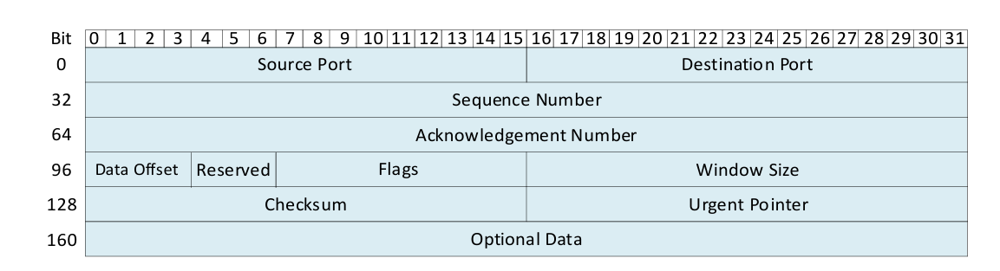

Introduction
============

For several decades, the networking industry operated in a bottom-up approach. At the bottom of 
the system are the fixed-function Application Specific Integrated Circuits (ASICs) or other 
domain-specific hardware, which enforce protocols, features, and processes available in the 
switch or the Network Interface Card (NIC). Programmers and operators are limited to these 
capabilities when building their systems. Consequently, systems have features defined by the 
vendors that are rigid and may not fit the network operators’ needs. P4 allows agility in the 
networking industry by enabling a top-down approach to the design of network applications. 
With this approach, the programmer or network operator can precisely describe features and how 
packets are processed in the packet processing pipeline. DPDK

With the Portable NIC Architecture (PNA) `[1] <references.html>`_, the programmer defines the headers and corresponding 
parser as well as actions executed in the pipeline and the deparser. The programmer has the 
flexibility of defining custom headers (i.e., a header not standardized). Such capability is 
not available in non-programmable devices. The Data Plane Development Kit (DPDK) accelerates 
packet processing and enhances performance. With P4-DPDK, the programmability features of P4 
and the acceleration capabilities of DPDK come together.

**Figure 1:** Ethernet header.

**Figure 2:** IPv4 header.

**Figure 3:** TCP header.

**Figure 4** shows an excerpt of a P4 program where a header is defined. This is typically written 
at the top of the program before the parsing starts. We can see that the programmer-defined header 
corresponds to Ethernet (lines 11-14). The Ethernet header fields are shown in Figure 1.

The programmer also defined an IPv4 header (lines 16-29) and a TCP header (lines 31-42). The IPv4 
header format is shown in Figure 2 and the TCP header is shown in Figure 3.

**Figure 4:** Program headers and definitions.

The code starts by including the core.p4 file (line 1) which defines some common types and variables 
used in all P4 programs. For instance, the ``packet_in`` and ``packet_out`` extern types which represent 
incoming and outgoing packets, respectively, are declared in core.p4 `[2] <references.html>`_. Next, the pna.p4 `[3] <references.html>`_ file is 
included (line 2) to define the PNA architecture and all its externs used when writing P4 programs `[4] <references.html>`_. 
Line 3 defines a 16-bit constant ``TYPE_IPV4`` with the value 0x800. Similarly, line 4 creates an 8-bit 
constant ``TYPE_TCP`` with the value 6. This means that these variables can be used later in the P4 program 
to reference the associated values. The typedef declarations (lines 8-9) are used to assign alternative 
names to types.

The program in Figure 4 defines the Ethernet header (lines 11-14). The declarations inside the header are 
usually written after referring to the standard specifications of the protocol. Note that in the ``ethernet_t`` 
header, the ``EthernetAddress`` is used rather than using a 48-bit field. The IPv4 header is also defined 
(lines 16-29) following the standard header specification shown in Figure 2. Note that in the ``ipv4_t`` header, 
the ``IP4Address`` is used rather than using a 32-bit field. Similarly, the TCP header is defined (lines 31-42) 
following the standard header specification shown in Figure 3. Lines 44 - 45 show how to declare user-defined 
metadata, which is passed from one block to another as the packet propagates through the architecture. For 
simplicity, this program does not require any user metadata. Finally, the headers struct (lines 47-50) that 
will be used in the program are defined. The headers are customized depending on how the programmer wants 
the packets to be parsed.

Programmable parser
~~~~~~~~~~~~~~~~~~~

The programmable parser permits the programmer to describe how the packets will be processed. The parser 
de-encapsulates the headers, converting the original packet into a parsed representation of the packet. The 
parser can be represented as a state machine without cycles (direct acyclic graph), with one initial state 
(start) and two final states (accept or reject).

.. centered:: **(a)** 

.. centered:: **(b)** 

**Figure 5.** Example of a parser. (a) Graphical representation of the parser. (b) In P4, the parser always 
starts with the initial state called ``start``. First, we transition unconditionally to ``parse_ethernet``. 
Then, we can create some conditions to direct the parser. Finally, when we transition to the ``accept`` state, 
the packet is moved to the control block of the pipeline. A packet that reaches the ``reject`` state will be 
dropped.

**Figure 5a** shows the graphical representation of the parser and **Figure 5b** its corresponding P4 code. 
Note that the packet is an instance of the ``packet_in`` extern and is passed as a parameter to the parser. 
The ``extract`` method associated with the packet extracts N bits, where N is the total number of bits defined 
in the corresponding header (for example, 112 bits for Ethernet). Afterward, the ``etherType`` field of the 
Ethernet header is examined using the select statement, and the program branches to the ``parse_ipv4`` state 
if the ``etherType`` field corresponds to IPv4. The state transitions to the ``reject`` if it is not an IPv4 header, 
as shown in the figure above (Line 15). In the ``parse_ipv4`` state, the ``protocol`` field of the IPv4 header is 
examined using the select statement, and the program branches to the ``parse_tcp`` state if the ``protocol`` field 
corresponds to TCP. The state transitions to the ``reject`` if it is not a TCP header, as shown in the figure 
above (Line 23). Finally, in the ``parse_tcp`` state, the TCP header is extracted, and the program unconditionally 
transitions to the ``accept`` state.

