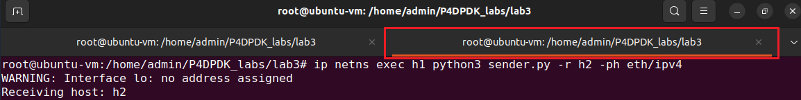

Testing the application
=======================

**Step 1.** To test the application, we will send a packet with an ethernet header from h1 to h2 
by running the provided Python script sender.py::

    ip netns exec h1 python3 sender.py -r h2 -ph eth

**Figure 31.** Sending a packet with an ethernet header from h1 to h2.

Running the Python script requires two parameters:

* ``-r``: receiving host (h1 or h2)
* ``-ph``: included packet headers (eth or eth/ipv4 or eth/ipv4/tcp)

**Step 2.** Switch back to the terminal tab in which the DPDK pipeline is running to observe the result.

**Figure 32.** Switch back to the DPDK pipeline terminal.

.. note::

    Observe the DPDK logs at the bottom of the terminal. These logs correspond to the packet processing 
    function executed in the .spec file generated when the P4 code is compiled.

**Figure 33.** Logs corresponding to the ethernet packet sent.

The “extract header” log followed by the header ID “0” in the grey box, corresponds to the parsed ethernet 
header with the size of 14 bytes (112 bits) as declared in the headers.p4 file. The header ID is an 
indicator of the parsed header order. Therefore “header 0” is the first parsed header. Note that the IPv4 
header (header 1) and the TCP header (header 2) were not extracted and not emitted (invalid) since they 
were not included in the sent packet.

The “tx 1 pkt to port 1” log indicated that one packet has been sent to port 1 which corresponds to host 2.

**Step 3.** For a more readable output press enter in the terminal a few times (five times).

**Figure 34.** Providing space in the terminal.

**Step 4.** Switch back to the terminal tab in which the Python script was executed.

**Figure 35.** Switching back to the Python terminal.

**Step 5.** We will send a packet with an Ethernet and IPv4 header from h1 to h2 by running the provided 
Python script sender.py.::

    ip netns exec h1 python3 sender.py -r h2 -ph eth/ipv4

**Figure 36.** Sending a packet with an Ethernet and IPv4 header from h1 to h2.

**Step 6.** Switch back to the terminal tab in which the DPDK pipeline is running to observe the result.

**Figure 37.** Switch back to the DPDK pipeline terminal.

Observe the DPDK logs at the bottom of the terminal.

.. image:: images/38.png

**Figure 38.** Logs corresponding to the IPv4 packet sent.

The “extract header” log appears twice in the grey box, corresponding to the parsed ethernet header 
(header 0) with a size of 14 bytes (112 bits) and the parsed IPv4 header (header 1) with a size of 
20 bytes (160 bits) as declared in the *headers.p4* file. Note that the TCP header (header 2) was not 
extracted and not emitted (invalid) since it was not included in the sent packet.

The “tx 1 pkt to port 1” log indicated that one packet has been sent to port 1 which corresponds 
to host 2.

**Step 7.** For a more readable output press enter in the terminal a few times (five times).

**Figure 39.** Providing space in the terminal.

**Step 8.** Switch back to the terminal tab in the Python script was executed.

**Figure 40.** Switching back to the Python terminal.

**Step 9.** We will send a packet with an ethernet, IPv4, and TCP header from h1 to h2 by running 
the provided Python script *sender.py*.:

ip netns exec h1 python3 sender.py -r h2 -ph eth/ipv4/tcp

**Figure 41.** Sending a packet with an ethernet, IPv4, and TCP header from h1 to h2.

**Step 10.** Switch back to the terminal tab in which the DPDK pipeline is running to observe the result.

**Figure 42.** Switch back to the DPDK pipeline terminal.

Observe the DPDK logs at the bottom of the terminal:

**Figure 43.** Logs corresponding to TCP the packet sent.

The “extract header” log appears three times in the grey box, corresponds to the parsed ethernet 
header (header 0) with size of 14 bytes (112 bits), the parsed IPv4 header (header 1) with size 
20 bytes (160 bits) and the parsed TCP header (header 2) with size 20 bytes (160 bits) as declared in 
the headers.p4 file. The “tx 1 pkt to port 1” log indicated that one packet has been sent to port 1 
which corresponds to host 2.

**Step 11.** Stop the DPDK pipeline by pressing ctrl+c.

**Figure 44.** Stopping the DPDK pipeline.

This concludes Lab 3. You can now end your reservation.