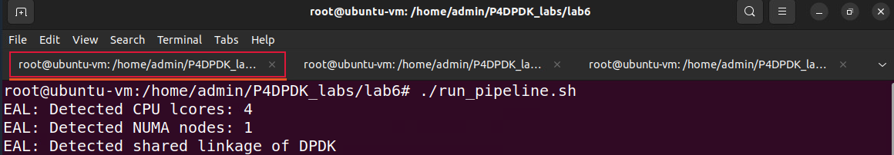

Running Commands at Runtime in the DPDK Pipeline CLI
====================================================

This section shows the steps required to open and run commands in the DPDK pipeline CLI.

Inspect DPDK pipeline interfaces and stats
~~~~~~~~~~~~~~~~~~~~~~~~~~~~~~~~~~~~~~~~~~

**Step 1.** To start the DPDK pipeline CLI by typing the following command.::

    telnet 0.0.0.0 8086

**Figure 30:** Entering the pipeline CLI.

**Step 2.** The telnet command is followed by the IP address of the server (0.0.0.0) and the port number (8086).

In the pipeline CLI, inspect the interface configuration by typing the following command.::

    ethdev show

**Figure 31:** Inspecting interfaces.

We can see that three interfaces are displayed (highlighted in the grey boxes); net_tap0, net_tap1, and net_tap2.

As we inspect the output for each ethernet device in the figure above, we can see in the first line, that ``ether`` is 
the MAC addresses assigned to the interfaces while running the pipeline along with ``rxqueues`` and ``txqueues``, the number 
of receiving and transmitting queues as assigned in the CLI script while listing the ethernet devices. The second 
line shows the port number ``port#`` as specified in the I/O file. The remaining lines of the output show the received 
packet count ``RX packets`` and the transmitted packet count ``TX packets`` with the corresponding total byte-count ``bytes`` 
and the number of dropped packets ``misses`` for each.

**Step 3.** In the pipeline CLI, inspect the pipeline statistics by typing the following command.::

    pipeline PIPELINE0 stats

**Figure 32:** Inspecting pipeline statistics.

The pipeline stats function shows statistical data of the specified pipeline (PIPELINE0). This pipeline has three ``Input 
ports`` highlighted in the first grey box and three ``Output ports`` highlighted in the second grey box. Also, each port is 
associated with counters that provide information about the number of packets and the total byte count.

The ``Tables`` section indicates that there are two tables defined, the *forwarding_exact* which applies exact matching, and 
the *forwarding_lpm* which applies the LPM algorithm. Each table is followed by the count of packets hit or miss along 
with the number of packets that underwent each action. Note that at the bottom, there are no learner tables defined 
because the *add_on_miss* feature is not enabled in this example.

Adding rules to match-action tables
~~~~~~~~~~~~~~~~~~~~~~~~~~~~~~~~~~~

**Step 1.** Add the following code inside the pipeline CLI to add rules to the forwarding_exact table.::

    pipeline PIPELINE0 table forwarding_exact add rules_exact.txt

**Figure 33:** Load the *rules_exact.txt* file to the forwarding_exact table.

To add rules to a table the *pipeline table add* function is used. This command takes three parameters:

* ``pipeline``: The table is processed in the specified DPDK pipeline (PIPELINE0).
* ``table``: These rules are added to the specified table (forwarding_exact). Note that the name of the table should match the 
  name used in the table declaration in the control.p4 code.
* ``add``: This parameter takes the path to the file containing the rules to be added to the table (rules_exact.txt).

**Step 2.** Add the following code inside the pipeline CLI to add rules to the forwarding_lpm table.::

    pipeline PIPELINE0 table forwarding_lpm add rules_lpm.txt

**Figure 34:** Load the *rules_lpm.txt* file to the *forwarding_lpm* table.

**Step 3.** To confirm changes made to the pipeline, type the following code inside the pipeline CLI.::

    pipeline PIPELINE0 commit

**Figure 35:** Apply all changes to the pipeline.

The ``pipeline commit`` function applies the changes made to the designated pipeline (PIPELINE0).

Inspecting packet count in pipeline stats
~~~~~~~~~~~~~~~~~~~~~~~~~~~~~~~~~~~~~~~~~

**Step 1.** Open a separate terminal tab.

**Figure 36:** Opening a new terminal tab.

**Step 2.** Issue the command ``sudo su`` on the terminal to enter root mode. When prompted for a password, type ``password`` and hit enter. 
Note that the password will not be visible as you type it.::

    sudo su

.. image:: images/37.png

**Figure 37:** Entering root mode.

**Step 3.** Navigate to the lab6 directory using the cd command.::

    cd P4DPDK_labs/lab6

**Figure 38:** Navigating to the lab6 directory.

**Step 4.** Now, we will send a packet from h1 to h2 over the destination IP address 192.168.20.2 by running the provided Python 
script *sender.py*.

    ip netns exec h1 python3 sender.py -s h1 -d 192.168.20.2

**Figure 39:** Sending a packet from h1 to h2.

Running the Python script requires two parameters:

* ``-s``: Sender (h1 or h2 or h3)
* ``-d``: Destination IP Address

None of the rules uploaded include matching on the IP address 192.168.20.2. Therefore, the LPM rules are applied to match the IP 
address to the longest prefix which is in this case 192.168.20.0.

**Step 5.** Switch back to the terminal tab in which the DPDK pipeline is running to observe the result.

**Figure 40:** Switch back to the DPDK pipeline terminal.

.. note::
    Observe the DPDK logs at the bottom of the terminal. These logs correspond to the packet processing function executed in the 
    .spec file generated when the P4 code is compiled.

**Figure 41:** Logs corresponding to the packet sent.

The log highlighted in the first grey box corresponds to the table lookup. An exact match was not found in table 0 which 
corresponds to the forwarding_exact table. In this case, a table lookup will be performed in the second table named *forwarding_lmp* 
with a table ID of 1. A match was found in the second table. Therefore, the *forward_lpm* (action 2) is executed.

The “tx 1 pkt to port 1” log in the second grey box indicates that the forwarding action is properly executed by sending one 
packet to port 1 which corresponds to host 2.

**Step 6.** For a more readable output press *enter* in the terminal a few times (five times).

**Figure 42:** Providing space in the terminal.

**Step 7.** Switch back to the terminal tab running the interactive CLI.

**Figure 43:** Open the pipeline CLI terminal.

**Step 8.** In the pipeline CLI, inspect the pipeline statistics by typing the following command.::

    pipeline PIPELINE0 stats

**Figure 44:** Inspecting pipeline statistics.

In the sending ports ``Input ports`` section, we can see in the grey box that port 0 (host 1) sent 1 packet of size 34 bytes. In the 
receiving ports ``Output ports`` section, we can see in the grey box that port 1 (host 2) received 1 packet of size 34 bytes.

In the ``Tables`` section, under the stats of the table forwarding_exact, we can see in the grey box that 1 packet was processed and 
no match was found. Therefore, no action was executed and now the packet will have to be looked up within the rules in the second 
table. Under the stats of the table *forwarding_lpm*, a match was found and the action *forward_lpm* was executed.

Removing match-action table rules at runtime
~~~~~~~~~~~~~~~~~~~~~~~~~~~~~~~~~~~~~~~~~~~~

**Step 1.** Enter the following command in the pipeline CLI to delete rules from a table.::

    pipeline PIPELINE0 table forwarding_exact delete rules_exact.txt

**Figure 45:** Deleting table rules.

To delete rules from a table, the *pipeline table delete* function is used. This command takes three parameters:

* ``pipeline``: The table is processed in the specified DPDK pipeline (PIPELINE0).

* ``table``: These rules are deleted from the specified table (forwarding_exact). Note that the name of the table should match the name 
  used in the table declaration in the *control.p4* code.

* ``delete``: This parameter takes the path to the file containing the rules to be deleted from the table (rules_exact.txt).

**Step 2.** To commit changes made to the pipeline, type the following code inside the pipeline CLI.::

    pipeline PIPELINE0 commit

**Figure 46:** Apply all changes to the pipeline.

The ``pipeline commit`` function applies the changes made to the designated pipeline.::

    (PIPELINE0).

**Step 3.** Switch back to the terminal tab in which the Python script was executed.

**Figure 47:** Switching back to the Python terminal.

**Step 4.** Now, we will send a packet from h1 to h3 over the destination IP address 192.168.30.1 by running the provided Python script *sender.py*.

    ip netns exec h1 python3 sender.py -s h1 -d 192.168.30.1

**Figure 48:** Sending a packet from h1 to h3.

**Step 5.** Switch back to the terminal tab in which the DPDK pipeline is running to observe the result.

**Figure 49:** Switch back to the DPDK pipeline terminal.

Observe the DPDK logs at the bottom of the terminal.

.. image:: images/50.png

**Figure 50:** Logs corresponding to the packet sent.

The log highlighted in the first grey box corresponds to the table lookup. An exact match was not found in table 0 which corresponds to the 
*forwarding_exact* table. In this case, a table lookup will be performed in the second table named *forwarding_lmp* with a table ID of 1. 
A match was not found in the second table. Therefore, the default action (action 3) is executed and the packet is dropped. 
The log in the second grey box indicates that one packet has been dropped.

**Step 6.** Switch back to the terminal tab running the interactive CLI.

**Figure 51:** Open the pipeline CLI terminal.

**Step 7.** In the pipeline CLI, inspect the pipeline statistics by typing the following command.::

    pipeline PIPELINE0 stats

**Figure 52:** Inspecting pipeline statistics.

In the sending ports ``Input ports`` section, we can see in the grey box that port 0 (host 1) sent another packet of size 34 bytes. In the 
receiving ports ``Output ports`` section, we can see in the grey box that the pipeline dropped the 1 packet.

In the ``Tables`` section, under the stats of the table ``forwarding_exact``, we can see in the grey box that the packet was processed, and no 
match was found. Therefore, no action was executed and now the packet will have to be looked up within the rules in the second table. Under 
the stats of the table *forwarding_lpm*, a match was not found, and the action *drop* was executed. This is because the rule that applies 
exact matching of the destination address of host 3 is deleted.

**Step 8.** Close the pipeline CLI and the telnet session by pressing ``ctrl+]`` and then type the ``quit`` command.

**Figure 53:** Closing pipeline and telnet session.

**Step 9.** Switch back to the terminal tab running the DPDK pipeline and press ``ctrl+c`` to terminate the process.

**Figure 54:** Stopping the running pipeline.

This concludes Lab 6. You can now end your reservation.
