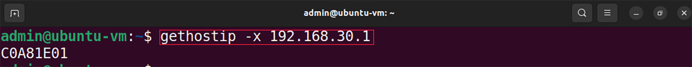

Defining Match-Action Table Rules
=================================

This section demonstrates how to define the match-action table rules in text files. The rules will be added to the tables at runtime.

VS Code will be used as the editor to write and inspect the codes. It highlights the syntax of P4 and provides an integrated terminal 
where the P4 compiler will be invoked. The P4 compiler that will be used is *p4c-dpdk*, which transforms the P4 code and executes it 
into a DPDK pipeline.

Loading the programming environment
~~~~~~~~~~~~~~~~~~~~~~~~~~~~~~~~~~~

**Step 1.** Launch a Linux terminal by clicking on the Linux terminal icon in the taskbar.

.. image:: images/3.png

**Figure 3:** Linux terminal icon.

The Linux terminal is a program that opens a window and permits you to interact with a command-line interface (CLI). A CLI is a 
program that takes commands from the keyboard and sends them to the operating system for execution.

**Step 2.** In the terminal, type the command below. This command launches the VS Code and opens the directory where the P4 program 
for this lab is located.::

    code P4DPDK_labs/lab6

**Figure 4:** Loading VS Code in the lab6 directory.

**Step 3.** Inspect the tables in the *control.p4* file.

**Figure 5:** Inspecting the *control.p4* file.

As we inspect the control.p4 file, we can see the defined table names and actions which will be needed to specify the rules and upload 
them to the tables. The first table is the *forwarding_exact* table and it takes the *forward_exact* action only. The second table 
defined is the *forwarding_lpm* table and it takes two actions, the *forward_lpm* and *drop*.

Preparing rules files
~~~~~~~~~~~~~~~~~~~~~

**Step 1.** Click on the Create *new file* icon to create a new file in the lab6 directory.

**Figure 6:** Creating a new file.

**Step 2.** Creating a new file.

**Figure 7:** Naming the file *rules_exact.txt*.

Now, we will add rules to the text file. The first rule is to forward the packet to host 3 if the destination IPv4 address matches the 
key. The rule matches on the destination IP address of the packets. The IP address of host 3 is 192.168.30.1. To add it to the rule it 
must be represented in hexadecimal format.

**Step 3.** Click on the terminal tab in the start bar to maximize the window.

.. image:: images/8.png

**Figure 8:** Maximizing Linux terminal window.

**Step 4.** All parameters to be included in the rules have to be represented in hexadecimal notation. Type the following command in the 
terminal to convert an IPv4 address to hexadecimal.::

    gethostip -x 192.168.30.1

    
**Figure 9.** Converting the IP address to hexadecimal.

The ``gethostip`` command takes an IP address and converts it to a different format. The ``-x`` flag is to specify that we want the IP 
address to be converted to hexadecimal.

192.168.30.1 is the IP address of host 3. As a result, in IP of host 3 is C0A81E01 in hexadecimal.

**Step 5.** Click on the VScode tab in the start bar to maximize the window.

.. image:: images/10.png

**Figure 10.** Maximizing VScode window.

**Step 6.** Now, we will fill the rules_exact.txt file with the rule that will be added to the table for exact matching. Type the following 
code in the rules_exact.txt file.::

    match 0xC0A81E01 action forward_exact dstAddr 0x3 port_id 0x2

**Figure 11.** Adding exact matching rule.

Defining a rule requires 3 parameters:

* ``match <key>``: The key based on which a match is found or not. The key is 192.168.30.1 (0xC0A81e01 in hexadecimal) which is the IP address 
  of host 3.
* ``action <action name>``: The action to be executed if there is a match. If a match is found the action to be executed for both entries is 
  the *forward_exact* action declared in the *control.p4* code.
* The last item is the action data In this case, the action data are the destination MAC address and egress port ID. Therefore, if a match is 
  found with this entry, the packet is forwarded to host h3 through port 2 (0x2 in hexadecimal), and the destination MAC address is 
  00:00:00:00:00:03 (0x3 in hexadecimal).

**Step 7.** Save the changes to the file by pressing ``Ctrl + s``.

**Step 8.** Click on the *Create new file* icon to create a new file in the *lab6* directory.

**Figure 12.** Creating a new file.

**Step 9.** Give to the file the name *rules_lpm.txt*.

**Figure 13.** Naming the file rules_lpmt.txt.

Now, we will add two rules to the text file that correspond to the table applying the Longest Prefix 
Matching (LPM) algorithm. In LPM rules, the network IP address and the subnet must be defined.

**Step 10.** Click on the terminal tab in the start bar to maximize the window.

.. image:: images/14.png

**Figure 14.** Maximizing Linux terminal window.

**Step 11.** Type the following command in the terminal to convert an IPv4 address to hexadecimal.::

    gethostip -x 192.168.10.0

**Figure 15.** Converting the IP address to hexadecimal.

The IP address 192.168.10.0 is represented as C0A80A00 in hexadecimal format.

**Step 12.** Type the following command in the terminal to convert an IPv4 address to hexadecimal.::

    gethostip -x 192.168.20.0

**Figure 16.** Converting the IP address to hexadecimal.

The IP address 192.168.20.0 is represented as C0A81400 in hexadecimal format.

**Step 13.** Type the following command in the terminal to convert the subset to hexadecimal.::

    gethostip -x 255.255.255.0

**Figure 17.** Converting the IP address to hexadecimal.

The /24 subnet indicates that the first 24 bits of the IP address are used for the network portion. 
The remaining 8 bits (32 - 24 = 8) are available for host addresses within that network. Therefore, 
the subnet mask 255.255.255.0 means that the first 24 bits are set to 1 (representing the network), 
and the last 8 bits are set to 0 (available for hosts). The subnet 255.255.255.0 is represented as 
FFFFFF00 in hexadecimal format.

**Step 14.** Click on the VScode tab in the start bar to maximize the window.

**Figure 18.** Maximizing VScode window.

**Step 15.** Now, we will fill the rules_exact.txt file with the rules that will be added to the 
table for exact matching. Type the following code in the rules_lpm.txt file.::

    match 0xC0A80A00/0xffffff00 action forward_lpm dstAddr 0x1 port_id 0x0

    match 0xC0A81400/0xffffff00 action forward_lpm dstAddr 0x2 port_id 0x1

**Figure 19.** Adding LPM rule.

Defining a rule requires 3 parameters:

* ``match <key>``: The key based on which a match is found or not. In the first entry, the key is 
  192.168.10.0/24 (0xC0A80A00/ffffff00 in hexadecimal) which is the IP address and netmask of host 1. 
  The match key of the second entry is 192.168.20.0/24 (0xC0A81400/ffffff00 in hexadecimal) which is 
  the IP address and netmask of host 2.
* ``action <action name>``: The action to be executed if there is a match. If a match is found the action 
  to be executed for both entries is the forward_lpm action declared in the control.p4 code which was 
  written earlier in this lab.
* The last item is the action data. In this case, the action data are the destination MAC address and 
  egress port ID. Therefore, if a match is found with the first entry, the packet is forwarded to host 
  1 through port 0 (0x0 in hexadecimal) and the destination MAC address is 00:00:00:00:00:01 (0x1 in 
  hexadecimal). Whereas, if a match is found with the second entry, the packet is forwarded to host 2 
  through port 1 (0x1 in hexadecimal) and the destination MAC address is 00:00:00:00:00:02 (0x2 in 
  hexadecimal).

**Step 16.** Save the changes to the file by pressing Ctrl + s.

Compiling the P4 program
~~~~~~~~~~~~~~~~~~~~~~~~

**Step 1.** Open a new terminal in VS Code by clicking on Terminal in the menu bar and then New Terminal 
in the drop-down menu.

**Figure 20.** Opening a new VS Code terminal.

**Step 2.** To compile the P4 program, issue the following command in the terminal panel inside VS Code.::

    p4c-dpdk --arch pna main.p4 -o lab6.spec

**Figure 21.** Compiling the P4 program using the VS Code terminal.

The command above invokes the *p4c-dpdk* compiler to compile the *lab6.p4* program and generates the 
*lab6.spec* file (highlighted in the grey box) which is a specification file to be executed in the 
pipeline.

