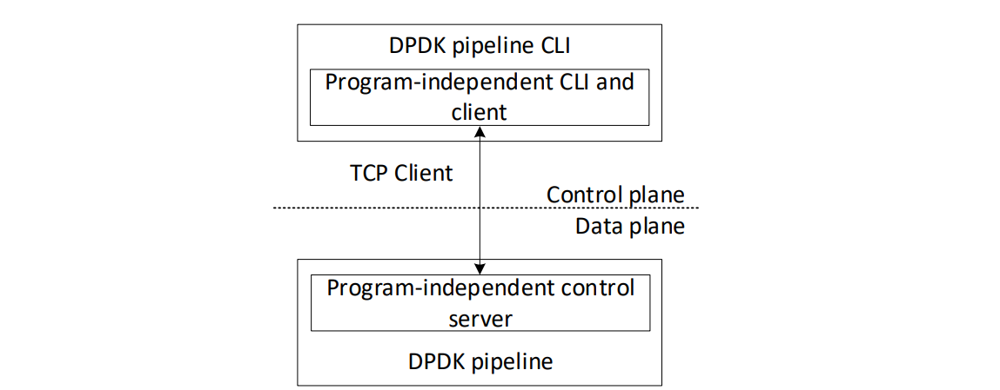

Introduction
============

Runtime
~~~~~~~

Once a P4 program is compiled into a target-specific configuration, the output is loaded into the 
data plane of the device. Then, the behavior of the P4 target can be managed at runtime by the 
control plane via data plane Application Programming Interface (APIs). Runtime operations include 
inserting, updating, and deleting entries in P4 tables as well

as controlling other entities of the program also called externs such as registers, counters, meters, 
etc.

Runtime APIs can be divided into program-dependent and program-independent APIs. Program-dependent 
APIs comprise functions whose names are derived from the P4 program itself. Thus, any changes to 
the P4 program would modify the names and the definitions of the APIs’ functions. Program-independent 
APIs comprise a set of fixed functions that are independent of the P4 program. Therefore, changes 
in the P4 programs do not affect those APIs.

The control plane that manages the data plane tables and externs can be remote or local on the device. 
Remote control planes invoke API calls through Remote Procedure Calls (RPCs) while relying on 
asynchronous message frameworks such as Thrift `[1] <references.html>`_ and gRPC `[2] <references.html>`_. Such frameworks use protocol buffers 
(protobuf) `[3] <references.html>`_ to define service API and message, and HTTP/2.0 and TLS for transport. On the other 
hand, a local control plane runs on the Central Processing Unit (CPU) of the device and invokes 
API calls locally. It is implemented by the driver of the device.

Pipelines are created and managed through Command Line Interface (CLI) `[4] <references.html>`_. Figure 1 shows the runtime 
environment used in this lab series to control the P4 target (P4-DPDK pipeline). The control plane 
uses the *DPDK pipeline CLI* tool to interact with the data plane. *The DPDK pipeline CLI* includes 
a program-independent CLI and a TCP Client (telnet) which connects to the program-independent control 
server residing on the DPDK pipeline. All the application objects are created and managed through 
CLI commands. The CLI can also be used to update the pipeline tables or poll the pipeline statistics `[5] <references.html>`_.

**Figure 1:** Runtime management of a P4 target (DPDK).
