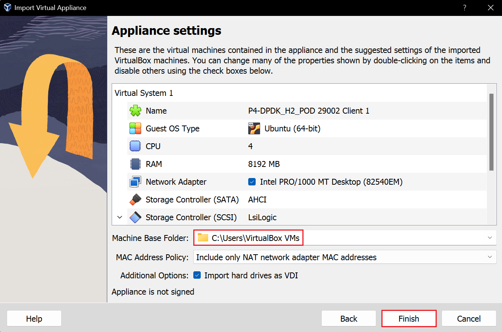

Hardware Requirements
=====================

Table 1 specifies the hardware requirements to achieve the performance depicted in the 
labs.

.. table:: Table 1: Hardware requirements.
   :align: center
   
   ==============  ===========  
   **Components**  **P4-DPDK**  
   ==============  ===========  
   CPU             3 cores           
   Memory          8 GB 
   Hard Disk       15 GB
   ==============  ===========

.. warning::
   You can reduce the hardware requirements in order to run the VM on your own 
   computer. However, the performance might be compromised.

Installation
++++++++++++

The following steps show how to install P4-DPDK on Oracle Virtual Box 7.0.

**Step 1.** Download and install Oracle Virtual Box 7.0.

**Step 2.** Download the .ova file `P4-DPDK_H2_POD <https://cilab.s3.us-east-2.amazonaws.com/VMs/P4-DPDK_H2_POD.ova>`_ to be installed. 
In this example, P4-DPDK VM is installed.

**Step 3.** Open Oracle Virtual Box 7.0.

**Step 4.** Click on *File -> Import Appliance*

**Figure 1:** Import Appliance.

**Step 5.** Browse to the folder that contains the .ova file.

**Figure 2:** Selection of *.ova* file.

**Step 6.** Select the destination folder and click on *Import*. Wait until it finishes. This process 
takes about 5 minutes.

**Figure 3:** Appliance settings.

**Step 7.** Start the virtual machine by clicking on *Start*.

**Figure 3:** Start the virtual machine.

This concludes the installation guide.

